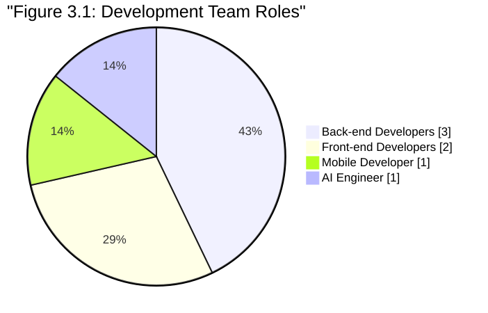
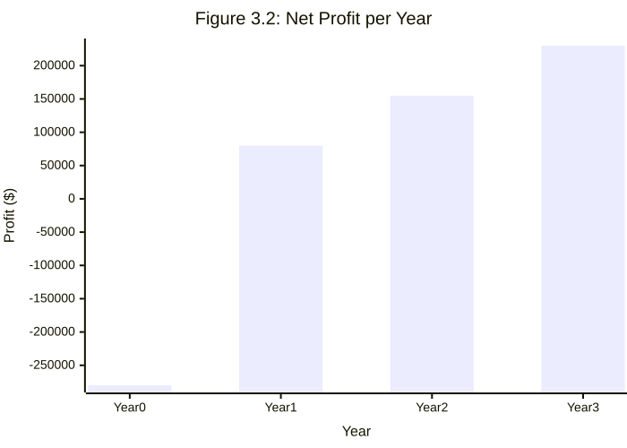
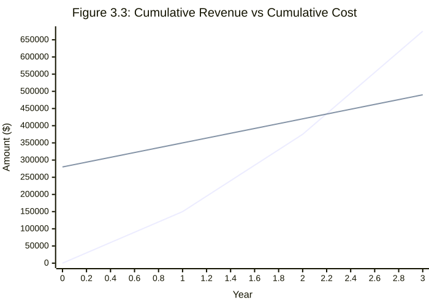

# الفصل الثالث: تحليل المتطلبات
[[toc]]

## 3.1 دراسة الجدوى

### 3.1.1 الجدوى التقنية

**🔧 الإلمام بالتطبيقات:**
- المتعلمون المستهدفون والمعلمون في منطقتنا مألوفون بالفعل مع تطبيقات التعليم المحمولة والدروس التفاعلية (مثل Duolingo، Code.org) باللغة العربية. استخدام واجهة مليئة بالألعاب باللغة العربية يجعل المنصة بديهية؛ المستخدمون لا يحتاجون تدريب إضافي لتسجيل الدخول، ممارسة البرمجة، أو تتبع التقدم.
- أعضاء الفريق الأساسي لديهم خبرة في بناء أدوات التعلم على الويب/المحمول، لذا نحن نفهم سير العمل النموذجي للمستخدم (إعداد الحساب، الدروس التفاعلية، منتديات المجتمع).
- لأن واجهة المستخدم والمحتوى باللغة العربية، تُزال حواجز اللغة، مما يُسهل منحنى التعلم للمبتدئين أكثر.

**💻 الإلمام بالتكنولوجيا:**
- فريقنا لديه خبرة قوية في مجموعة التقنيات المختارة: لقد بنينا تطبيقات Vue/Nuxt.js و Node.js من قبل ونحن ماهرون مع قواعد بيانات PostgreSQL. هذا يعني أنه يمكننا تطوير واجهة المستخدم الأمامية والخادم الخلفي بكفاءة.
- لدينا خبرة مع دمج محررات الأكواد في الوقت الفعلي (ستستخدم المنصة Monaco Editor من Microsoft، نفس المحرك مثل VS Code) والتعامل مع تنفيذ أكواد Python و JavaScript على الخادم.
- نحن مرتاحون في العمل مع واجهات برمجة التطبيقات للذكاء الاصطناعي؛ في مشاريع سابقة دمجنا خدمات (مثل واجهات برمجة التطبيقات OpenAI) ويمكننا بالمثل استخدام OpenRouter للاتصال بـ Gemini API للتلميحات الذكية. إجمالاً، **إلمامنا عالي** ولدينا ثقة أن لدينا مهارات البرمجة والتصميم والتكامل المطلوبة لتنفيذ جميع الميزات المخططة.

**📏 حجم المشروع:**
- الفريق الأساسي سيتضمن حوالي 6 أعضاء (مفصل أدناه)، وهو مناسب لمشروع متوسط الحجم.
- نطاق المنصة يتضمن تنوعاً معتدلاً من الميزات: محرر أكواد في الوقت الفعلي (يدعم Python و JS)، آليات الألعاب (XP، شارات، سلاسل، أهداف يومية)، تلميحات مدفوعة بالذكاء الاصطناعي، ووحدة مشاركة مجتمعية. هذا تعقد متوسط المستوى لفريق ذو خبرة.
- الجدول الزمني للتطوير ضيق نسبياً: مع هدف الإطلاق بحلول مايو 2026 (حوالي 6 أشهر من بداية التخطيط)، الجدول طموح. ومع ذلك، من خلال تخصيص سباقات متوازية للواجهة الأمامية والخلفية وإنشاء المحتوى، والاستفادة من المكونات القابلة لإعادة الاستخدام (مكتبات Nuxt/Vue، Monaco Editor، إلخ)، نعتقد أن الفريق يمكنه الوفاء بهذا الموعد النهائي.

---

### 3.1.2 الجدوى التنظيمية

**🏆 البطل:** فريق التطوير والمشرفون يقدمون الوقت والجهد للنظام.

**💼 راعي المشروع:** د. رحاب عماد الدين

**👥 مستخدمو النظام:**
1. **المتعلمون:** الطلاب والمتعلمون الذاتيون الناطقون بالعربية الذين يستخدمون المنصة لتعلم البرمجة من خلال دورات منظمة، تمارين تفاعلية، وتحديات أكواد في الوقت الفعلي. يكسبون XP وشارات وسلاسل كلما تقدموا.
2. **الموجهون/المدرسون:** مطورون أو معلمون أكثر خبرة يساهمون من خلال الإجابة على الأسئلة، مراجعة أكواد المستخدمين، تنظيم المحتوى، وإدارة المجتمع. الموجهون يساعدون في ضمان الجودة وتوفير دعم إضافي (مشابه لـ "موجهي اللغة" في Duolingo).
3. **المديرون/منشئو المحتوى:** فريق صغير من المديرين الذين يرفعون مواد دورات جديدة، يراقبون النظام، ويتعاملون مع الدعم التقني.

**👨‍💼 مدير المشروع:** د. رحاب عماد الدين

**🔧 تفصيل فريق التطوير:** الفريق منظم في أدوار متخصصة مع تعاون متداخل لضمان المرونة:

- **مطورو الخلفية (3):**  
  بناء وصيانة منطق الخادم في Node.js، إدارة قاعدة بيانات PostgreSQL، وتنفيذ واجهات برمجة التطبيقات. أحد مطوري الخلفية سيتولى أيضاً **مسؤوليات DevOps**، التعامل مع البنية التحتية السحابية، خطوط CI/CD، والأمان. معاً، سينفذون أيضاً تنفيذ الأكواد في الوقت الفعلي والتكامل مع واجهات برمجة التطبيقات للذكاء الاصطناعي.

- **مطورو الواجهة الأمامية (2):**  
  تطوير واجهة المستخدم باستخدام Nuxt.js، ضمان تصميم متجاوب وبديهي عبر متصفحات سطح المكتب والهاتف المحمول. سيدمجون محرر Monaco، ينفذون ميزات الألعاب (XP، شارات، لوحات المتصدرين)، ويتعاونون بشكل وثيق مع مطور الهاتف المحمول للحفاظ على اتساق التصميم.

- **مطور الهاتف المحمول (1):**  
  يركز على بناء وتحسين إصدار تطبيق الهاتف المحمول للمنصة، ضمان تجربة سلسة على iOS و Android. يعمل مع فرق الواجهة الأمامية والخلفية للمزامنة والأداء.

- **مهندس الذكاء الاصطناعي (1):**  
  متخصص في دمج ميزات الذكاء الاصطناعي، بما في ذلك التلميحات الذكية والتغذية الراجعة الشخصية، من خلال واجهات برمجة التطبيقات مثل OpenRouter/Gemini. هذا الدور يستكشف أيضاً نماذج التعلم التكيفي لتخصيص التمارين لتقدم كل متعلم.

- **المحتوى والتصميم التعليمي (مسؤولية مشتركة):**  
  بدلاً من منشئي محتوى مخصصين، **سيتعاون جميع أعضاء الفريق** في إنتاج وتوطين مواد الدورة باللغة العربية. يتضمن هذا تصميم دروس منظمة، كتابة التمارين، ودمج آليات الألعاب. خبرة أعضاء الفريق التقنية تضمن دقة المحتوى، بينما المسؤولية المشتركة توزع عبء العمل بالتساوي.

---

### 3.1.3 الجدوى الاقتصادية

**💰 الفوائد الملموسة:**
- **إيرادات الدورات:** مع نموذج الدفع لكل دورة بمتوسط سعر 30 دولار لكل دورة، تسجيل 5,000 مستخدم في السنة الأولى (هدفنا) سيولد تقريباً 150,000 دولار في مبيعات السنة الأولى. مع استمرار نمو المستخدمين، إيرادات السنة الثانية والثالثة يمكن أن تكون، على سبيل المثال، 225,000 دولار و 300,000 دولار (بافتراض نمو 50% سنوياً للمستخدمين).
- **تدفقات إيرادات إضافية:** يمكننا تطوير محتوى مميز أو خدمات شهادات في السنوات اللاحقة (مثل دورات متقدمة، شهادات إكمال رسمية) لخلق إيرادات جديدة. الشراكات أو التراخيص بالجملة مع المدارس أو الشركات يمكن أن تضيف دخلاً أيضاً.
- **وفورات الحجم:** لأن تكاليف الاستضافة والصيانة (انظر أدناه) ثابتة إلى حد كبير سنوياً، كل مستخدم إضافي فوق السنة الأولى يحقق معظمه ربح. على سبيل المثال، بمجرد تغطية مصروف الاستضافة 20,000 دولار/سنة و 50,000 دولار/سنة للتسويق، التسجيلات الإضافية تحسن الهوامش بشكل كبير.

**🌟 الفوائد غير الملموسة:**
- **مشاركة المتعلمين:** النهج المليء بالألعاب بأسلوب Duolingo سيحافظ على تحفيز الطلاب. الدراسات تُظهر أن الألعاب (النقاط، السلاسل، الشارات) تعزز مشاركة المستخدم والاحتفاظ بشكل كبير. من خلال جعل البرمجة ممتعة ومكافئة، نساعد المتعلمين على الاستمرار.
- **تأثير تعليمي:** توفير تعليم البرمجة باللغة العربية يزيل حواجز اللغة ويجعل علوم الكمبيوتر أكثر إمكانية للوصول. هذا يمكن أن يوسع المشاركة في تعليم التكنولوجيا ويساعد في تطوير المواهب المحلية في البرمجة.
- **نمو المجتمع:** بناء منصة تعاونية يعزز مجتمع التعلم من الأقران. المتعلمون والموجهون يشاركون المشاريع والنصائح، مما يعزز نتائج التعلم ويوفر قيمة اجتماعية.
- **العلامة التجارية وموقع السوق:** إطلاق هذه المنصة بنجاح سيضعنا كمبتكرين في تكنولوجيا التعليم العربية. السمعة الإيجابية وشهادات المستخدمين ستجذب استثمارات مستقبلية، شراكات، وربما التوسع في مواضيع أو أسواق جديدة.

---

**تكاليف التطوير والتشغيل (السنوات 0-3):**

| البند                           | السنة 0      | السنة 1     | السنة 2     | السنة 3     | المجموع      |
| ------------------------------ | ----------- | ---------- | ---------- | ---------- | ----------- |
| **التطوير (مرة واحدة)**         | $280,000    | $0         | $0         | $0         | $280,000    |
| رواتب فريق التطوير              | $180,000    | –          | –          | –          | $180,000    |
| إنشاء المحتوى                   | $100,000    | –          | –          | –          | $100,000    |
| **الاستضافة/الذكاء الاصطناعي/الصيانة** | $0          | $20,000    | $20,000    | $20,000    | $60,000     |
| **التسويق**                    | $0          | $50,000    | $50,000    | $50,000    | $150,000    |
| **التكلفة الإجمالية**            | **$280,000** | **$70,000** | **$70,000** | **$70,000** | **$490,000** |

**العائد على الاستثمار والصافي التراكمي:**

| المقياس              | السنة 0    | السنة 1    | السنة 2   | السنة 3   | المجموع    |
| ------------------- | --------- | --------- | -------- | -------- | -------- |
| **الإيرادات**        | $0        | $150,000  | $225,000 | $300,000 | $675,000 |
| **التكلفة الإجمالية** | $280,000  | $70,000   | $70,000  | $70,000  | $490,000 |
| **صافي الربح**       | -$280,000 | $80,000   | $155,000 | $230,000 | $185,000 |
| **الصافي التراكمي**   | -$280,000 | -$200,000 | -$45,000 | $185,000 | —        |

> **العائد على الاستثمار لـ 3 سنوات:** $185,000 ÷ $490,000 ≈ **37.8%**

---

**تحليل نقطة التعادل**

**نقطة التعادل** تحدث عندما تتجاوز الإيرادات التراكمية التكاليف التراكمية:

- **السنة 1:** الإيرادات التراكمية = $150,000، التكلفة التراكمية = $350,000 → لا تزال سالبة (-$200,000).
- **السنة 2:** الإيرادات التراكمية = $375,000، التكلفة التراكمية = $420,000 → لا تزال سالبة (-$45,000).
- **السنة 3:** الإيرادات التراكمية = $675,000، التكلفة التراكمية = $490,000 → **صافي تراكمي موجب ($185,000)**.

لذلك، من المتوقع أن يصل المشروع إلى **التعادل خلال السنة الثالثة**، وبعدها تساهم جميع الإيرادات الإضافية في الربح.

للتوضيح:

- **عتبة إيرادات التعادل:** $490,000 (إجمالي تكلفة 3 سنوات).
- تُحقق عند ~**16,333 تسجيل مدفوع** (490,000 ÷ $30).
- بناءً على النمو المتوقع، سيتم الوصول لهذا المعلم في **السنة الثالثة من التشغيل**.

---

## 3.2 إدارة المخاطر

يحدد هذا القسم المخاطر الرئيسية لمنصة تعليم البرمجة عبر المجالات التقنية والتشغيلية والقانونية. كل خطر يُقيم بمستوى احتمالية (منخفض/متوسط/عالي)، تأثير (منخفض/متوسط/عالي)، واستراتيجيات التخفيف. عند الاقتضاء، تُستخدم مصفوفة المخاطر النوعية للتأكيد على الأولوية.

### 3.2.1 المخاطر التقنية

| **المخاطر**                      | **الوصف**                                                                                                                                                      | **الاحتمالية** | **التأثير** | **التخفيف**                                                                                                                                                                                              |
| -------------------------------- | -------------------------------------------------------------------------------------------------------------------------------------------------------------- | -------------- | ----------- | ------------------------------------------------------------------------------------------------------------------------------------------------------------------------------------------------------- |
| **القابلية للتوسع ووقت التشغيل**  | حركة المرور العالية أو نمو البيانات يمكن أن يطغى على المنصة. بدون هندسة معيارية واختبار قوي، يمكن أن تحدث اختناقات في الأداء وتوقف.                              | عالي           | عالي        | تصميم هندسة قابلة للتوسع قائمة على الخدمات المصغرة؛ استخدام التوسع الأفقي (توزيع الأحمال، CDN، التخزين المؤقت)؛ تنفيذ الاختبار التلقائي والمراقبة لاكتشاف ومنع الاختناقات.                          |
| **تكامل واجهات برمجة التطبيقات الخارجية** | الاعتماد على واجهات برمجة التطبيقات الخارجية (مثل Gemini، OpenRouter) يمكن أن يقدم انقطاع أو سلوك غير متوقع. خدمات الطرف الثالث قد تواجه توقف أو تغييرات مدمرة. | متوسط          | عالي        | فحص ومراقبة واجهات برمجة التطبيقات الخارجية عن كثب (فحوصات وقت التشغيل/SLA)؛ تنفيذ مهلات زمنية وإعادة المحاولة؛ استخدام قواطع الدائرة للحماية من الطفرات؛ إعداد أوضاع احتياطية أو متدهورة إذا فشلت واجهة برمجة التطبيقات. |
| **تنفيذ الكود في الوقت الفعلي**    | تشغيل كود مُرسل من المستخدم في الوقت الفعلي عرضة للأخطاء. فشل الصندوق الرملي، استنزاف الموارد، أو الثغرات يمكن أن تعطل المنفذ، مما يضر بالموثوقية.           | متوسط          | عالي        | عزل التنفيذ في صناديق رملية آمنة أو حاويات؛ فرض حدود الموارد (الذاكرة/الوقت)؛ اختبار مستمر مع أحمال عمل متنوعة؛ توسيع محرك التنفيذ بشكل منفصل؛ مراقبة والاستعادة التلقائية.                      |

### 3.2.2 المخاطر التشغيلية

| المخاطر                           | الوصف                                                                                                            | الاحتمالية | التأثير | التخفيف                                                                                                                                           |
| --------------------------------- | --------------------------------------------------------------------------------------------------------------- | ---------- | ------- | ------------------------------------------------------------------------------------------------------------------------------------------------- |
| **تأخيرات الجدول الزمني**          | تغييرات المتطلبات، زحف النطاق، أو التقدير المنخفض يمكن أن يخرج الجداول عن مسارها. التقديرات المفرطة في التفاؤل قد تؤدي إلى مواعيد نهائية ممتدة. | عالي       | عالي    | استخدام تخطيط شامل مقدماً ومتطلبات واضحة؛ تطبيق تقديرات وقت واقعية مع طوارئ؛ استخدام سباقات رشيقة للتسليم والمراجعات التدريجية.                    |
| **قيود الموارد**                  | حجم الفريق المحدود أو نقص المهارات يخلق اختناقات.                                                               | متوسط      | عالي    | التدريب المتقاطع للموظفين والحصول على المواهب مبكراً؛ استخدام موارد طارئة؛ الحفاظ على خط أنابيب من المطورين؛ التنبؤ وإعادة تخصيص أحمال العمل بشكل استباقي. |
| **اختناقات تطوير المحتوى**        | إنشاء دروس ومارين برمجة عالية الجودة وجذابة يستغرق وقتاً طويلاً، مما يمكن أن يؤخر الإصدارات أو يقلل الجودة.        | متوسط      | متوسط   | تطوير المحتوى بشكل تدريجي مع خبراء المادة؛ إعادة استخدام أو تكييف المواد الموجودة؛ توظيف مصممين تعليميين؛ إعطاء الأولوية للوحدات عالية التأثير أولاً.     |

### 3.2.3 المخاطر القانونية والامتثال

| المخاطر                           | الوصف                                                                                                                              | الاحتمالية | التأثير | التخفيف                                                                                                                                                                      |
| --------------------------------- | --------------------------------------------------------------------------------------------------------------------------------- | ---------- | ------- | ---------------------------------------------------------------------------------------------------------------------------------------------------------------------------- |
| **خصوصية البيانات (القُصّر)**     | جمع البيانات على الأطفال يثير متطلبات قانونية صارمة (مثل COPPA، GDPR). الفشل في الامتثال يمكن أن يسبب عقوبات شديدة.                   | متوسط      | عالي    | تطبيق "الخصوصية بالتصميم": تقليل جمع البيانات، تشفير البيانات الحساسة، الحصول على موافقة الوالدين، الحفاظ على سياسات خصوصية واضحة، وإجراء مراجعات منتظمة.                        |
| **حقوق النشر والترخيص**           | استخدام كود/أصول طرف ثالث أو مجتمعية يخاطر بانتهاك الترخيص. حتى ترخيص واحد غير متوافق يمكن أن يؤدي إلى عقوبات قانونية أو مالية.         | منخفض      | متوسط   | فرض مراجعة صارمة لجميع المحتوى/الكود؛ استخدام ماسحات الترخيص؛ تفضيل المحتوى المتساهل أو الأصلي؛ تثقيف المستخدمين حول الانتحال؛ معالجة المواد المنتهكة.                         |
| **انتهاكات شروط الخدمة**          | المستخدمون قد ينشرون محتوى غير مسموح (خطاب الكراهية، كود محمي بحقوق النشر، مشاركات خبيثة) أو يغشون، منتهكين شروط خدمة المنصة.        | متوسط      | متوسط   | نشر شروط خدمة شاملة؛ تنفيذ أدوات إشراف وإبلاغ؛ فرض القواعد عبر المرشحات والمراجعة اليدوية؛ الاستجابة بسرعة ومراجعة السياسات بانتظام.                                      |

---

## 3.3 خطة المشروع

**لم يتم بعد**

## 3.4 مخطط جانت

**لم يتم بعد**