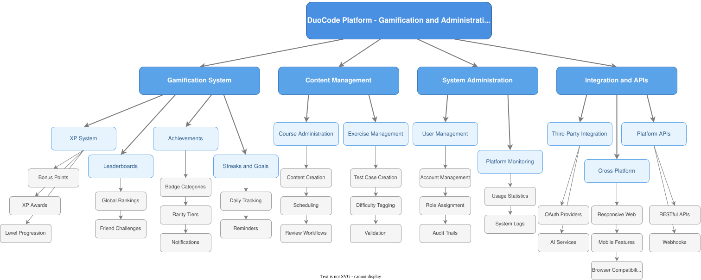

# 4.3 Functional Decomposition

## Overview

This document presents the functional decomposition diagrams for the system, breaking down the main functionality into smaller, manageable components.

## Decomposition Diagram - Part 1

## Decomposition Diagram - Part 2

## Decomposition Diagram - Part 3

