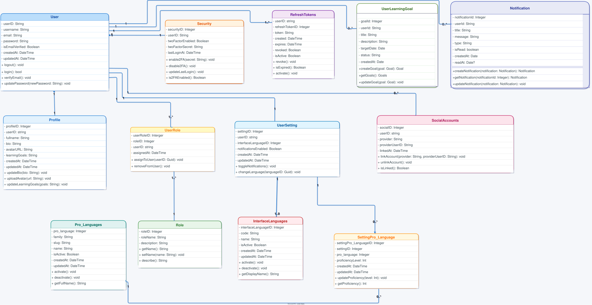
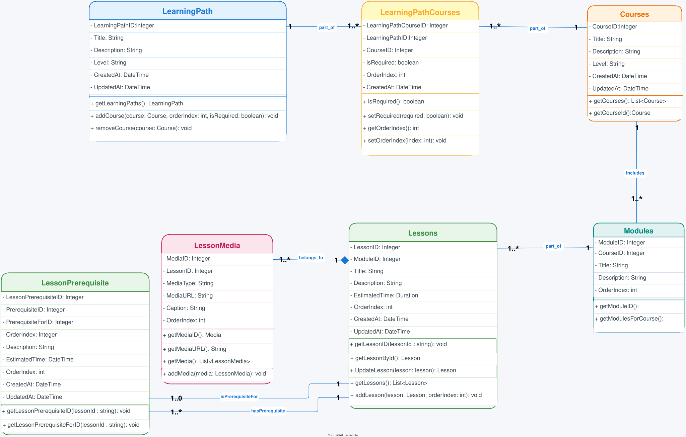
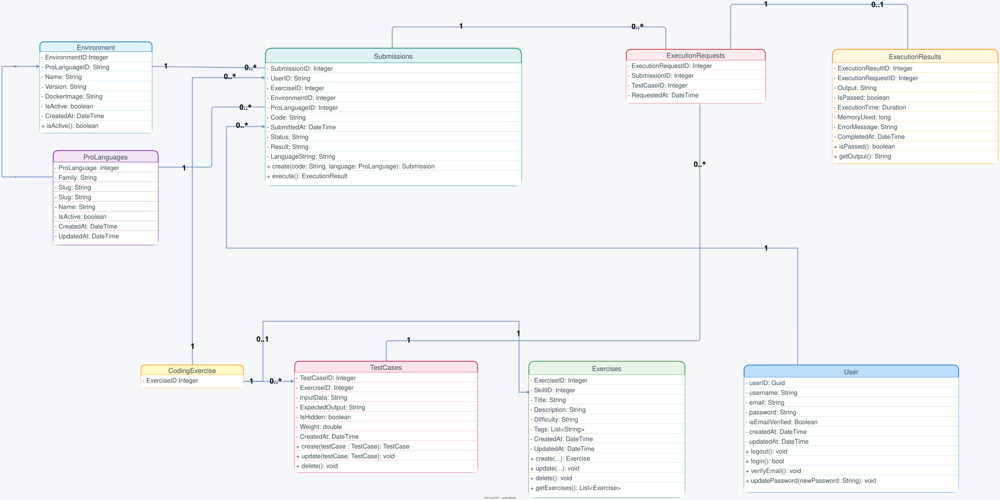
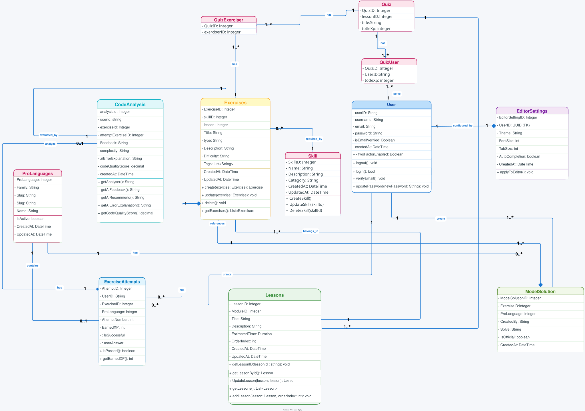
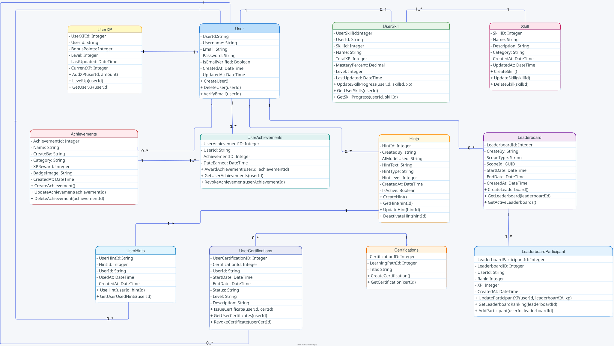
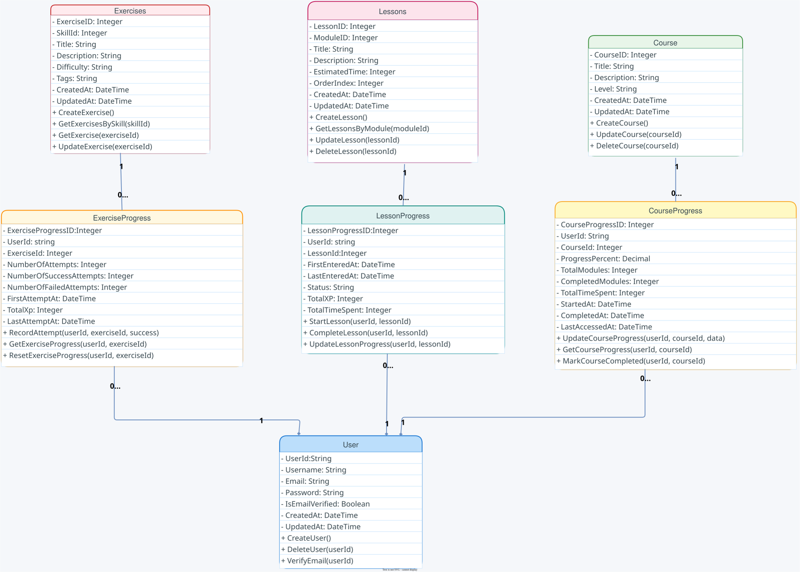

# Chapter 5: System Architecture

## 5.5 Class Diagrams

Class diagrams are structural diagrams that show the static structure of the system, including its classes, attributes, operations, and the relationships among objects. They provide a detailed view of the system's architecture and design.

[[toc]]

---

## Part 1: Core User and Authentication System

This section presents the foundational classes for user management, authentication, and authorization within the DuoCodo platform. It includes user roles, profile management, and security features.

<figure>
    
    <figcaption>Figure 5.38: Class Diagram - Core User and Authentication System</figcaption>
</figure>

---

## Part 2: Learning Content Management

This section illustrates the classes responsible for managing educational content, including courses, lessons, exercises, and learning paths. It shows how content is structured and organized within the platform.

<figure>
    
    <figcaption>Figure 5.39: Class Diagram - Learning Content Management</figcaption>
</figure>

---

## Part 3: Submission and Code Execution

This section demonstrates the classes that handle submission and code execution. It shows how the platform motivates and engages learners.

<figure>
    
    <figcaption>Figure 5.40: Class Diagram - Submission and Code Execution</figcaption>
</figure>

---

## Part 4: Exercises, Attempts and Code Analysis

This section presents the classes that enable exercises, attempts and code analysis, including comments, discussions, friend connections, sharing capabilities, and community engagement features.

<figure>
    
    <figcaption>Figure 5.41: Class Diagram - Exercises, Attempts and Code Analysis</figcaption>
</figure>

---

## Part 5: Certification and Gamification

This section shows the classes related to certification and gamification, and validation mechanisms. It demonstrates how the platform evaluates learner competency and awards credentials.

<figure>
    
    <figcaption>Figure 5.42: Class Diagram - Certification and Gamification</figcaption>
</figure>

---

## Part 6: Administration and Platform Management

This section illustrates the classes responsible for platform administration, including system monitoring, analytics, content moderation, user management, and reporting capabilities.

<figure>
    
    <figcaption>Figure 5.43: Class Diagram - Administration and Platform Management</figcaption>
</figure>

---

## Key Design Patterns and Relationships

The class diagrams above illustrate several important design patterns and relationships:

- **Inheritance**: User roles (Administrator, Content Creator, Learner) inherit from a base User class
- **Composition**: Courses are composed of Lessons, which contain Exercises
- **Association**: Many-to-many relationships between Learners and Courses through enrollment
- **Aggregation**: Learning Paths aggregate multiple Courses
- **Dependency**: Classes depend on authentication and authorization services

These diagrams provide a comprehensive view of the DuoCodo platform's architecture, showing how different components interact to deliver a complete learning experience.
