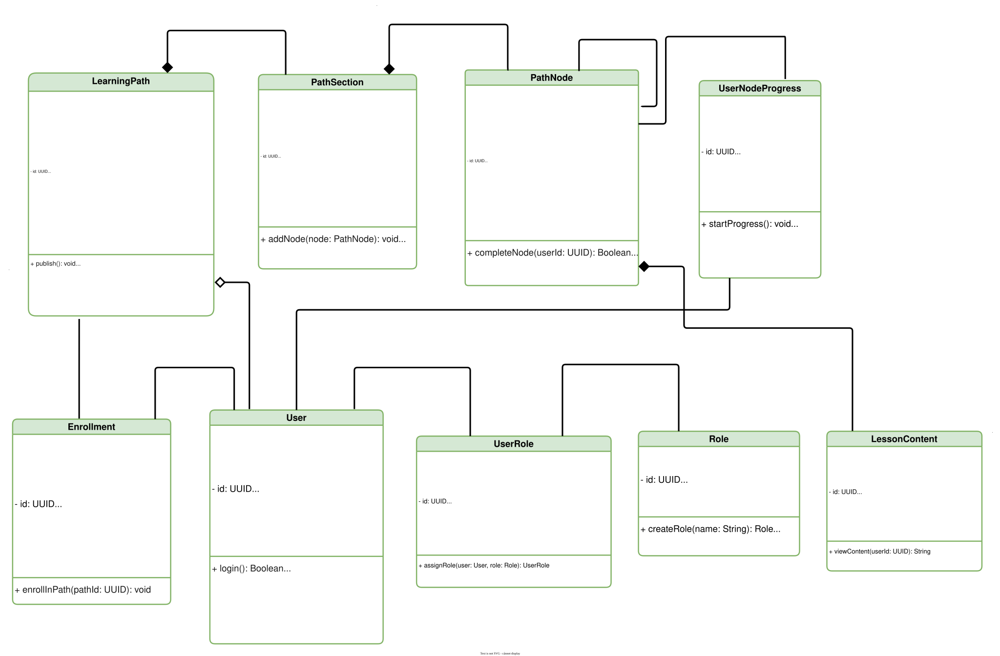
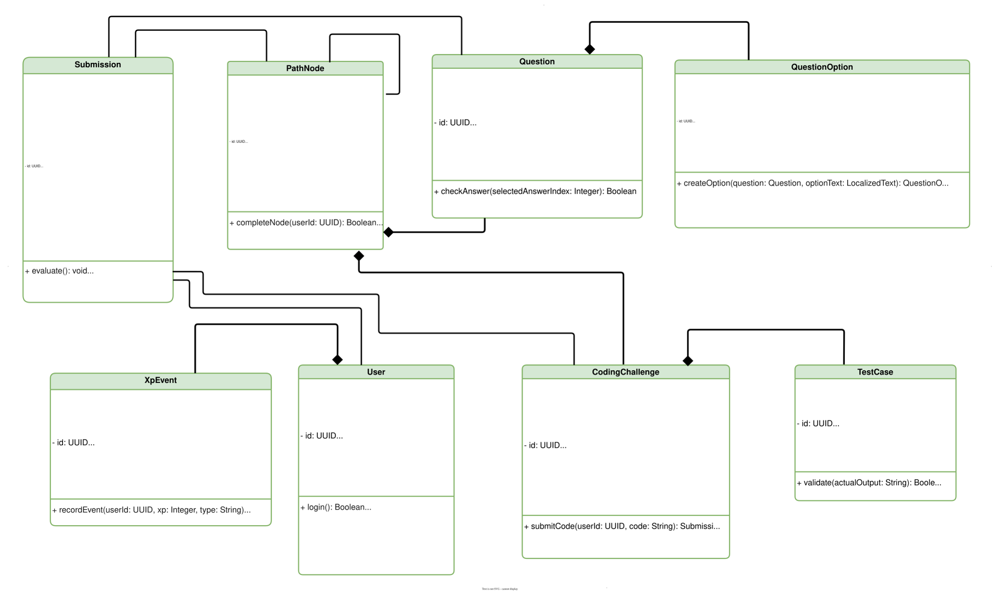

# Chapter 5: System Architecture

## 5.5 Class Diagrams

Class diagrams are structural diagrams that show the static structure of the system, including its classes, attributes, operations, and the relationships among objects. They provide a detailed view of the system's architecture and design.

[[toc]]

---

## Part 1: Core User and Authentication System

This section presents the foundational classes for user management, authentication, and authorization within the DuoCode platform. It includes user roles, profile management, and security features.

<figure>
    
    <figcaption>Figure 5.38: Class Diagram - Core User and Authentication System</figcaption>
</figure>

---

## Part 2: Learning Content Management

This section illustrates the classes responsible for managing educational content, including courses, lessons, exercises, and learning paths. It shows how content is structured and organized within the platform.

<figure>
    
    <figcaption>Figure 5.39: Class Diagram - Learning Content Management</figcaption>
</figure>

## Key Design Patterns and Relationships

The class diagrams above illustrate several important design patterns and relationships:

- **Inheritance**: User roles (Administrator, Content Creator, Learner) inherit from a base User class
- **Composition**: Courses are composed of Lessons, which contain Exercises
- **Association**: Many-to-many relationships between Learners and Courses through enrollment
- **Aggregation**: Learning Paths aggregate multiple Courses
- **Dependency**: Classes depend on authentication and authorization services

These diagrams provide a comprehensive view of the DuoCode platform's architecture, showing how different components interact to deliver a complete learning experience.
