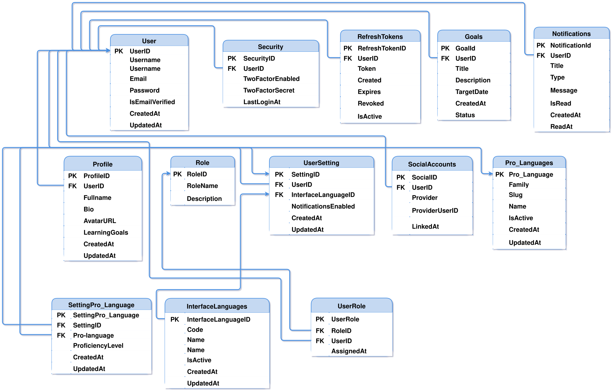
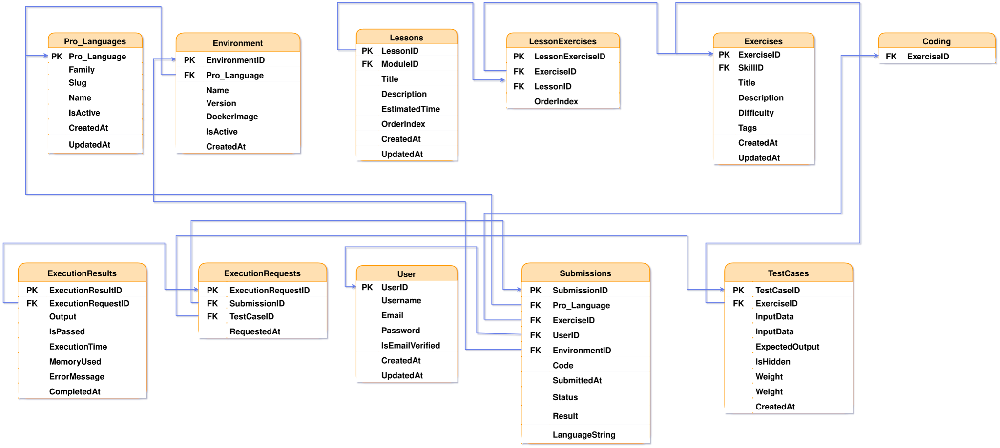
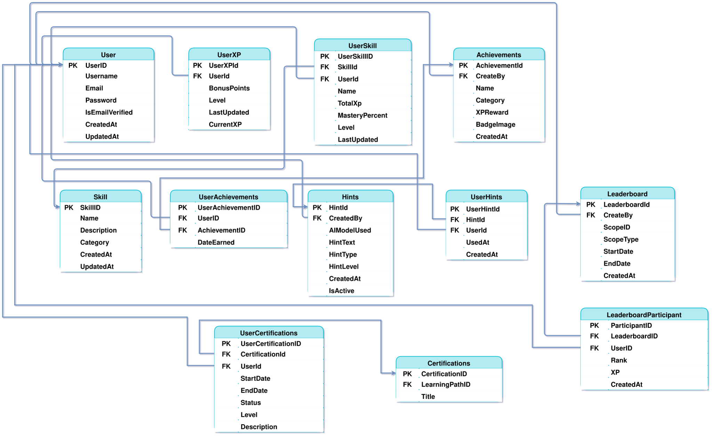
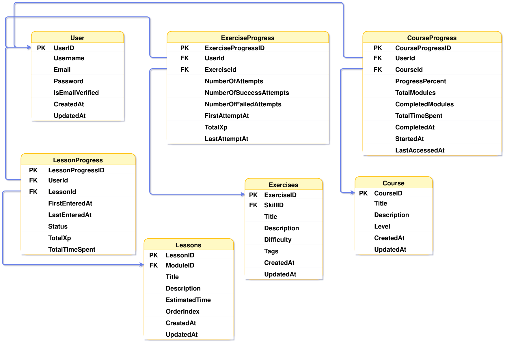

# Chapter 6: Database Design

## 6.2 Database Schema

Database Schema represents the logical structure of the DuoCodo platform database, showing tables, columns, data types, constraints, and relationships. This detailed schema design ensures optimal performance, data integrity, and supports all platform functionalities.

[[toc]]

---

## Part 1: User Management and Authentication

This section presents the database tables for user management, including user accounts, roles, authentication mechanisms, and profile information. It establishes the foundation for user identity and access control with detailed field specifications.

<figure>
    
    <figcaption>Figure 6.53: Database Schema - User Management and Authentication</figcaption>
</figure>

---

## Part 2: Learning Content and Course Structure

This section illustrates the database tables related to educational content organization, including courses, lessons, modules, exercises, and learning paths. It shows how content is structured and stored within the database with proper data types and constraints.

<figure>
    
    <figcaption>Figure 6.54: Database Schema - Learning Content and Course Structure</figcaption>
</figure>

---

## Part 3: Progress Tracking and Gamification

This section demonstrates the database tables that track learner progress, achievements, experience points (XP), badges, streaks, and leaderboard rankings. It shows how the platform stores and manages gamification elements with appropriate indexing.

<figure>
    
    <figcaption>Figure 6.55: Database Schema - Progress Tracking and Gamification</figcaption>
</figure>

---

## Part 4: Assessment and Certification

This section shows the database tables for quizzes, assessments, test cases, submissions, grading, and certifications. It demonstrates how the platform stores evaluation data and manages credentials with proper validation constraints.

<figure>
    
    <figcaption>Figure 6.56: Database Schema - Assessment and Certification</figcaption>
</figure>

---

## Part 5: Social Features and Community

This section presents the database tables that enable social interactions, including comments, discussions, friend connections, notifications, sharing, and community engagement features with optimized query structures.

<figure>
    
    <figcaption>Figure 6.57: Database Schema - Social Features and Community</figcaption>
</figure>

---

## Part 6: Administration and System Management

This section illustrates the database tables for platform administration, including system logs, analytics, content moderation, reports, backups, and monitoring capabilities with appropriate data retention policies.

<figure>
    
    <figcaption>Figure 6.58: Database Schema - Administration and System Management</figcaption>
</figure>

---

## Database Schema Specifications

The database schema implementation follows these key specifications:

- **Data Types**: Appropriate data types chosen for optimal storage and performance
- **Constraints**: Primary keys, foreign keys, unique constraints, and check constraints ensure data integrity
- **Indexing**: Strategic indexes on frequently queried columns for optimal performance
- **Normalization**: Tables normalized to 3NF (Third Normal Form) to eliminate redundancy
- **Referential Integrity**: Foreign key relationships maintain consistency across related tables
- **Security**: Sensitive fields include encryption specifications and access control measures
- **Scalability**: Schema design supports partitioning and sharding for future growth
- **Backup Strategy**: Tables include timestamp fields for incremental backup operations

This detailed schema provides the implementation blueprint for the DuoCodo platform's database, ensuring robust data management and optimal query performance across all system components.