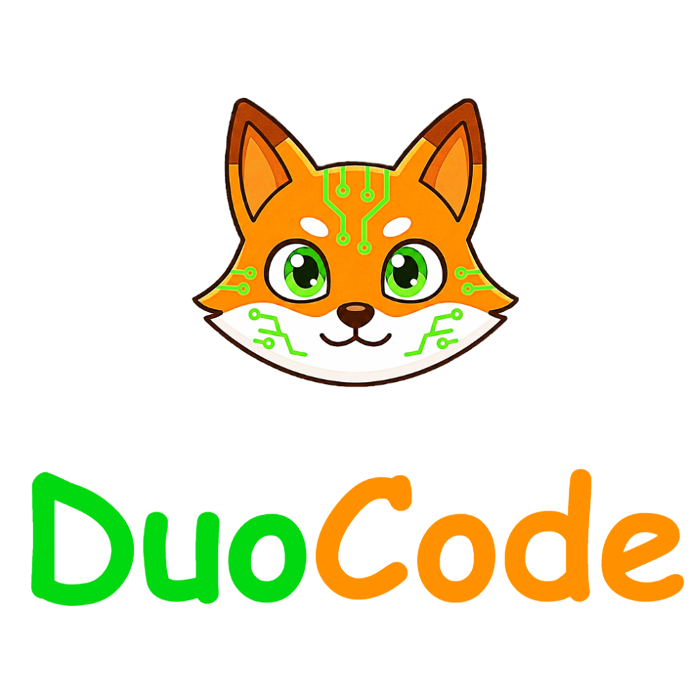
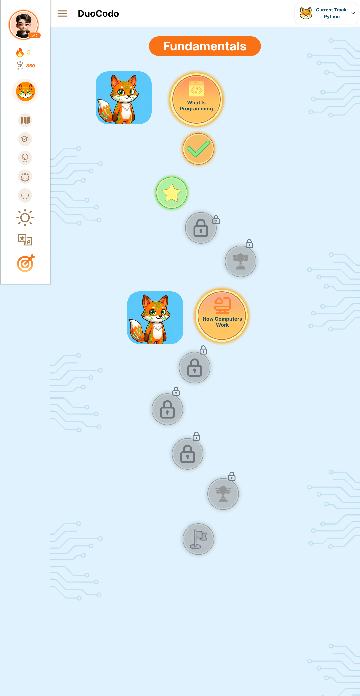
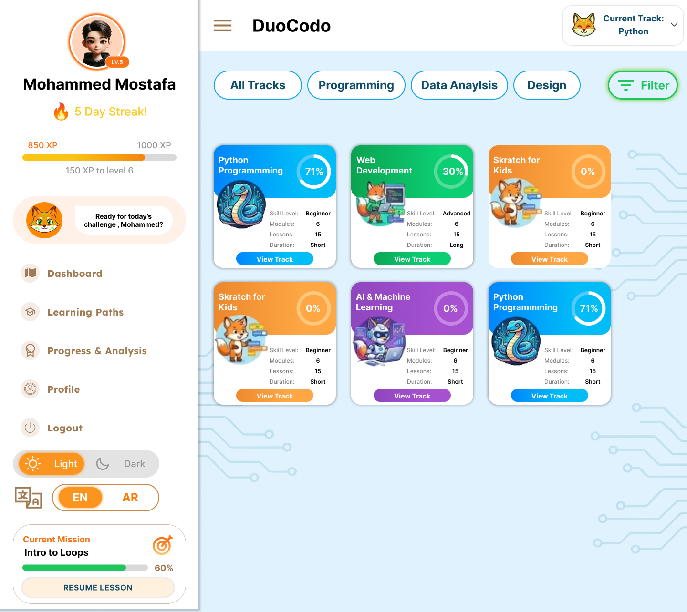
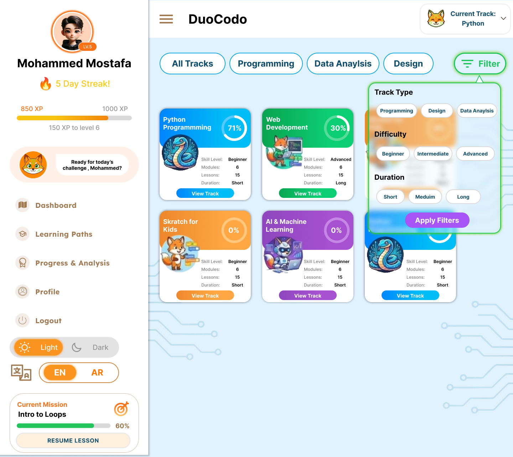
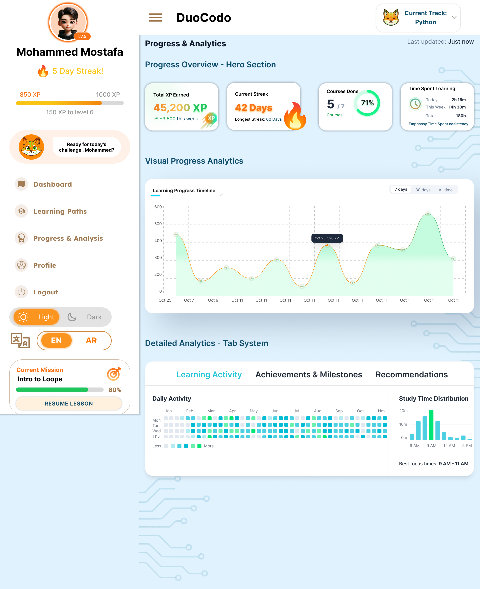

<!-- <meta charset="utf-8"> -->
<!--  -->
<!--  -->

  <!-- Vibrant Hero Header -->
  

  

  <!-- Logos -->
  

    

        

          
        

      

      

        <h2>Faculty of Computers and Information</h2>
          
Minia University

          
Academic Year: 2025 / 2026

        

        

          

            
          

        

      

    

    <!-- Content Section -->
    

      <!-- Title & Project Logo Combined -->
      

        

          

            
          

          

            <h1 class="main-title">DuoCodo</h1>
            
Gamified, Arabic-Centered Programming Learning Platform and Application

          

        

      

      <!-- Team Table -->
      <section class="team-container">
        
Project Team Members

        <table class="team-table">
          <thead>
            <tr>
              <th>#</th>
              <th>Name</th>
              <th>Dept</th>
              <th>Email</th>
              <!-- <th>LinkedIn</th> -->
            </tr>
          </thead>
          <tbody>
            <tr>
              <td>1</td>
              <td>Mohamed Mostafa Amer Abdelkader</td>
              <td>CS</td>
              <td><a href="81457191@fci.s-mu.edu.eg">81457191@fci.s-mu.edu.eg</a></td>
              <!-- <td><a href="https://www.linkedin.com/in/mohamed-mostafa-abdelkader" target="_blank">
                <svg xmlns="http://www.w3.org/2000/svg" xmlns:xlink="http://www.w3.org/1999/xlink" width="16" height="16" version="1.1" id="Layer_1" viewBox="0 0 382 382" xml:space="preserve">
                <path style="fill:#0077B7;" d="M347.445,0H34.555C15.471,0,0,15.471,0,34.555v312.889C0,366.529,15.471,382,34.555,382h312.889  C366.529,382,382,366.529,382,347.444V34.555C382,15.471,366.529,0,347.445,0z M118.207,329.844c0,5.554-4.502,10.056-10.056,10.056  H65.345c-5.554,0-10.056-4.502-10.056-10.056V150.403c0-5.554,4.502-10.056,10.056-10.056h42.806  c5.554,0,10.056,4.502,10.056,10.056V329.844z M86.748,123.432c-22.459,0-40.666-18.207-40.666-40.666S64.289,42.1,86.748,42.1  s40.666,18.207,40.666,40.666S109.208,123.432,86.748,123.432z M341.91,330.654c0,5.106-4.14,9.246-9.246,9.246H286.73  c-5.106,0-9.246-4.14-9.246-9.246v-84.168c0-12.556,3.683-55.021-32.813-55.021c-28.309,0-34.051,29.066-35.204,42.11v97.079  c0,5.106-4.139,9.246-9.246,9.246h-44.426c-5.106,0-9.246-4.14-9.246-9.246V149.593c0-5.106,4.14-9.246,9.246-9.246h44.426  c5.106,0,9.246,4.14,9.246,9.246v15.655c10.497-15.753,26.097-27.912,59.312-27.912c73.552,0,73.131,68.716,73.131,106.472  L341.91,330.654L341.91,330.654z"/>
                  </svg>
                </a>
              </td> -->
            </tr>
            <tr>
              <td>2</td>
              <td>Mohamed Ragab Abdelhafez Mehran</td>
              <td>CS</td>
              <td><a href="81457191@fci.s-mu.edu.eg">81457191@fci.s-mu.edu.eg</a></td>
            </tr>
            <tr>
              <td>3</td>
                <td>Alaa Mohamed Abdelhakeem Ahmed</td>
                <td>CS</td>
                <td><a href="81438405@fci.s-mu.edu.eg">81438405@fci.s-mu.edu.eg</a></td>
              </tr>
              <tr>
                <td>4</td>
                <td>Ammar Emad Ahmed Azmy Zewain</td>
                <td>IS</td>
                <td><a href="81451636@fci.s-mu.edu.eg">81451636@fci.s-mu.edu.eg</a></td>
              </tr>
              <tr>
                <td>5</td>
                <td>Yassin Khaled Khalaf</td>
                <td>IS</td>
                <td><a href="81797831@fci.s-mu.edu.eg">81797831@fci.s-mu.edu.eg</a></td>
              </tr>
              <tr>
                <td>6</td>
                <td>Marwa Farid Mohamed</td>
                <td>IS</td>
                <td><a href="81145783@fci.s-mu.edu.eg">81145783@fci.s-mu.edu.eg</a></td>
              </tr>
          </tbody>
        </table>
      </section>
    

    <!-- Supervisors Section -->
    <section class="supervisors-section">
      
Under Supervision of

        

          

            
Supervisor

            
Dr. Rehab Emad El-Dein

            
CS Department

            
<a href="rehab.mohamed@mu.edu.eg">rehab.mohamed@mu.edu.eg</a>

          

          

            
Teaching Assistant

            
T.A. Mohammed Shaaban

            
CS Department

            
<a href="mailto:mohamed.shaban@mu.edu.eg">mohamed.shaban@mu.edu.eg</a>

        

    

  </section>

<h2>Abstract</h2>

Learning programming remains a significant challenge for beginners, particularly within Arabic-speaking communities, due to fragmented learning resources, limited interactivity, delayed feedback, and declining learner motivation. This project presents DuoCodo, a gamified, Arabic-centered programming learning platform inspired by Duolingo’s engagement model and designed to provide a structured, interactive, and motivating educational experience. The platform delivers a progressive curriculum covering programming fundamentals through advanced topics such as object-oriented programming, algorithms, and web development. It integrates multi-format learning content, including articles, videos, and guided walkthroughs, alongside an in-browser code editor that supports real-time code execution, instant feedback, and intelligent error analysis. Gamification elements—such as experience points, badges, levels, leaderboards, and daily streaks—are employed to enhance learner motivation and retention. Additionally, AI-powered assistance offers contextual hints, personalized recommendations, and adaptive difficulty based on learner performance. By combining structured learning paths, continuous practice, immediate feedback, and motivational mechanics within an Arabic-first environment, DuoCodo aims to reduce learning barriers, improve engagement, and enable learners to build practical programming skills effectively and confidently.

#### 
Table of Contents

<!-- toc -->

- [Chapter 1: Project Overview](#chapter-1-project-overview)
  - [1.1 Main Idea](#main-idea)
  - [1.2 Project Scope](#project-scope)
  - [1.3 Problem Statement](#problem-statement)
  - [1.4 Solution Approach](#solution-approach)
  - [1.5 Project Objectives](#project-objectives)
- [Chapter 2: Project Background](#chapter-2-project-background)
  - [2.1 Project Background](#project-background)
  - [2.2 Related Work](#related-work)
  - [2.3 Summary](#summary)
- [Chapter 3: Feasibility and Project Planning](#chapter-3-feasibility-and-project-planning)
  - [3.1 Feasibility Study](#feasibility-study)
  - [3.2 Risk Management](#risk-management)
- [Chapter 4: System Analysis](#chapter-4-system-analysis)
  - [4.1 Function Requirements](#function-requireements)
  - [4.2 Non-Function Requirements](#non-function-requirements)
  - [4.3 Functional Decomposition](#functional-decomposition)
- [Chapter 5: System Architecture](#chapter-5-system-architecture)
  - [5.1 Actor-goal List](#actor-goal-list)
  - [5.2 Use Cases Diagram](#use-cases-diagram)
  - [5.3 Use Cases Format](#use-cases-format)
  - [5.4 Sequence Diagram](#sequence-diagram)
  - [5.5 Class Diagram](#class-diagram)
- [Chapter 6: Database Design](#chapter-6-database-design)
  - [6.1 Entity Relationship Diagram](#entity-relationship-diagram)
  - [6.2 Database Schema](#database-schema)
- [Chapter 7: User Interface](#Chapter-7-User-Interface)
  - [7.1 Authentication Screens](#Authentication-Screens)
  - [7.2 Main Dashboard](#Main-Dashboard)
  - [7.3 Learning Paths](#Learning-Paths)
  - [7.4 Progress Tracking & Analytics](#Progress-Tracking-Analytics)
  - [7.5 Theme Options](#Theme-Options)
- [Chapter 8: References](#Chapter-8-References)

<!-- tocstop -->

#### 
List of Figures

- [Figure 3.1: Development Team Roles](#Figure31)
- [Figure 3.2: Net Profit per Year](#Figure32)
- [Figure 3.3: Cumulative Revenue vs Cumulative Cost](#Figure33)
- [Figure 4.1: Decomposition Diagram Part 1](#Figure41)
- [Figure 4.2: Decomposition Diagram Part 2](#Figure42)
- [Figure 4.3: Decomposition Diagram Part 3](#Figure43)
- [Figure 5.1: Use Cases Diagram](#Figure51)
- [Figure 5.2: Assign User Role](#Figure52)
- [Figure 5.3: Create Coding Exercise](#Figure53)
- [Figure 5.4: Track Progress](#Figure54)
- [Figure 5.5: Learn XP and Level Up](#Figure55)
- [Figure 5.6: Class Diagram - Core User and Authentication System](#Figure56)
- [Figure 5.7: Class Diagram - Learning Content Management](#Figure57)
- [Figure 5.8: Class Diagram - Submissions and Code Execution](#Figure58)
- [Figure 5.9: Class Diagram - Exercises, Attempts and Code Analysis](#Figure59)
- [Figure 5.10: Class Diagram - Certification and Gamification](#Figure510)
- [Figure 5.11: Class Diagram - Administration and Platform Management](#Figure511)
- [Figure 6.1: Entity Relationship Diagram - User Management and Authentication](#Figure61)
- [Figure 6.2: Entity Relationship Diagram - Learning Content and Course Structure](#Figure62)
- [Figure 6.3: Entity Relationship Diagram - Submissions and Code Execution](#Figure63)
- [Figure 6.4: Entity Relationship Diagram - Exercises, Attempts and Code Analysis](#Figure64)
- [Figure 6.5: Entity Relationship Diagram - Certification and Gamification](#Figure65)
- [Figure 6.6: Entity Relationship Diagram - Administration and System Management](#Figure66)
- [Figure 6.7: Database Schema - User Management and Authentication](#Figure67)
- [Figure 6.8: Database Schema - Learning Content and Course Structure](#Figure68)
- [Figure 6.9: Database Schema - Submissions and Code Execution](#Figure69)
- [Figure 6.10: Database Schema - Exercises, Attempts and Code Analysis](#Figure610)
- [Figure 6.11: Database Schema - Certification and Gamification](#Figure611)
- [Figure 6.12: Database Schema - Administration and System Management](#Figure612)

- [Figure 7.1: Login Screen](#Figure71)
- [Figure 7.2: Registration Screen](#Figure72)
- [Figure 7.3: OTP Verification Screen](#Figure73)
- [Figure 7.4: Password Entry Screen](#Figure74)
- [Figure 7.5: New Password Creation Screen](#Figure75)
- [Figure 7.6: Set Username](#Figure76)
- [Figure 7.7: Learning Path Interface](#Figure77)
- [Figure 7.8: Interface with Collapsed Sidebar](#Figure78)
- [Figure 7.9: Chat Interface](#Figure79)
- [Figure 7.10: Video Player Screen](#Figure710)
- [Figure 7.11: Multiple Choice Quiz](#Figure711)
- [Figure 7.12: Code Quiz Interface](#Figure712)
- [Figure 7.13: Quiz Completion Screen](#Figure713)
- [Figure 7.14: Main Dashboard](#Figure714)
- [Figure 7.15: Dashboard Details View](#Figure715)
- [Figure 7.16: Dashboard with Filtration Options](#Figure716)
- [Figure 7.17: Progress & Analysis Dashboard](#Figure717)
- [Figure 7.18: Dark Mode Interface](#Figure718)

#### 
List of Tables

- [Table 2.1: Elzero Web School](#table1)
- [Table 2.2: Codeforces](#table2)
- [Table 2.3: CodeChef](#table3)
- [Table 2.4: HackerRank](#table4)
- [Table 2.5: LeetCode](#table5)
- [Table 2.6: TopCoder](#table6)
- [Table 2.7: AtCoder](#table7)
- [Table 2.8: CodinGame](#table8)
- [Table 2.9: CodeCombat](#table9)
- [Table 2.10: Codewars](#table10)
- [Table 2.11: CheckiO](#table11)
- [Table 3.1: Development and Operational Costs](#table12)
- [Table 3.2: Financial Projections](#table13)
- [Table 3.3: Technical Risks](#table14)
- [Table 3.4: Project Management Risks](#table15)
- [Table 3.5: Legal and Compliance Risks](#table16)
- [Table 5.1: Actors and Goals List](#table17)

    <!-- Decorative Elements -->
    

    

    

    

    <!-- Content -->
    

        <!-- Chapter Badge -->
        

            
01

        

        <!-- Chapter Label -->
        
CHAPTER ONE

        <!-- Decorative Line -->
        

        <!-- Main Title -->
        <h1 class="chapter-title" style="font-size: 4rem;">Introduction</h1>
        <!-- Subtitle -->
        

            An overview of the project and its key objectives
        

    

    <!-- Bottom Pattern -->
    

        

        

        

        

        

    

### 
1.1 Main Idea

We aim to create a Duolingo-inspired programming education platform that transforms how beginners learn to code by eliminating overwhelm through structured, gamified micro-lessons. Unlike fragmented resources, this platform provides a clear, progressive learning path—from core programming fundamentals to advanced topics like OOP, algorithms, and web development—all delivered via multi-format explanations (articles, videos, and guided walkthroughs).

At its core, the platform seamlessly integrates:

<ol>
  

    <li>
      <bold>Interactive Practice & Feedback:</bold>
      <ul>
        <li>An in-browser code editor (supporting Python and JavaScript) with real-time execution, syntax highlighting, and instant error diagnostics.</li>
        <li>Hands-on exercises featuring model solutions and optional complexity analysis to deepen understanding of code efficiency.</li>
      </ul>
    </li>
  

  

    <li>
      <bold>Motivational Gamification:</bold>
      <ul>
        <li>XP systems, unlockable levels, daily streaks, and skill badges to reward consistency.</li>
        <li>Global leaderboards competitions to fuel engagement.</li>
      </ul>
    </li>
  

  

    <li>
      <bold>Personalized Progress Tracking:</bold>
      <ul>
        <li>Visual roadmaps highlighting completed, active, and upcoming modules.</li>
        <li>Mastery dashboards quantifying skill growth and retention.</li>
      </ul>
    </li>
  

</ol>

By combining structured curriculum, instant feedback, and social accountability, the platform turns programming education into an addictive, confidence-building journey—making learning feel like play while ensuring tangible skill development.

### 
1.2 Project Scope

#### 
1. Comprehensive Curriculum & Content 

- Structured Learning Path:
  - Tiered modules from absolute fundamentals (variables, loops) to advanced domains (OOP, algorithms, web frameworks, databases).
  - Specialized tracks for Python, JavaScript, and full-stack development.
- Multi-Format Delivery:
  - Concept primers: Short videos + annotated articles.
  - Interactive Chat Learning: AI mascot chatbot for conversational explanations.

#### 
2. Intelligent Code Editor 

- Multi-Language Support:
  - Browser-based execution for Python, JavaScript, HTML/CSS, and more.
- Enhanced Developer Experience:
  - Real-time syntax + error highlighting, auto-completion, and debugging hints.
- Accessibility:
  - Dark/light mode, keyboard shortcuts.

#### 
3. Dynamic Interactive Exercises 

- Adaptive Challenges:
  - Exercises auto-adjust difficulty based on user performance.
  - "Fix-the-Bug" tasks: Debug pre-written flawed code.
- Deep-Dive Analysis:
  - Runtime complexity breakdowns (Big O notation).
  - Memory/performance metrics for optimization practice.
- Solution Libraries:
  - Model answers + multiple approach comparisons (e.g., iterative vs. recursive).

#### 
4. Advanced Gamification System 

- Engagement Mechanics:
  - Daily streaks, skill-specific badges (e.g., "Algorithm Ace"), and XP bonuses for consistency.
  - Unlockable content: Secret lessons or tools for high achievers.
- Competitive Elements:
  - Global/weekly leaderboards (XP-based).

#### 
5. Personalized Progress Ecosystem 

- Learning Analytics:
  - Mastery dashboards showing skill proficiency (e.g., "Data Structures: 85%").
  - Time-tracking: Session duration, concepts revisited.

#### 
6. Accessibility & Scalability 

- Mobile-responsive design: Seamless tablet/phone access.
- Offline mode: Download lessons/exercises for practice without internet.

---

### 
1.3 Problem Statement

Learning programming remains a daunting barrier for beginners, exacerbated by _four core gaps_ in existing solutions:

1. Structural Deficiency:
   - Resources are fragmented (video tutorials, disjointed exercises) with no coherent progression, leaving learners adrift.
   - _Advanced topics_ (OOP, algorithms) feel inaccessible without scaffolded skill-building.

2. Practice-Explanation Misalignment:
   - Passive video/article consumption fails to translate to coding competence.
   - Feedback is delayed or absent, leading to reinforcement of errors and frustration.

3. Motivation Erosion:
   - Isolated learning lacks psychological hooks (rewards, social accountability) to sustain consistency.
   - _80% of beginners quit within 3 months_ due to diminishing confidence.

### 
1.4 Solution Approach

To bridge these gaps, the platform leverages Duolingo’s engagement model fused with developer-centric depth:

#### 
A. Structured Yet Adaptive Onboarding 

  <ul>
    <li>Skill Tree Curriculum:</li>  
    <ul>
      <li><i>Tiered modules</i> map concepts from syntax basics → real-world stacks (e.g., Flask/React).</li>
      <li>Diagnostic quizzes auto-route learners to optimal starting points.</li>
    </ul>
    <li>Bite-Sized, Multi-Modal Lessons:</li> 
    <ul>
      <li>Concepts taught via &lt 5-min videos, annotated snippets, and interactive sandboxes—all in one flow.</li>
    </ul>
  </ul>

#### 
B. Contextual Practice Engine 

  <ul>
    <li>AI-Assisted Feedback:</li>
    <ul>
      <li>
          Real-time error explanations + debugging hints (e.g., “Your loop exits early: check conditionals!”).
      </li>
    </ul>
    <li>Exercise Evolution:</li>
    <ul>
      <li>Adaptive difficulty: Problems scale complexity based on user mastery.</li>
      <li>Project Sprints: Build <i>portfolio-ready micro-apps</i> (e.g., API-driven weather dashboard).</li>
    </ul>
  </ul>

#### 
C. Gamification × Depth 

  <ul>
    <li>Progressive Unlock System:</li>
    <ul>
      <li>Earn XP/badges for <i>accuracy</i>, <i>efficiency</i> (e.g., “O(1) Solver”), and <i>streaks</i>.</li>
    </ul>
    <li>Competitive Depth:</li>
    <ul>
      <li>Leaderboards rank speed (solved in 30s) vs. elegance (least code lines).</li>
    </ul>
    <li>Complexity Playgrounds:</li>
    <ul>
      <li>Visualize Big O trade-offs via interactive graph comparisons (e.g., O(n²) vs. O(n log n)).</li>
    </ul>
  </ul>

#### 
D. Personalized Reinforcement 

  <ul>
    <li>Predictive Roadmaps:</li>
    <ul>
      <li>Weakness-targeted challenges (e.g., “Struggling with callbacks? Try these 3 exercises!”).</li>
    </ul>
    <li>Mastery Analytics:</li>
    <ul>
      <li>Heatmaps track concept retention + time-to-proficiency across skills.</li>
    </ul>
  </ul>

---

### 
1.5 Project Objectives

#### 
1. Deliver a Progressive, Mastery-Based Curriculum 

- Modular Skill Tiers: Implement 10+ competency levels (Novice → Architect) with checkpoint assessments for each tier.
- Cross-Language Tracks: Offer specialized paths for Python (Data Science/Backend), JavaScript (Frontend/Full-Stack), and Algorithms.
- Real-World Alignment: Integrate industry frameworks (e.g., React, Flask) and tools (Git, APIs) into advanced modules.

#### 
2. Build an Intelligent, Adaptive Practice Ecosystem 

- AI-Driven Exercise Engine:
  - Generate personalized problem sets targeting weak areas (e.g., "80% accuracy on recursion? Try these 5 challenges!").
  - Auto-graded projects with rubrics for code quality, efficiency, and creativity.
- Multi-Layer Feedback:
  - Provide instant syntax corrections, runtime error diagnostics, and performance benchmarks (CPU/memory usage).

#### 
3. Gamify Learning with Depth & Nuance 

- Tiered Reward System:
  - Award skill-specific badges (e.g., "Memory Optimizer") + rarity tiers (Bronze → Platinum).
  - "Double-or-Quit" streaks: Bonus XP for consecutive days, reset on skip.
- Competitive Arenas:
  - Host weekly efficiency leagues (lowest Big O wins) and speed sprints (fastest debugger).

#### 
4. Enable Hyper-Personalized Tracking 

- Predictive Analytics Dashboard:
  - Visualize skill decay (e.g., "Arrays mastery ↓15% in 2 weeks") and recommend refreshers.
  - Track efficiency gains (e.g., "Reduced solution time by 40% this month").
- Custom Roadmapping:
  - Let users build goal-oriented playlists ("Prep for FAANG Interviews" → auto-adds relevant exercises).

#### 
5. Ensure Accessibility & Scalability 

- Inclusive Design:
  - Support screen readers, keyboard navigation, and color-blind modes.
  - Offer text-to-speech explanations for complex concepts.
- Infrastructure Goals:
  - Offline-first capability: Download modules + editor for remote learning.
  - API extensibility: Integrate with GitHub/LMS platforms for portfolio syncing.

  By achieving these objectives, the platform will not only demystify programming for beginners but also cultivate a motivated, skilled community ready to tackle real-world coding challenges.

---

    <!-- Decorative Elements -->
    

    

    

    

    <!-- Content -->
    

        <!-- Chapter Badge -->
        

            
02

        

        <!-- Chapter Label -->
        
CHAPTER TWO

        <!-- Decorative Line -->
        

        <!-- Main Title -->
        <h1 class="chapter-title" style="font-size: 3rem;">Project Background</h1>
        <!-- Subtitle -->
        

            An overview of the project context and related work
        

    

    <!-- Bottom Pattern -->
    

        

        

        

        

        

    

### 
2.1 Project Background

  

    <strong>Figma</strong> is a versatile, cloud‑based design platform widely used for crafting user interfaces, wireframes, and interactive prototypes. It enables designers and stakeholders to collaborate in real time, streamlining the design process from ideation to final output. Figma’s rich feature set — including vector editing, component‑based design, version history, and a robust plugin ecosystem — makes it central to modern UI/UX workflows. As a browser‑based tool, it removes installation barriers and ensures cross‑device accessibility.

    
For more detailed information, you can refer to <a href="https://www.figma.com/">Figma</a>.

  

    <strong>Nuxt.js</strong> is a high-level framework built on Vue.js, optimized for developing server-rendered applications and static websites. It offers features like automatic routing, server-side rendering (SSR), static site generation, and a modular architecture. With built-in support for SEO, performance optimizations, and a rich community-driven ecosystem, Nuxt simplifies the development of scalable, high‑performance web apps.

    
For more detailed information, you can refer to <a href="https://nuxt.com/">Nuxt.js</a>.

  

    <strong>.NET</strong> is a powerful, open-source development platform created by Microsoft for building modern, scalable, and high-performance applications. It supports multiple languages such as C#, F#, and VB.NET, and enables developers to create applications across web, desktop, mobile, cloud, and IoT environments. Known for its strong type system, robust security features, and extensive class libraries, .NET streamlines development while ensuring reliability and maintainability. With the introduction of .NET Core and now .NET 8, it offers cross-platform support and exceptional performance.
  

  

    For more detailed information, you can refer to <a href="https://dotnet.microsoft.com/">.NET</a>.
  

  

    <strong>Microsoft SQL Server</strong> is a robust, enterprise-grade relational database management system (RDBMS) developed by Microsoft. It is designed to store, manage, and retrieve data efficiently while ensuring high performance, security, and reliability. SQL Server supports both structured query language (SQL) for relational data and JSON for semi-structured data, making it suitable for diverse modern applications. It offers advanced features such as ACID compliance, indexing, views, triggers, stored procedures, and built-in analytics through SQL Server Analysis Services (SSAS). With strong support for scalability, data integrity, and transaction management, SQL Server is widely used in enterprise environments for web applications, business intelligence, and large-scale data solutions.
  

  

      For more detailed information, you can refer to <a href="https://www.microsoft.com/en-us/sql-server">Microsoft SQL Server</a>.
  

  

    <strong>OpenRouter</strong> is an open‑source API platform that offers a unified interface to multiple large language models (LLMs). It enables developers to seamlessly integrate AI features—such as natural language processing, chat interfaces, and content generation—while managing authentication, fallback strategies, and cost efficiency. OpenRouter simplifies switching between or combining models from different providers.

    
For more detailed information, you can refer to <a href="https://openrouter.ai/">OpenRouter</a>.

  

    <strong>Gemini API</strong> is a developer-friendly interface provided by Google to access the capabilities of its Gemini family of large language models (LLMs). It allows developers to integrate advanced AI features into their applications, including natural language understanding, code generation, content summarization, and multi-modal reasoning (text, image, and more). The Gemini API is accessible through Google AI Studio and is designed to support rapid prototyping and scalable deployment of generative AI solutions. With robust security, comprehensive documentation, and seamless integration with Google Cloud, the Gemini API enables powerful, flexible AI experiences across a wide range of use cases.

    
For more detailed information, you can refer to <a href="https://ai.google.dev/gemini-api/docs">Gemini API documentation</a>.

  

    <strong>Monaco Editor</strong> is the highly customizable, in‑browser code editor that powers Visual Studio Code. It supports syntax highlighting, IntelliSense, code folding, and more. Lightweight yet powerful, Monaco is perfect for embedding code editing experiences within web applications such as educational platforms, developer tools, or live coding playgrounds.

    
For more detailed information, you can refer to <a href="https://microsoft.github.io/monaco-editor/">Monaco Editor</a>.

  

    <strong>Cloudflare</strong> is a leading web performance and security platform that provides a wide range of services to protect and accelerate websites, APIs, and applications. It acts as a reverse proxy between users and web servers, offering features such as DDoS protection, content delivery network (CDN), SSL/TLS encryption, firewall rules, and performance optimization. By caching content at global edge locations and filtering malicious traffic, Cloudflare helps improve loading speeds, reduce server load, and enhance overall security. It also offers developer tools like Cloudflare Pages and Workers for deploying scalable, serverless applications.

    
For more detailed information, you can refer to <a href="https://www.cloudflare.com/">Cloudflare</a>.

### 
2.2 Related Work

#### 
Elzero Web School

| Description                                                                                                                                                                                     | Techniques Used                                                                                                                 | Advantages                                                                                                                         | Disadvantages                                                                                                    |
| ----------------------------------------------------------------------------------------------------------------------------------------------------------------------------------------------- | ------------------------------------------------------------------------------------------------------------------------------- | ---------------------------------------------------------------------------------------------------------------------------------- | ---------------------------------------------------------------------------------------------------------------- |
| Elzero Web School is an excellent free resource for Arabic-speaking beginners and intermediate learners who want to build strong web development skills through structured, practical learning. | - External resources and useful tool recommendations included - A Q&A section to ask questions and receive community support | - Step-by-step structured study plans for better learning flow - Dedicated learning paths for Frontend, Backend, and Full Stack | - No built-in progress tracking to monitor course completion - Users cannot rate or review courses or lessons |

**Reference:** https://elzero.org

#### 
Codeforces

| Description                                                                                                                                                       | Techniques Used                                                      | Advantages                                                                                                                           | Disadvantages                                                                                       |
| ----------------------------------------------------------------------------------------------------------------------------------------------------------------- | -------------------------------------------------------------------- | ------------------------------------------------------------------------------------------------------------------------------------ | --------------------------------------------------------------------------------------------------- |
| A well-known platform that hosts regular contests like Div 1 and Div 2. It includes a robust rating system and editorial support to develop algorithmic thinking. | - Mathematical algorithms - Rating system - Editorial learning | - Regular contests with large community participation - Detailed editorial explanations - Transparent and active rating system | - Interface can be intimidating for beginners - Problems often require deep mathematical insight |

**Reference:** https://codeforces.com

#### 
CodeChef

| Description                                                                                                                              | Techniques Used                                                                                      | Advantages                                                                                                 | Disadvantages                                                                                                             |
| ---------------------------------------------------------------------------------------------------------------------------------------- | ---------------------------------------------------------------------------------------------------- | ---------------------------------------------------------------------------------------------------------- | ------------------------------------------------------------------------------------------------------------------------- |
| An Indian educational platform hosting contests like Long Challenge and Lunchtime, with a vast problem archive and community engagement. | - Long format contests (Long Challenge) - Short contests (Lunchtime) - Tutorial-based learning | - Great for long-term learning with multiple contest formats - Offers tutorials and mentorship programs | - Sometimes suffers from server lags during contests - Problems can be less curated compared to Codeforces or LeetCode |

**Reference:** https://www.codechef.com

#### 
HackerRank

| Description                                                                                                      | Techniques Used                                                                                                            | Advantages                                                                                                                                                  | Disadvantages                                                                        |
| ---------------------------------------------------------------------------------------------------------------- | -------------------------------------------------------------------------------------------------------------------------- | ----------------------------------------------------------------------------------------------------------------------------------------------------------- | ------------------------------------------------------------------------------------ |
| Focuses on algorithms, SQL, and data structures with a live coding environment, widely used for tech interviews. | - Structured learning paths - Auto-grading system - Skill-specific tracks (SQL, AI, etc.) - Live coding interface | - Beginner-friendly interface and structured learning paths - Great for practicing specific skills (e.g. SQL, AI) - Instant feedback and auto-grading | - Contest competitiveness is relatively low - Less challenging for advanced users |

**Reference:** https://www.hackerrank.com

#### 
LeetCode

| Description                                                                                       | Techniques Used                                                                                        | Advantages                                                                                                                   | Disadvantages                                                                          |
| ------------------------------------------------------------------------------------------------- | ------------------------------------------------------------------------------------------------------ | ---------------------------------------------------------------------------------------------------------------------------- | -------------------------------------------------------------------------------------- |
| A premier platform for coding interview prep with 2,500+ problems and company-specific questions. | - Interview prep questions - Company-tagged problems - Weekly contests - Solution discussions | - Focused on technical interview preparation - Community solutions and tutorials - Weekly contests to benchmark skills | - Some premium features are behind a paywall - Less emphasis on advanced algorithms |

**Reference:** https://leetcode.com

#### 
TopCoder

| Description                                                                                                                     | Techniques Used                                                                                                            | Advantages                                                                                                                     | Disadvantages                                                        |
| ------------------------------------------------------------------------------------------------------------------------------- | -------------------------------------------------------------------------------------------------------------------------- | ------------------------------------------------------------------------------------------------------------------------------ | -------------------------------------------------------------------- |
| One of the oldest platforms, known for SRM (Single Round Matches) and Marathon Matches focusing on complex, long-term problems. | - SRM (Single Round Match) - Marathon Match - High-difficulty algorithm challenges - Real-world modeling problems | - Highly competitive and professional-grade problems - Real-world challenges and big prizes - Community of expert coders | - Interface feels outdated - Steeper learning curve for newcomers |

**Reference:** https://www.topcoder.com

#### 
AtCoder

| Description                                                                                                                                | Techniques Used                                                                                                      | Advantages                                                                                                             | Disadvantages                                                                                               |
| ------------------------------------------------------------------------------------------------------------------------------------------ | -------------------------------------------------------------------------------------------------------------------- | ---------------------------------------------------------------------------------------------------------------------- | ----------------------------------------------------------------------------------------------------------- |
| A Japanese platform offering well-structured contests (ABC, ARC, AGC) with a focus on clean problem statements and difficulty progression. | - ABC, ARC, AGC contests - Clean and structured problems - Difficulty progression - On-time weekly contests | - High-quality problems and fair difficulty curve - Regular, punctual contests - Structured for serious learners | - Japanese-first interface; some translations may be rough - Smaller international community than others |

**Reference:** https://atcoder.jp

#### 
CodinGame

| Description                                                                                               | Techniques Used                                                                                                                   | Advantages                                                                                                      | Disadvantages                                                                           |
| --------------------------------------------------------------------------------------------------------- | --------------------------------------------------------------------------------------------------------------------------------- | --------------------------------------------------------------------------------------------------------------- | --------------------------------------------------------------------------------------- |
| Gamifies coding challenges with multiplayer and story-based games like Clash of Code and Code vs Zombies. | - Game-based problem solving - Real-time multiplayer coding - Visual programming challenges - Language flexibility (25+) | - Fun and visual way to learn coding - Supports 25+ programming languages - Great for casual or team play | - Not focused on algorithm depth - Less suitable for serious competitive programming |

**Reference:** https://www.codingame.com

#### 
CodeCombat

| Description                                                                                                | Techniques Used                                                                                                     | Advantages                                                                                                   | Disadvantages                                                                    |
| ---------------------------------------------------------------------------------------------------------- | ------------------------------------------------------------------------------------------------------------------- | ------------------------------------------------------------------------------------------------------------ | -------------------------------------------------------------------------------- |
| An RPG-style platform that teaches Python, JavaScript, and HTML through story-driven games and challenges. | - RPG-style game interface - Code-to-play mechanics - Curriculum-based learning - Beginner visual feedback | - Ideal for children and beginners - Game-based engagement with rewards - Offers structured curriculum | - Too basic for experienced developers - Some content requires a subscription |

**Reference:** https://codecombat.com

#### 
Codewars

| Description                                                                                                 | Techniques Used                                                                         | Advantages                                                                                                                     | Disadvantages                                                               |
| ----------------------------------------------------------------------------------------------------------- | --------------------------------------------------------------------------------------- | ------------------------------------------------------------------------------------------------------------------------------ | --------------------------------------------------------------------------- |
| Uses "Kata" - short coding exercises - to improve coding progressively with ranking and community feedback. | - Community challenge creation - Rank-based progression - Peer-reviewed solutions | - Unique ranking and progression system - Community-driven challenges and solutions - Good for practicing idiomatic code | - Lacks formal contest system - Quality of community challenges can vary |

**Reference:** https://www.codewars.com

#### 
CheckiO

| Description                                                                                              | Techniques Used                                                                                | Advantages                                                                                                               | Disadvantages                                                                 |
| -------------------------------------------------------------------------------------------------------- | ---------------------------------------------------------------------------------------------- | ------------------------------------------------------------------------------------------------------------------------ | ----------------------------------------------------------------------------- |
| Offers gamified learning of Python and JavaScript through short, interactive problem-solving challenges. | - Gamified challenges - Code review mechanism - Puzzle solving - Interactive feedback | - Fun and visual interface - Encourages reviewing others' code - Python-focused challenges are especially polished | - Less suitable for advanced algorithm training - Limited language support |

**Reference:** https://checkio.org

### 
2.3 Summary

In this chapter, the implementation tools such as Node.js, Nuxt.js, Figma, Gemini API, OpenRouter, Monaco Editor, and Cloudflare were described.
Then, the related work listed in the previous tables was described, and the advantages, disadvantages, and benefits of each platform were compared with the project.

---

    <!-- Decorative Elements -->
    

    

    

    

    <!-- Content -->
    

        <!-- Chapter Badge -->
        

            
03

        

        <!-- Chapter Label -->
        
CHAPTER THREE

        <!-- Decorative Line -->
        

        <!-- Main Title -->
        <h1 class="chapter-title" style="font-size: 2.7rem;">Feasibility And Project Planning</h1>
        <!-- Subtitle -->
        

            An evaluation of the project’s feasibility and planning approach
        

    

    <!-- Bottom Pattern -->
    

        

        

        

        

        

    

### 
3.1 Feasibility Study

#### 
3.1.1 Technical Feasibility

- **Familiarity with Applications:**
  - The target learners and educators in our region are already familiar with mobile educational apps and interactive tutorials (e.g. Duolingo, Code.org) in Arabic. Using a gamified, Arabic-language interface makes the platform intuitive; users require no extra training to log in, practice coding, or track progress.
  - Core team members have experience building web/mobile learning tools, so we understand typical user workflows (account setup, interactive lessons).
  - Because the UI and content are in Arabic, language barriers are eliminated, further smoothing the learning curve for beginners.

- **Familiarity with Technology:**
  - Our team has strong expertise in the chosen tech stack: we have built Vue/Nuxt.js and .NET applications before and are proficient with SQL Server databases. This means we can efficiently develop the front-end UI and the back-end server.
  - We have experience with embedding real-time code editors (the platform will use Microsoft’s Monaco Editor, the same engine as VS Code) and handling Python and JavaScript code execution on the server.
  - We are comfortable working with AI APIs; in past projects we have integrated services (e.g. OpenAI APIs) and we can similarly use OpenRouter to connect to the Gemini API for intelligent hints. Overall, **our familiarity is high** and we have confidence that we have the coding, design, and integration skills needed to implement all planned features.

- **Project Size:**
  - The core team will include about 6 members (detailed below), which is appropriate for a mid-size project.
  - The platform’s scope involves a moderate variety of features: a real-time code editor (supporting Python and JS), gamification mechanics (XP, badges, streaks, daily goals), AI-driven hints. This is a mid-level complexity for an experienced team.
  - The development timeline is relatively tight: with a target launch by May 2026 (about 6 months from planning start), the schedule is ambitious. However, by assigning parallel sprints for front-end, back-end, and content creation, and by leveraging reusable components (Nuxt/Vue libraries, Monaco Editor, etc.), we believe the team can meet this deadline.

#### 
3.1.2 Organizational Feasibility

- **Project Advisor:** Dr. Rehab Emad El-Dein

- **Champion:** The development team and supervisors provide time and effort for the system.

- **System Users:**
  1. **Learners:** Arabic-speaking students and self-learners who use the platform to learn programming through structured courses, interactive exercises, and real-time code challenges. They earn XP, badges, and streaks as they progress.
  2. **Mentors/Instructors:** More experienced developers or educators who contribute by answering questions, reviewing user code, curating content, and moderating the community. Mentors help ensure quality and provide additional support (similar to Duolingo “language mentors”).
  3. **Administrators/Content Creators:** A small team of admins who upload new course material, monitor the system, and handle technical support.

- **Development Team Breakdown:** The team is organized into specialized roles with overlapping collaboration to ensure flexibility:
  - **Back-end Developers (2):**  
    Build and maintain the server-side logic in .NET, manage the SQL Server database, and implement APIs. One of the back-end developers will also take on DevOps responsibilities, handling cloud infrastructure, CI/CD pipelines, and security. Together, they will also implement real-time code execution and integration with AI APIs.

  - **Front-end Developers (2):**  
    Develop the user interface using Nuxt.js, ensuring a responsive and intuitive design across desktop and mobile browsers. They will integrate the Monaco editor, implement gamification features (XP, badges, leaderboards), and collaborate closely with the mobile developer to keep design consistent.

  - **Mobile Developer (1):**  
    Focuses on building and optimizing the mobile application version of the platform, ensuring a smooth experience on iOS and Android. Works with front-end and back-end teams for synchronization and performance.

  - **AI Engineer (1):**  
    Specializes in integrating AI features, including intelligent hints and personalized feedback, through APIs like OpenRouter/Gemini. This role also explores adaptive learning models to tailor exercises to each learner’s progress.

  - **Content & Instructional Design (shared responsibility):**  
    Instead of dedicated content creators, **all team members will collaborate** on producing and localizing course material in Arabic. This includes designing structured lessons, writing exercises, and embedding gamification mechanics. Team members’ technical expertise ensures content is accurate, while shared responsibility distributes workload evenly.

<figure id="Figure31">
  
  <figcaption>Figure 3.1: Development Team Roles</figcaption>
</figure>

#### 
3.1.3 Economic Feasibility

- **Tangible Benefits:**
  - **Course Revenue:** With a pay-per-course model at an average price of $30 per course, enrolling 5,000 users in Year 1 (our target) would generate roughly $150,000 in Year-1 sales. As user growth continues, Year 2 and 3 revenues could be, for example, $225,000 and $300,000 (assuming 50% year-over-year user growth).
  - **Additional Revenue Streams:** We can develop premium content or certification services in later years (e.g. advanced courses, official completion certificates) to create new revenue. Partnerships or bulk licenses with schools or companies could also add income.
  - **Economies of Scale:** Because hosting and maintenance costs (see below) are largely fixed per year, each additional user above Year 1 yields mostly profit. For instance, once we cover the $20,000/year hosting expense and $50,000/year marketing, further enrollments significantly improve margins.

- **Intangible Benefits:**
  - **Learner Engagement:** The gamified, Duolingo-style approach will keep students motivated. Studies show gamification (points, streaks, badges) significantly boosts user engagement and retention. By making coding fun and rewarding, we help learners persist.
  - **Education Impact:** Providing coding education in Arabic removes language barriers and makes computer science more accessible. This can broaden participation in tech education and help develop local talent in programming.
  - **Brand and Market Position:** Successfully launching this platform will position our team as innovators in Arabic EdTech. Positive reputation and user testimonials will attract future investments, partnerships, and possibly expansion into new topics or markets.

---

**Development and Operational Costs (Years 0–3):**

| Item                       | Year 0       | Year 1      | Year 2      | Year 3      | Total        |
| -------------------------- | ------------ | ----------- | ----------- | ----------- | ------------ |
| **Development (one-time)** | $280,000     | $0          | $0          | $0          | $280,000     |
| Dev team salaries          | $180,000     | –           | –           | –           | $180,000     |
| Content creation           | $100,000     | –           | –           | –           | $100,000     |
| **Hosting/AI/maint.**      | $0           | $20,000     | $20,000     | $20,000     | $60,000      |
| **Marketing**              | $0           | $50,000     | $50,000     | $50,000     | $150,000     |
| **Total Cost**             | **$280,000** | **$70,000** | **$70,000** | **$70,000** | **$490,000** |

**ROI and Cumulative Net:**

| Metric             | Year 0    | Year 1    | Year 2   | Year 3   | Total    |
| ------------------ | --------- | --------- | -------- | -------- | -------- |
| **Revenue**        | $0        | $150,000  | $225,000 | $300,000 | $675,000 |
| **Total Cost**     | $280,000  | $70,000   | $70,000  | $70,000  | $490,000 |
| **Net Profit**     | -$280,000 | $80,000   | $155,000 | $230,000 | $185,000 |
| **Cumulative Net** | -$280,000 | -$200,000 | -$45,000 | $185,000 | —        |

> **3-Year ROI:** $185,000 ÷ $490,000 ≈ **37.8%**

<figure id="Figure32">
  
  <figcaption>Figure 3.2: Net Profit per Year</figcaption>
</figure>

---

**Break-even Analysis**

The **break-even point** occurs when cumulative revenue surpasses cumulative costs:

- **Year 1:** Cumulative revenue = $150,000, cumulative cost = $350,000 → still negative (-$200,000).
- **Year 2:** Cumulative revenue = $375,000, cumulative cost = $420,000 → still negative (-$45,000).
- **Year 3:** Cumulative revenue = $675,000, cumulative cost = $490,000 → **positive cumulative net ($185,000)**.

Therefore, the project is expected to **break even during Year 3**, after which all additional revenue contributes to profit.

To illustrate:

- **Break-even revenue threshold:** $490,000 (total 3-year cost).
- Achieved at ~**16,333 paid enrollments** (490,000 ÷ $30).
- Based on projected growth, this milestone will be reached in the **third year of operation**.

<figure id="Figure33">
  
  <figcaption>Figure 3.3: Cumulative Revenue vs Cumulative Cost</figcaption>
</figure>

### 
3.2 Risk Management

This section identifies key risks for the coding education platform across technical, operational, and legal domains. Each risk is assessed with a likelihood (Low/Medium/High), impact (Low/Medium/High), and mitigation strategies. Where appropriate, a qualitative risk matrix is used to emphasize prioritization.

#### 
3.2.1 Technical Risks

| **Risk**                     | **Description**                                                                                                                                                     | **Likelihood** | **Impact** | **Mitigation**                                                                                                                                                                                         |
| ---------------------------- | ------------------------------------------------------------------------------------------------------------------------------------------------------------------- | -------------- | ---------- | ------------------------------------------------------------------------------------------------------------------------------------------------------------------------------------------------------ |
| **Scalability & Uptime**     | High traffic or data growth could overwhelm the platform. Without modular architecture and robust testing, performance bottlenecks and downtime can occur.          | High           | High       | Design a scalable, microservices-based architecture; use horizontal scaling (load balancing, CDN, caching); implement automated testing and monitoring to detect and prevent bottlenecks.              |
| **External API Integration** | Reliance on third-party APIs (e.g. Gemini, OpenRouter) can introduce outages or unpredictable behavior. Third-party services may have downtime or breaking changes. | Medium         | High       | Vet and monitor external APIs closely (uptime/SLA checks); implement timeouts and retries; use circuit breakers to protect against surges; prepare fallback or degraded modes if an API fails.         |
| **Real-time Code Execution** | Running user-submitted code in real time is error-prone. Sandbox failures, resource exhaustion, or vulnerabilities could crash the executor, harming reliability.   | Medium         | High       | Isolate execution in secure sandboxes or containers; enforce resource limits (memory/time); continuously test with diverse workloads; scale the execution engine separately; monitor and auto-recover. |

#### 
3.2.2 Operational Risks

| Risk                                | Description                                                                                                                          | Likelihood | Impact | Mitigation                                                                                                                                                     |
| ----------------------------------- | ------------------------------------------------------------------------------------------------------------------------------------ | ---------- | ------ | -------------------------------------------------------------------------------------------------------------------------------------------------------------- |
| **Timeline Delays**                 | Requirement changes, scope creep, or underestimation can derail schedules. Over-optimistic estimates may lead to extended deadlines. | High       | High   | Use thorough upfront planning and clear requirements; apply realistic time estimates with contingency; use agile sprints for incremental delivery and reviews. |
| **Resource Constraints**            | Limited team size or skill shortages create bottlenecks.                                                                             | Medium     | High   | Cross-train staff and onboard talent early; use contingent resources; maintain a pipeline of developers; forecast and reallocate workloads proactively.        |
| **Content Development Bottlenecks** | Creating high-quality, engaging coding lessons and exercises is time-consuming, which can delay releases or reduce quality.          | Medium     | Medium | Develop content iteratively with SMEs; reuse or adapt existing materials; employ instructional designers; prioritize high-impact modules first.                |

#### 
3.2.3 Legal & Compliance Risks

| Risk                            | Description                                                                                                                                        | Likelihood | Impact | Mitigation                                                                                                                                                          |
| ------------------------------- | -------------------------------------------------------------------------------------------------------------------------------------------------- | ---------- | ------ | ------------------------------------------------------------------------------------------------------------------------------------------------------------------- |
| **Data Privacy (Minors)**       | Collecting data on children raises strict legal requirements (e.g., COPPA, GDPR). Failure to comply can cause severe penalties.                    | Medium     | High   | Apply "privacy by design": minimize data collection, encrypt sensitive data, obtain parental consent, maintain clear privacy policies, and conduct regular audits.  |
| **Copyright & Licensing**       | Using third-party or community code/assets risks license infringement. Even one noncompliant license could result in legal or financial penalties. | Low        | Medium | Enforce strict review of all content/code; use license scanners; prefer permissive or original content; educate users on plagiarism; remediate infringing material. |
| **Terms-of-Service Violations** | Users may post disallowed content (hate speech, copyrighted code, malicious submissions) or cheat, violating the platform's ToS.                   | Medium     | Medium | Publish comprehensive ToS; implement moderation and reporting tools; enforce rules via filters and manual review; respond promptly and revise policies regularly.   |

---

    <!-- Decorative Elements -->
    

    

    

    

    <!-- Content -->
    

        <!-- Chapter Badge -->
        

            
04

        

        <!-- Chapter Label -->
        
CHAPTER FOUR

        <!-- Decorative Line -->
        

        <!-- Main Title -->
        <h1 class="chapter-title" style="font-size: 4rem;">System Analysis</h1>
        <!-- Subtitle -->
        

            An analysis of system functionality and requirements
        

    

    <!-- Bottom Pattern -->
    

        

        

        

        

        

    

### 
4.1 Function Requirements

#### 
4.1.1 User Management System

**User Registration and Authentication**

- **FR-1.1:** System shall allow users to create accounts using email, username, and password.
- **FR-1.2:** System shall support social login (Google, GitHub, LinkedIn) for quick registration.
- **FR-1.3:** System shall implement email verification for new accounts.
- **FR-1.4:** System shall provide secure password reset functionality via email.
- **FR-1.5:** System shall enforce strong password policies (minimum 8 characters, special characters).

**User Profiles and Settings**

- **FR-1.7:** System shall allow users to create and edit personal profiles with avatar, bio, and learning goals.
- **FR-1.9:** System shall support multiple language interface options (Arabic, English).

  <strong>Optional Feature:</strong> Language interface options.

**User Roles and Permissions**

- **FR-1.10:** System shall support multiple user roles: Learner, Administrator, Content Creator.
- **FR-1.11:** System shall implement role-based access control for different platform features.

---

#### 
4.1.2 Learning Management System

**Course Structure and Navigation**

- **FR-2.1:** System shall organize content into structured learning paths from fundamentals to advanced topics.
- **FR-2.2:** System shall implement prerequisite-based lesson unlocking mechanisms.
- **FR-2.3:** System shall provide a visual learning roadmap showing completed, current, and locked modules.
- **FR-2.4:** System shall support multiple learning tracks (Python, JavaScript, Web Development, OOP, Algorithms).

  <strong>Optional Feature:</strong> Lesson bookmarking.

**Lesson Content Delivery**

- **FR-2.5:** System shall support multi-format lesson content (text, videos, interactive demos).
- **FR-2.6:** System shall provide step-by-step coding walkthroughs with highlighted code segments.
- **FR-2.7:** System shall include conceptual explanations before practical exercises.
- **FR-2.8:** System shall support rich text formatting, code syntax highlighting, and embedded media.
- **FR-2.9:** System shall display estimated completion time for each lesson.

**Adaptive Learning Features**

- **FR-2.10:** System shall track user performance and recommend personalized learning paths.
- **FR-2.11:** System shall provide spaced repetition reminders for previously learned concepts.

---

#### 
4.1.3 Code Editor and Execution Environment

**In-Browser Code Editor**

- **FR-3.1:** System shall embed Monaco Editor for in-browser code editing.
- **FR-3.2:** System shall support syntax highlighting for Python, JavaScript, etc.
- **FR-3.3:** System shall provide auto-completion and IntelliSense features.
- **FR-3.4:** System shall include line numbering, code folding, and bracket matching.
- **FR-3.5:** System shall support multiple editor themes (dark/light mode).
- **FR-3.6:** System shall provide keyboard shortcuts for common coding operations.

**Code Execution and Testing**

- **FR-3.7:** System shall execute user code securely using APIs.
- **FR-3.8:** System shall display real-time output and error messages.

  <strong>Optional Feature:</strong> Test case validation, execution performance metrics.

**Code Analysis and Feedback**

- **FR-3.9:** System shall provide instant syntax error detection and suggestions.
- **FR-3.10:** System shall offer code optimization suggestions and best practices.
- **FR-3.11:** System shall compare user solutions with model answers.
- **FR-3.12:** System shall highlight potential bugs or logical errors using LLM.

  <strong>Optional Feature:</strong> Code complexity analysis with Big O insights.

**Blockly Integration**

- **FR-3.13:** System shall provide a block-based workspace with customizable categories (Logic, Math, Control, Events, etc.).
- **FR-3.14:** System shall allow users to generate source code (JavaScript/Python) from block structures.
- **FR-3.15:** System shall enable code execution within the application environment.
- **FR-3.16:** System shall support saving and loading block configurations in XML/JSON format.

  <strong>Optional Feature:</strong> Custom block expansion.

---

#### 
4.1.4 Interactive Exercise System

**Exercise Types and Structure**

- **FR-4.1:** System shall support coding challenges, bug fixing, code completion, and multiple-choice exercises.
- **FR-4.2:** System shall provide clear problem statements with input/output examples.
- **FR-4.3:** System shall include starter code templates when appropriate.
- **FR-4.4:** System shall support progressive difficulty within exercise sets.
- **FR-4.5:** System shall offer optional hints and explanations.

**Validation and Grading**

- **FR-4.6:** System shall automatically validate solutions against test cases.
- **FR-4.7:** System shall track solution attempts and provide retry mechanisms.

  <strong>Optional Feature:</strong> Immediate feedback, partial credit.

**Solution Management**

- **FR-4.8:** System shall provide "section of solutions" after successful completion.
- **FR-4.9:** System shall allow users to submit multiple approaches to the same problem.

  <strong>Optional Feature:</strong> Save and version solutions.

---

#### 
4.1.5 Gamification System

**Points and Experience (XP)**

- **FR-5.1:** System shall award XP for completed lessons, exercises, and achievements.
- **FR-5.2:** System shall implement progressive XP requirements for level advancement.
- **FR-5.3:** System shall provide XP bonuses for consecutive learning streaks.
- **FR-5.4:** System shall award bonus points for first attempts.
- **FR-5.5:** System shall display XP progress bars and level indicators.

**Achievement System**

- **FR-5.6:** System shall implement badge categories (completion, mastery, collaboration).
- **FR-5.7:** System shall provide rare and legendary badges for exceptional achievements.
- **FR-5.8:** System shall display badge galleries on user profiles.
- **FR-5.9:** System shall notify users upon earning new achievements.

  <strong>Optional Feature:</strong> Skill-specific badges.

**Leaderboards and Competition**

- **FR-5.10:** System shall maintain global and weekly leaderboards.
- **FR-5.11:** System shall support friend-based leaderboards and challenges.
- **FR-5.12:** System shall provide leaderboard filtering by time, skill level, or language.

**Streaks and Daily Goals**

- **FR-5.13:** System shall track daily learning streaks with visual indicators.
- **FR-5.14:** System shall send streak reminder notifications.
- **FR-5.15:** System shall provide streak recovery options.

  <strong>Optional Feature:</strong> Personalized daily goals.

**Certification Management**

- **FR-5.16:** System shall display all available certifications with details.
- **FR-5.17:** System shall allow eligible users to enroll in certification tracks.
- **FR-5.18:** System shall create a certification dashboard showing progress and deadlines.

---

#### 
4.1.6 Progress Tracking and Analytics

**Individual Progress Monitoring**

- **FR-6.1:** System shall maintain comprehensive learning history per user.
- **FR-6.2:** System shall calculate and display skill mastery percentages.
- **FR-6.3:** System shall track time spent on topics and exercises.
- **FR-6.4:** System shall identify strengths and weaknesses.

**Performance Analytics**

- **FR-6.5:** System shall track accuracy rates and improvement trends.
- **FR-6.6:** System shall monitor learning velocity.
- **FR-6.7:** System shall calculate estimated completion time for coursework.

**Visual Progress Representation**

- **FR-6.8:** System shall provide interactive progress roadmaps.
- **FR-6.9:** System shall display skill trees showing mastered and locked concepts.

  <strong>Optional Feature:</strong> Charts and graphs for analytics.

---

#### 
4.1.7 AI-Powered Features

**Intelligent Hints and Assistance**

- **FR-7.1:** System shall integrate AI APIs (Gemini via OpenRouter) for contextual hints.
- **FR-7.2:** System shall provide progressive hint levels.
- **FR-7.3:** System shall analyze user code and suggest improvements.
- **FR-7.4:** System shall generate explanations for complex programming concepts.
- **FR-7.5:** System shall adapt hint complexity based on user skill.

**Personalized Learning Recommendations**

- **FR-7.6:** System shall suggest relevant exercises when users struggle.

  <strong>Optional Feature:</strong> Learning schedules, AI practice problems.

**Automated Content Generation**

- **FR-7.7:** System shall generate variations of exercises for extra practice.
- **FR-7.8:** System shall generate code examples for abstract concepts.

---

#### 
4.1.8 Content Management System

**Course and Lesson Administration**

- **FR-8.1:** System shall provide a content creation interface for authorized users.

  <strong>Optional Feature:</strong> Content scheduling, review workflows.

**Exercise and Assessment Management**

- **FR-8.2:** System shall allow creation of coding exercises with test cases.
- **FR-8.3:** System shall support exercise difficulty categorization.
- **FR-8.4:** System shall validate exercises before publication.

  <strong>Optional Feature:</strong> Exercise cloning and templates.

**Multimedia Content Support**

- **FR-8.5:** System shall support video upload or embedding.
- **FR-8.6:** System shall support content localization for multiple languages.

  <strong>Optional Feature:</strong> Image embedding and interactive content creation.

---

#### 
4.1.9 System Administration

**User Management**

- **FR-9.1:** System shall provide an administrative dashboard for managing user accounts.
- **FR-9.2:** System shall support user role assignment and permission management.

**Platform Monitoring and Analytics**

- **FR-9.3:** System shall maintain system logs and audit trails.
- **FR-9.4:** System shall provide usage statistics and dashboards.

**Content Moderation**

- **FR-9.5:** System shall support manual content review and moderation workflows.
- **FR-9.6:** System shall maintain content removal and user warning systems.

---

#### 
4.1.10 Integration and API Features

**Third-Party Integrations**

- **FR-10.1:** System shall integrate with external authentication providers (OAuth or BetterAuth).
- **FR-10.2:** System shall connect with AI services (OpenRouter, Gemini API).

**Platform APIs**

- **FR-10.3:** System shall provide RESTful APIs for web and mobile apps.
- **FR-10.4:** System shall support webhook integrations.

**Mobile and Cross-Platform Support**

- **FR-10.5:** System shall deliver a responsive web interface optimized for mobile.
- **FR-10.6:** System shall provide mobile-specific features (push notifications).
- **FR-10.7:** System shall ensure cross-browser compatibility.

  <strong>Optional Feature:</strong> Offline content caching.

---

#### 
4.1.11 Security and Privacy

**Data Protection**

- **FR-11.1:** System shall encrypt sensitive user data at rest and in transit.
- **FR-11.2:** System shall implement secure session management and timeouts.
- **FR-11.3:** System shall provide privacy controls and data deletion options.
- **FR-11.4:** System shall comply with GDPR and COPPA standards.

**Platform Security**

- **FR-11.5:** System shall implement input validation and sanitization.
- **FR-11.6:** System shall protect against XSS, CSRF, and SQL injection.
- **FR-11.7:** System shall secure API endpoints with authentication and authorization.
- **FR-11.8:** System shall implement rate limiting and DDoS protection.

### 
4.2 Non-Function Requirements

#### 
4.2.1 Performance

**NFR-1.1:** Response Time

- Landing page load: **2 seconds** (3G or better)
- Monaco editor initialization: **3 seconds**
- Code execution results: **5 seconds** (standard exercises)
- API responses: **1 second** (login, save, submit)
- Search/filtering: **2 seconds**

---

**NFR-1.2:** Throughput

- Concurrent users: **1,000+** without degradation
- Simultaneous code executions: **500+**
- Peak submissions: **10,000/hour**

---

**NFR-1.3:** Resource Utilization

- Client memory: ≤ **500MB**
- Monaco editor: ≤ **200MB**
- Database queries: **100ms** (95% of operations)
- CDN cache hit rate: **90%+**

---

**NFR-1.4:** Rendering Performance

- Interactive elements response: **100ms**
- Animation frame rate: **60 FPS**
- Roadmap rendering (100 nodes): **1.5 seconds**

#### 
4.2.2 Availability

**NFR-2.1:** System Uptime

- Annual uptime: **99.5%** (~43.8 hours downtime)
- Maintenance windows: ≤ **4 hours/month** (low-usage periods)

---

**NFR-2.2:** Service Availability

- Core features: **24/7** availability
- AI hints: **95%** uptime
- Leaderboards: **98%** uptime

---

**NFR-2.3:** Geographic Availability

- Global accessibility with focus on Arabic-speaking regions

---

**NFR-2.4:** Graceful Degradation

- AI unavailable → pre-generated hints available
- Execution service down → lessons & content accessible

#### 
4.2.3 Scalability

**NFR-3.1:** Horizontal Scalability

- Stateless architecture for seamless load balancing
- Connection pooling for efficient resource management

---

**NFR-3.2:** User Growth

- Year 1: **50,000** users
- Year 3: **200,000** users (without major changes)

---

**NFR-3.3:** Content Scalability

- Launch: **500 lessons**, **5,000 exercises**
- Future: **2,000 lessons**, **20,000 exercises**
- Support new languages without refactoring

---

**NFR-3.4:** Database Scalability

- PostgreSQL with read replicas
- Quarterly query plan reviews

#### 
4.2.4 Reliability

**NFR-4.1:** Error Rate

- System error rate: **&lt0.5%**
- Code execution failures: **&lt1%** (system errors only)

---

**NFR-4.2:** Data Integrity

- ACID compliance for progress data (Atomicity, Consistency, Isolation, Durability)
- Daily backups with 30-day point-in-time recovery

---

**NFR-4.3:** Fault Tolerance

- No single point of failure
- Database failover: **60 seconds** automatic

---

**NFR-4.4:** Data Consistency

- Leaderboards: eventual consistency within **5 minutes**
- User profiles: immediate consistency
- Cache invalidation: **30 seconds**

#### 
4.2.5 Interoperability

**NFR-5.1:** API Standards

- RESTful design with standard HTTP methods
- JSON responses with consistent structure
- OpenAPI/Swagger documentation

---

**NFR-5.2:** Third-Party Integration

- OAuth 2.0 (Google, GitHubو LinkedIn)
- Webhook support with JSON payloads

---

**NFR-5.3:** Data Exchange

- Export formats: JSON, CSV
- Version-control compatible storage

---

**NFR-5.4:** Browser Compatibility

- Chrome, Firefox, Safari, Edge (latest versions)
- Browsers released within **2 years**

---

**NFR-5.5:** Mobile Compatibility

- Responsive: **320px–2560px**
- Native notifications (FCM/APNs)

#### 
4.2.6 Usability

**NFR-6.1:** Learnability

- Account setup → first lesson: **5 minutes**
- Interactive tutorial: **&lt10 minutes**

---

**NFR-6.2:** UI Design

- Material Design principles
- Arabic (RTL) and English (LTR) support
- 3 font size options

---

**NFR-6.3:** Accessibility

- Keyboard navigation (tab, arrows, enter)
- ARIA labels and semantic HTML
- Color-blind modes with alternative indicators

---

**NFR-6.4:** Error Handling

- User-friendly messages (Arabic/English)
- Contextual help tooltips
- Searchable help center accessible from all pages

---

**NFR-6.5:** Localization

- Full Arabic/English localization
- Language switching without progress loss
- Regional date, time, and number formatting

---

**NFR-6.6:** Responsiveness

- Immediate visual feedback
- Progress indicators for operations > **1 second**

#### 
4.2.7 Maintainability

**NFR-7.1:** Code Quality

- Test coverage: **≥ 80%** (critical components)
- Peer review required before merge

---

**NFR-7.2:** Documentation

- API docs with examples and schemas
- Architecture diagrams (system, database, data flow)
- Code comments for complex logic

---

**NFR-7.3:** Modularity

- Reusable, independently testable components
- Versioned migration scripts

---

**NFR-7.4:** Logging & Monitoring

- Centralized logs with **90-day** retention
- Automated alerts for critical errors

---

**NFR-7.5:** Deployment

- Automated CI/CD pipelines
- Rollback capability: **10 minutes**

#### 
4.2.8 Recovery

**NFR-8.1:** Backup & Restore

- Daily full + 6-hour incremental backups
- 30-day point-in-time recovery
- Weekly integrity verification

---

**NFR-8.2:** Disaster Recovery

- Semi-annual testing
- **RTO**: 4 hours
- **RPO**: ≤ 1 hour data loss

---

**NFR-8.3:** Failure Detection

- Alert within **2 minutes** of critical failure

---

**NFR-8.4:** Data Recovery

- Individual account restoration
- Checksum validation with automatic rollback

---

**NFR-8.5:** Service Recovery

- Resume after maintenance: **5 minutes**
- Automatic session restoration
- Clear incident messaging

---

**NFR-8.6:** Transaction Recovery

- Automatic completion or manual review
- Transaction log maintenance

---

### 
4.3 Functional Decomposition

**Decomposition Diagram - Part 1**

<figure id="Figure41">
  
  <figcaption>Figure 4.1: Decomposition Diagram Part 1 - User Learning</figcaption>
</figure>

**Decomposition Diagram - Part 2**

<figure id="Figure42">
  
  <figcaption>Figure 4.2: Decomposition Diagram Part 2 - Code Exercises</figcaption>
</figure>

**Decomposition Diagram - Part 3**

<figure id="Figure43">
  
  <figcaption>Figure 4.3: Decomposition Diagram Part 3 - Gamification & Admin</figcaption>
</figure>

---

    <!-- Decorative Elements -->
    

    

    

    

    <!-- Content -->
    

        <!-- Chapter Badge -->
        

            
05

        

        <!-- Chapter Label -->
        
CHAPTER FIVE

        <!-- Decorative Line -->
        

        <!-- Main Title -->
        <h1 class="chapter-title" style="font-size: 3.5rem;">System Architecture</h1>
        <!-- Subtitle -->
        

            An An examination of the system’s architectural structure
        

    

    <!-- Bottom Pattern -->
    

        

        

        

        

        

    

### 
5.1 Actor-goal List

| Actor                                  | Goals                                                                                                                                                                                                                                                                                                                                                                                                                                                                                                                                                                                                                        |
| -------------------------------------- | ---------------------------------------------------------------------------------------------------------------------------------------------------------------------------------------------------------------------------------------------------------------------------------------------------------------------------------------------------------------------------------------------------------------------------------------------------------------------------------------------------------------------------------------------------------------------------------------------------------------------------- |
| **Learner**                            | 1. Register, log in, and manage their own profiles. 2. Choose preferred programming languages and interface languages. 3. Follow structured learning paths and unlock lessons progressively. 4. Learn via text, videos, and interactive demos. 5. Practice coding using Monaco Editor with syntax highlighting, auto-completion, and real-time feedback. 6. Receive AI-powered hints, explanations, and recommendations. 7. Complete exercises, earn XP, badges, and certifications. 8. Track progress, mastery, and performance analytics. 9. Participate in leaderboards, streaks, and challenges. |
| **Content Creator / Instructor**       | 1. Create and manage courses, lessons, and coding exercises. 2. Categorize exercises by difficulty and validate before publishing. 3. Add multimedia (videos, images) and localized content. 4. Review and update educational materials. 5. Generate content in different formats (text, code, interactive demos).                                                                                                                                                                                                                                                                                               |
| **Administrator**                      | 1. Manage user accounts and assign roles/permissions. 2. Monitor platform analytics and logs. 3. Moderate content and enforce warnings or removals. 4. Oversee data security, backups, and system performance. **"_-_"** 5. Configure integrations and APIs for external services. **"_-_"**                                                                                                                                                                                                                                                                                                                     |
| **AI System (Gemini / OpenRouter)** | 1. Provide contextual hints and adaptive learning recommendations. 2. Analyze learner code to detect errors and suggest improvements. 3. Generate additional exercises and code examples. **"_-_"** 4. Adjust hint complexity based on user skill level. **"_-_"**                                                                                                                                                                                                                                                                                                                                                  |

### 
5.2 Use Cases Diagram

<figure id="Figure51">
  
  <figcaption>Figure 5.1: Use Cases Diagram</figcaption>
</figure>

---

### 
5.3 Use Case Formats

This section presents use cases for the DuoCodo platform organized by user role. The cases progress from administrative functions through content creation to learner interactions, using three format levels: Brief (one-line), Casual (structured scenarios), and Fully Dressed (comprehensive specifications).

#### 
5.3.1 Administrator Use Cases

**Brief Format Use Cases**

1. Check Platform Statistics

The administrator views key metrics including total users, active learners, course enrollments, and system performance indicators.

2. View User List

The administrator displays a searchable list of all registered users with basic information and account status.

**Casual Format Use Cases**

3. Assign User Roles

Actor

Administrator

Main Success Scenario

The administrator navigates to "Role Management" in the admin panel.

The system displays available roles:

Learner (default)

Content Creator

Administrator

The administrator searches for a specific user.

The administrator selects the user and clicks "Change Role."

The system displays current role and available role options.

The administrator selects the new role from the dropdown.

If promoting to Content Creator or higher, the system prompts:

"This role grants elevated permissions. Confirm you want to proceed?"

The administrator confirms the role change.

The system updates the user's role and permissions.

The system sends notification to the user:

"Your account role has been updated to [New Role]. You now have access to [features]."

The system logs the role change with timestamp and admin identifier.

The user's interface updates to reflect new capabilities on next login.

Alternative Scenarios

A1. Insufficient Permissions

At Step 6, if the admin lacks authority to assign certain roles:

"You cannot assign [Role Name]. Only Super Administrators can grant this role."

A2. User Already Has Role

At Step 6, if attempting to assign the current role:

"This user already has the [Role Name] role."

A3. Content Creator Requirements Not Met

At Step 8, if promoting to Content Creator but the user hasn't met criteria:

"This user hasn't completed Content Creator training. Assign role anyway?"

Admin can proceed with override or require training first.

A4. Demoting Active Content Creator

At Step 8, if demoting a creator with published content:

"This user has [X] published courses. Demoting will affect content management. Reassign content?"

Admin must decide how to handle existing content.

#### 
5.3.2 Content Creator Use Cases

---

**Brief Format Use Cases**

1. View Created Content

The content creator views a list of all courses, lessons, and exercises they have authored.

2. Preview Lesson

The content creator previews how learners will see and interact with a lesson before publishing.

3. Delete Draft

The content creator removes unpublished course materials or exercises from their drafts.

**Casual Format Use Cases**

4. Create Path

Actor

Content Creator

Main Success Scenario

The content creator logs into the platform.

The content creator navigates to "My Paths" section.

The content creator clicks "Create New Path."

The system displays a Path creation form with fields:

Path title

Path description

Difficulty level (Beginner/Intermediate/Advanced)

Path category (e.g., Programming, Data Analysis)

Path thumbnail image

Estimated duration

The content creator fills in all required information.

The content creator organizes the Path into modules:

Adds module titles

Orders modules sequentially

Assigns estimated time per module

The content creator clicks "Create Path."

The system validates all inputs and generates a unique Path ID.

The system creates the Path structure and saves it as a draft.

The system displays: 
"Path created successfully! Now you can add lessons and exercises."

The content creator is redirected to the Path dashboard to begin adding content.

Alternative Scenarios

A1. Missing Required Fields

At Step 7, if required fields are empty:

"Please complete all required fields: [Field Names]."

Incomplete fields are highlighted in red.

A2. Duplicate Path Title

At Step 8, if a path with the same title exists:

"A path with this title already exists. Please choose a different title or modify the existing path."

A3. Path Creation Limit Reached

At Step 3, if the creator has reached their path limit:

"You've reached the maximum number of draft paths (5). Please publish or delete existing drafts."

5. Create Lesson Node

Actor

Content Creator

Main Success Scenario

The content creator selects an existing path from their dashboard.

The content creator selects a module within the path.

The content creator clicks "Add New Node."

The system displays the Node creation interface with sections:

Node title

Node Description

Node type selection (Lesson/Quiz/Challenge)

Content type selection (Text/Video)

Prerequisite Node selection

The content creator enters the Node title and description.

The content creator selects multi-format content:

Uploads or embeds video tutorial

Interactive conversation with AI tutor

Writes explanatory text with rich formatting (Articles)

The content creator adds code snippets with syntax highlighting.

The content creator previews the Node to see how it will appear to learners.

The content creator sets Node order within the module.

The content creator clicks "Save Node."

The system validates content and saves the Node.

The system displays: 
"Node saved successfully!"

Alternative Scenarios

A1. Video Upload Fails

At Step 6, if video upload encounters an error:

"Video upload failed. Please ensure the file is under 500MB and in MP4 format."

Text content is saved as draft automatically.

A2. Content Too Short

At Step 11, if the lesson content is minimal:

"This lesson appears brief. Consider adding more detail to help learners understand the concept."

The creator can proceed or add more content.

**Fully Dressed Format Use Cases**

6. Create Coding Exercise

Primary Actor

Content Creator

Content Creator: Wants to design effective, fair exercises that test specific skills.

Learners: Need clear instructions, fair test cases, and appropriate difficulty.

Platform: Needs quality-controlled exercises that can be auto-graded reliably.

Preconditions

Content creator must be logged in and authorized.

Content creator must have at least one path created.

Postconditions

Exercise is created with complete problem statement, test cases, and model solution.

Exercise is saved as draft and ready for validation.

Exercise metadata is stored in the database.

Main Success Scenario

The content creator navigates to a path module.

The content creator clicks "+ Add Node."

The content creator selects "Challenge" as the node type.

The content creator clicks "Add Challenge."

The system displays the exercise creation wizard:

Problem Details

Test Cases

Model Solution

Hints

Metadata

<strong>Problem Details:</strong> The content creator enters:

Exercise title (clear, concise)

Problem statement with context

Constraints (time limits, input ranges)

The content creator writes starter code template (optional).

<strong>Test Cases:</strong> The content creator creates test cases:

At least 3 test cases (minimum requirement)

Mix of edge cases, typical cases, and boundary cases

For each test case: input data, expected output, visibility (public/hidden)

Test case descriptions explaining what is being tested

The content creator marks 2-3 test cases as public (visible to learners).

The content creator marks remaining cases as hidden (for final validation).

<strong>Model Solution:</strong> The content creator writes a reference solution:

Correct, efficient code in the target language

Well-commented for educational value

Multiple approaches (optimal, brute-force, alternative methods)

The content creator runs the model solution against all test cases.

The system validates that the model solution passes all test cases.

<strong>Hints:</strong> The content creator creates progressive hints:

Level 1: Conceptual hint (approach suggestion)

Level 2: Algorithmic hint (specific strategy)

Level 3: Implementation hint (code structure)

<strong>Metadata:</strong> The content creator sets:

Difficulty level (Beginner/Intermediate/Advanced)

Estimated time to complete

Skill tags (e.g., "arrays", "sorting", "dynamic-programming")

XP reward value

The content creator clicks "Save as Draft."

The system saves the exercise in draft status.

The system displays: 
"Exercise saved successfully! Proceed to validation when ready."

The content creator can:

Continue editing

Submit for validation

Delete draft

The content creator clicks "Submit for Validation."

The system transitions to Use Case 16 (Validate Exercise Before Publishing).

Alternative Scenarios

A1. Insufficient Test Cases

At Step 16, if fewer than 3 test cases exist:

"Add at least 3 test cases before saving."

Save is blocked until minimum requirement is met.

A2. Model Solution Fails Test Cases

At Step 13, if the model solution doesn't pass all tests:

"Your model solution failed test case [X]. Expected: [Y], Got: [Z]."

The creator must fix either the solution or the test case before saving.

A3. Missing Required Fields

At Step 16, if mandatory fields are empty:

"Complete all required fields: [List]"

Incomplete sections are highlighted in red.

Extensions

E1. Complexity Analysis Addition

Creator adds Big O notation explanations:

Time complexity of optimal solution

Space complexity analysis

Comparison with alternative approaches

This enhances educational value.

E2. Interactive Test Case Builder

System provides GUI to build test cases:

Generate random inputs within constraints

Automatically compute expected outputs using model solution

Visualize test coverage

E3. Import from External Sources

Creator can import exercise templates from:

Other platforms (with proper attribution)

Previous exercises (as starting point)

Community-contributed templates

E4. Multiple Programming Languages

If the exercise supports multiple languages:

Creator must provide model solutions in each language.

Each solution is validated independently before saving.

Language-specific hints may be needed.

Special Requirements

<ul>
<li>All data must be auto-saved every 2 minutes to prevent loss.</li>
<li>Draft exercises are only visible to the creator.</li>
<li>Model solutions must be encrypted in the database.</li>
<li>System must support Python, JavaScript, and eventually Java/C++.</li>
<li>Problem statements must pass basic grammar check before saving.</li>
<li>Exercise creation interface must be accessible via keyboard navigation.</li>
</ul>

Frequency of Use

High frequency during initial course development. Moderate ongoing use as creators add content. Estimated 10-20 exercises created per active content creator per month.

Open Issues

Should we allow saving incomplete exercises with warnings?

How long should drafts be retained before auto-deletion?

Should creators earn points for creating quality exercises?

#### 
5.3.3 Learner Use Cases

---

**Brief Format Use Cases**

1. View Profile

The learner views their profile information including avatar, bio, learning goals, and XP progress.

2. Change Theme

The learner switches between dark and light mode in the editor settings (or using switch sun/moon icon).

3. View Badges

The learner views their earned badges and achievements in their profile gallery.

4. Check Streak

The learner checks their current daily learning streak and streak milestones.

5. View Leaderboard

The learner views global, weekly, or friend-based leaderboards showing XP rankings.

**Casual Format Use Cases**

6. Track Progress and View Learning Analytics

Actor

Learner

Main Success Scenario

The learner navigates to the "Progress & Analytics" section from the dashboard.

The system displays a comprehensive dashboard with two main views:

<strong>Progress Overview</strong>

<strong>Detailed Analytics</strong>

<strong>Progress Overview Section</strong> displays:

Completed modules and lessons

Current XP and level

Skill mastery percentages

Time spent learning

Streak information

<strong>Detailed Analytics Section</strong> displays:

Accuracy rates per skill

Time-to-completion trends

Learning velocity

Performance metrics with charts and graphs

Alternative Scenarios

A1. No Progress Data

At Step 2, if the learner hasn't completed any content:

The system displays: 
"Start your learning journey! Complete lessons to see your progress and analytics here."

Shows sample analytics dashboard with demo data

A2. Data Loading Delays

At Step 2, if analytics take time to compile:

The system displays progress indicator: 
"Loading your analytics... This may take a moment."

Shows cached data with timestamp while fresh data loads

7. Earn XP and Level Up

Actor

Learner

Main Success Scenario

The learner completes a lesson, quiz, or challenge.

The system calculates earned XP based on:

Task difficulty

Completion time

Accuracy

Streak bonuses

The system adds XP to the learner's total.

If the learner reaches a level threshold, the system triggers level-up animation.

The learner sees a congratulatory message with new level badge.

The system unlocks new content or features appropriate to the new level.

Alternative Scenarios

A1. Bonus XP Earned

At Step 2, if the learner completes on the first attempt or maintains a streak, the system displays:

"Bonus XP! You earned +[X] extra points for [reason]."

### 
5.4 Sequence Diagram

Sequence diagrams were created only for casual and fully-dressed use cases, as these provide sufficient interaction detail to model system behavior. Brief use cases were excluded since they describe high-level functionality without internal system collaboration.

<figure id="Figure52">
  
  <figcaption>Figure 5.2: Assign User Role</figcaption>
</figure>

---

<figure id="Figure53">
  
  <figcaption>Figure 5.3: Create Coding Exercise</figcaption>
</figure>

---

<figure id="Figure54">
  
  <figcaption>Figure 5.4: Track Progress</figcaption>
</figure>

---

<figure id="Figure55">
  
  <figcaption>Figure 5.5: Learn XP and Level Up</figcaption>
</figure>

---

### 
5.5 Class Diagram

Class diagrams are structural diagrams that show the static structure of the system, including its classes, attributes, operations, and the relationships among objects. They provide a detailed view of the system's architecture and design.

---

**Part 1:** Core User and Authentication System

This section presents the foundational classes for user management, authentication, and authorization within the DuoCodo platform. It includes user roles, profile management, and security features.

<figure id="Figure56">
    
    <figcaption>Figure 5.6: Class Diagram - Core User and Authentication System</figcaption>
</figure>

---

**Part 2:** Learning Content Management

This section illustrates the classes responsible for managing educational content, including courses, lessons, exercises, and learning paths. It shows how content is structured and organized within the platform.

<figure id="Figure57">
    
    <figcaption>Figure 5.7: Class Diagram - Learning Content Management</figcaption>
</figure>

---

**Part 3:** Submissions and Code Execution

This section demonstrates the classes that handle submission and code execution. It shows how the platform motivates and engages learners.

<figure id="Figure58">
    
    <figcaption>Figure 5.8: Class Diagram - Submissions and Code Execution</figcaption>
</figure>

---

**Part 4:** Exercises, Attempts and Code Analysis

This section presents the classes that enable exercises, attempts and code analysis, including comments, discussions, friend connections, sharing capabilities, and community engagement features.

<figure id="Figure59">
    
    <figcaption>Figure 5.9: Class Diagram - Exercises, Attempts and Code Analysis</figcaption>
</figure>

---

**Part 5:** Certification and Gamification

This section shows the classes related to certification and gamification, and validation mechanisms. It demonstrates how the platform evaluates learner competency and awards credentials.

<figure id="Figure510">
    
    <figcaption>Figure 5.10: Class Diagram - Certification and Gamification</figcaption>
</figure>

---

**Part 6:** Administration and Platform Management

This section illustrates the classes responsible for platform administration, including system monitoring, analytics, content moderation, user management, and reporting capabilities.

<figure id="Figure511">
    
    <figcaption>Figure 5.11: Class Diagram - Administration and Platform Management</figcaption>
</figure>

---

**Key Design Patterns and Relationships**

The class diagrams above illustrate several important design patterns and relationships:

- **Inheritance**: User roles (Administrator, Content Creator, Learner) inherit from a base User class
- **Composition**: Courses are composed of Lessons, which contain Exercises
- **Association**: Many-to-many relationships between Learners and Courses through enrollment
- **Aggregation**: Learning Paths aggregate multiple Courses
- **Dependency**: Classes depend on authentication and authorization services

These diagrams provide a comprehensive view of the DuoCodo platform's architecture, showing how different components interact to deliver a complete learning experience.

---

    <!-- Decorative Elements -->
    

    

    

    

    <!-- Content -->
    

        <!-- Chapter Badge -->
        

            
06

        

        <!-- Chapter Label -->
        
CHAPTER SIX

        <!-- Decorative Line -->
        

        <!-- Main Title -->
        <h1 class="chapter-title" style="font-size: 3.7rem;">Database Design</h1>
        <!-- Subtitle -->
        

            An overview of the ER diagrams and database schema
        

    

    <!-- Bottom Pattern -->
    

        

        

        

        

        

    

### 
6.1 Entity Relationship Diagram

Entity Relationship Diagrams (ERD) represent the data model of the DuoCodo platform, showing the entities, their attributes, and the relationships between them. This comprehensive database design ensures data integrity, efficient querying, and scalability.

---

**Part 1: User Management and Authentication**

This section presents the core entities for user management, including user accounts, roles, authentication mechanisms, and profile information. It establishes the foundation for user identity and access control.

<figure id="Figure61">
    
    <figcaption>Figure 6.1: Entity Relationship Diagram - User Management and Authentication</figcaption>
</figure>

---

**Part 2: Learning Content and Course Structure**

This section illustrates the entities related to educational content organization, including courses, lessons, modules, exercises, and learning paths. It shows how content is structured and interconnected within the platform.

<figure id="Figure62">
    
    <figcaption>Figure 6.2: Entity Relationship Diagram - Learning Content and Course Structure</figcaption>
</figure>

---

**Part 3: Submissions and Code Execution**

This section demonstrates the entities that track submission and code execution. It shows how the platform motivates learners through gamification elements.

<figure id="Figure63">
    
    <figcaption>Figure 6.3: Entity Relationship Diagram - Submissions and Code Execution</figcaption>
</figure>

---

**Part 4: Exercises, Attempts and Code Analysis**

This section shows the entities for exercises, attempts and code analysis. It demonstrates how the platform evaluates learner competency and issues credentials.

<figure id="Figure64">
    
    <figcaption>Figure 6.4: Entity Relationship Diagram - Exercises, Attempts and Code Analysis</figcaption>
</figure>

---

**Part 5: Certification and Gamification**

This section presents the entities that enable certification and gamification, including comments, discussions, friend connections, notifications, sharing, and community engagement features.

<figure id="Figure65">
    
    <figcaption>Figure 6.5: Entity Relationship Diagram - Certification and Gamification</figcaption>
</figure>

---

**Part 6: Administration and System Management**

This section illustrates the entities for platform administration, including system logs, analytics, content moderation, reports, backups, and monitoring capabilities.

<figure id="Figure66">
    
    <figcaption>Figure 6.6: Entity Relationship Diagram - Administration and System Management</figcaption>
</figure>

---

**Database Design Principles**

The ERD design follows these key principles:

- **Normalization**: Entities are normalized to reduce data redundancy and improve data integrity
- **Referential Integrity**: Foreign key relationships ensure data consistency across tables
- **Scalability**: Design supports horizontal and vertical scaling for growing user base
- **Performance**: Indexed fields and optimized relationships for efficient queries
- **Flexibility**: Schema allows for future extensions and feature additions
- **Security**: Sensitive data fields include encryption and access control mechanisms

These diagrams provide a comprehensive view of the DuoCodo platform's data architecture, showing how information is stored, organized, and related to support all system functionalities.

---

### 
6.2 Database Schema

Database Schema represents the logical structure of the DuoCodo platform database, showing tables, columns, data types, constraints, and relationships. This detailed schema design ensures optimal performance, data integrity, and supports all platform functionalities.

---

**Part 1: User Management and Authentication**

This section presents the database tables for user management, including user accounts, roles, authentication mechanisms, and profile information. It establishes the foundation for user identity and access control with detailed field specifications.

<figure id="Figure67">
    
    <figcaption>Figure 6.7: Database Schema - User Management and Authentication</figcaption>
</figure>

---

**Part 2: Learning Content and Course Structure**

This section illustrates the database tables related to educational content organization, including courses, lessons, modules, exercises, and learning paths. It shows how content is structured and stored within the database with proper data types and constraints.

<figure id="Figure68">
    
    <figcaption>Figure 6.8: Database Schema - Learning Content and Course Structure</figcaption>
</figure>

---

**Part 3: Submissions and Code Execution**

This section demonstrates the database tables that track learner progress, achievements, experience points (XP), badges, streaks, and leaderboard rankings. It shows how the platform stores and manages gamification elements with appropriate indexing.

<figure id="Figure69">
    
    <figcaption>Figure 6.9: Database Schema - Submissions and Code Execution</figcaption>
</figure>

---

**Part 4: Exercises, Attempts and Code Analysis**

This section shows the database tables for quizzes, assessments, test cases, submissions, grading, and certifications. It demonstrates how the platform stores evaluation data and manages credentials with proper validation constraints.

<figure id="Figure610">
    
    <figcaption>Figure 6.10: Database Schema - Exercises, Attempts and Code Analysis</figcaption>
</figure>

---

**Part 5: Certification and Gamification**

This section presents the database tables that enable social interactions, including comments, discussions, friend connections, notifications, sharing, and community engagement features with optimized query structures.

<figure id="Figure611">
    
    <figcaption>Figure 6.11: Database Schema - Certification and Gamification</figcaption>
</figure>

---

**Part 6: Administration and System Management**

This section illustrates the database tables for platform administration, including system logs, analytics, content moderation, reports, backups, and monitoring capabilities with appropriate data retention policies.

<figure id="Figure612">
    
    <figcaption>Figure 6.12: Database Schema - Administration and System Management</figcaption>
</figure>

---

**Database Schema Specifications**

The database schema implementation follows these key specifications:

- **Data Types**: Appropriate data types chosen for optimal storage and performance
- **Constraints**: Primary keys, foreign keys, unique constraints, and check constraints ensure data integrity
- **Indexing**: Strategic indexes on frequently queried columns for optimal performance
- **Normalization**: Tables normalized to 3NF (Third Normal Form) to eliminate redundancy
- **Referential Integrity**: Foreign key relationships maintain consistency across related tables
- **Security**: Sensitive fields include encryption specifications and access control measures
- **Scalability**: Schema design supports partitioning and sharding for future growth
- **Backup Strategy**: Tables include timestamp fields for incremental backup operations

This detailed schema provides the implementation blueprint for the DuoCodo platform's database, ensuring robust data management and optimal query performance across all system components.

---

    <!-- Decorative Elements -->
    

    

    

    

    <!-- Content -->
    

        <!-- Chapter Badge -->
        

            
07

        

        <!-- Chapter Label -->
        
CHAPTER SEVEN

        <!-- Decorative Line -->
        

        <!-- Main Title -->
        <h1 class="chapter-title" style="font-size: 3.7rem;">User Interface</h1>
        <!-- Subtitle -->
        

            An examination of the user interface design and user experience
        

    

    <!-- Bottom Pattern -->
    

        

        

        

        

        

    

### 
7.1 Authentication Screens

<figure id="Figure71">
    
    <figcaption>Figure 7.1: Login Screen</figcaption>
</figure>

<figure id="Figure72">
    
    <figcaption>Figure 7.2: Registration Screen</figcaption>
</figure>

<figure id="Figure73">
    
    <figcaption>Figure 7.3: OTP Verification Screen</figcaption>
</figure>

<figure id="Figure74">
    
    <figcaption>Figure 7.4: Password Entry Screen</figcaption>
</figure>

<figure id="Figure75">
    
    <figcaption>Figure 7.5: New Password Creation Screen</figcaption>
</figure>

<figure id="Figure76">
    
    <figcaption>Figure 7.6: Set Username</figcaption>
</figure>

### 
7.2 Main Dashboard

<figure id="Figure77">
    
    <figcaption>Figure 7.7: Learning Path Interface</figcaption>
</figure>

<figure id="Figure78">
    
    <figcaption>Figure 7.8: Interface with Collapsed Sidebar</figcaption>
</figure>

<figure id="Figure79">
    
    <figcaption>Figure 7.9: Chat Interface</figcaption>
</figure>
    
<figure id="Figure710">
    
    <figcaption>Figure 7.10: Video Player Screen</figcaption>
</figure>
    
<figure id="Figure711">
    
    <figcaption>Figure 7.11: Multiple Choice Quiz</figcaption>
</figure>
    
<figure id="Figure712">
    
    <figcaption>Figure 7.12: Code Quiz Interface</figcaption>
</figure>
    
<figure id="Figure713">
    
    <figcaption>Figure 7.13: Quiz Completion Screen</figcaption>
</figure>

7.3 Learning Paths

<figure id="Figure714">
    
    <figcaption>Figure 7.14: Main Dashboard</figcaption>
</figure>
    
<figure id="Figure715">
    
    <figcaption>Figure 7.15: Dashboard Details View</figcaption>
</figure>

<figure id="Figure716">
    
    <figcaption>Figure 7.16: Dashboard with Filtration Options</figcaption>
</figure>

7.4 Progress Tracking & Analytics

    <figure id="Figure717">
        
        <figcaption>Figure 7.17: Progress & Analysis Dashboard</figcaption>
    </figure>

7.5 Theme Options

    <figure id="Figure718">
        
        <figcaption>Figure 7.18: Dark Mode Interface</figcaption>
    </figure>

    <!-- Decorative Elements -->
    

    

    

    

    <!-- Content -->
    

        <!-- Chapter Badge -->
        

            
08

        

        <!-- Chapter Label -->
        
CHAPTER EIGHT

        <!-- Decorative Line -->
        

        <!-- Main Title -->
        <h1 class="chapter-title" style="font-size: 4rem;">References</h1>
        <!-- Subtitle -->
        

            Links and addresses for references
        

    

    <!-- Bottom Pattern -->
    

        

        

        

        

        

    

**Feasibility References**

**1. Online Course Pricing Range**

- **Used value:** $20–$50 per course (average $30).
- **Sources:**
  - [https://www.classcentral.com/report/udemy-vs-coursera/?utm_source=chatgpt.com](https://www.classcentral.com/report/udemy-vs-coursera/?utm_source=chatgpt.com) – Udemy courses typically range **$19.99–$199.99**, with most under $50.
  - [https://www.open2study.com/coursera/pricing/?utm_source=chatgpt.com](https://www.open2study.com/coursera/pricing/?utm_source=chatgpt.com) – Many individual courses are in the **$39–$79** range.
  - Based on these ranges, an average of **$30 per course** is realistic for a pay-per-course platform.

---

**2. Target of 5,000 Paid Users in Year 1**

- **Used value:** 5,000 users × $30 = $150,000 revenue in Year 1.
- **Sources:**
  - [https://elearningindustry.com/elearning-statistics-and-facts](https://elearningindustry.com/elearning-statistics-and-facts) – Confirms steady growth in eLearning markets, especially localized platforms.
  - [https://www.businessofapps.com/data/duolingo-statistics/](https://www.businessofapps.com/data/duolingo-statistics/) – Duolingo reached millions within its first years; **5K initial users** is realistic for a regional launch.

---

**3. Development Cost Estimate: $180,000**

- **Used value:** $180,000 (small full-stack team for ~9 months).
- **Sources:**
  - [https://topflightapps.com/ideas/app-development-costs/?utm_source=chatgpt.com](https://topflightapps.com/ideas/app-development-costs/?utm_source=chatgpt.com) – Typical range **$50K–$150K** for mid-scale web projects.
  - [https://www.goodfirms.co/resources/software-development-cost](https://www.goodfirms.co/resources/software-development-cost) – Confirms similar ranges for small-to-medium web applications.

---

**4. Content Creation (10 Courses): $100,000**

- **Used value:** $10,000 per course × 10 = $100,000 total.
- **Sources:**
  - [https://pinlearn.com/how-much-does-it-cost-to-develop-an-online-course/?utm_source=chatgpt.com](https://pinlearn.com/how-much-does-it-cost-to-develop-an-online-course/?utm_source=chatgpt.com) – Simple interactive courses cost **$5.9K–$50K** each.
  - With Arabic localization and interactivity, **$10K per course** is an accurate midpoint.

---

**5. Hosting, AI, and Maintenance: $20,000/year**

- **Used value:** $20,000 annually.
- **Sources:**
  - [https://calculator.aws/#/](https://calculator.aws/#/) and [Google Cloud Estimate](https://cloud.google.com/pricing) – Small SaaS hosting averages **$1K–$2K/month**.
  - AI usage (Gemini/OpenRouter) adds roughly **$300–$500/month**.
  - Combined yearly estimate ≈ **$20K** including DevOps.

---

**6. Marketing Budget: $50,000/year**

- **Used value:** $50,000 annually.
- **Sources:**
  - [https://upgrowth.in/how-much-does-edtech-marketing-cost-how-much-to-spend-without-breaking-the-bank/](https://upgrowth.in/how-much-does-edtech-marketing-cost-how-much-to-spend-without-breaking-the-bank/) – Small EdTech startups spend **8.3%** of revenue on marketing.
  - $50K aligns with an active but cost-conscious launch plan.

---

**7. Arabic eLearning Market Context**

- **Sources:**
  - [https://www.unesco.org/en/digital-education](https://www.unesco.org/en/digital-education) – Highlights rapid adoption of Arabic eLearning.
  - [https://www.researchandmarkets.com/reports/5731047/middle-east-e-learning-market-growth-trends](https://www.researchandmarkets.com/reports/5731047/middle-east-e-learning-market-growth-trends) – Predicts **>10% annual growth** in Arabic/MENA EdTech.

---

