<style>
  :root {
    --primary: #2c3e50;
    --secondary: #3498db;
    --accent: #e74c3c;
    --light: #f8f9fa;
    --dark: #343a40;
    --success: #28a745;
    --warning: #ffc107;
    --info: #17a2b8;
  }
    
  .one-for-all {
    position: relative;
    
    .highlight-box {
      background: #e8f4fc;
      border-left: 4px solid var(--secondary);
      padding: 15px 20px;
      margin: 20px 0;
      color: #333;
      border-radius: 0 5px 5px 0;
    }
    
    .chapter {
      background: var(--primary);
      color: white;
      padding: 12px 20px;
      /* margin: 40px 0 20px 0; */
      border-radius: 5px;
      font-size: 20px;
      font-weight: bold;
    }
    
    .chapter::before {
      content: "Chapter";
      background: var(--secondary);
      padding: 4px 10px;
      border-radius: 3px;
      font-size: 14px;
      margin-right: 10px;
    }
    
    .section {
      color: var(--primary);
      border-left: 4px solid var(--secondary);
      padding: 8px 15px;
      margin: 25px 0 15px 0;
      background: var(--light);
      font-size: 18px;
      font-weight: 600;
      border-start-end-radius: 5px;
      border-end-end-radius: 5px;
    }
    
    .subsection {
      border-bottom: 2px solid var(--secondary);
      padding-bottom: 8px;
      margin: 20px 0 12px 0;
      font-size: 16px;
      font-weight: 600;
    }

    ul, ul ul, ul ul ul {
      list-style-type: none;
    }
    
    ul, ol {
      margin: 15px 0;
      padding-left: 30px;
    }
    
    ul li {
      margin: 8px 0;
      position: relative;
    }
    
    ul li::before {
      content: "▸";
      color: var(--secondary);
      font-weight: bold;
      position: absolute;
      left: -20px;
    }

    ul ul li::before {
      content: "\25Aa";
      color: var(--secondary);
      font-weight: bold;
      position: absolute;
      left: -20px;
    }

    ul ul ul li::before {
      content: "\25AB";
      color: var(--secondary);
      font-weight: bold;
      position: absolute;
      left: -20px;
    }
    
    ol li::before {
      color: var(--secondary);
      font-weight: bold;
      position: absolute;
      left: -25px;
    }
    
    table {
      width: 100%;
      border-collapse: collapse;
      margin: 20px 0;
      box-shadow: 0 2px 8px rgba(0,0,0,0.1);
      border-radius: 5px;
      overflow: hidden;
    }
    
    th {
      background: var(--primary);
      color: white;
      padding: 12px 15px;
      text-align: left;
      font-weight: 600;
    }
    
    td {
      padding: 10px 15px;
      border-bottom: 1px solid #dee2e6;
    }
    
    tr:nth-child(even) {
      background: var(--light);
        color: var(--dark);
    }
    
    code {
      background: #f8f9fa;
      padding: 2px 6px;
      border-radius: 3px;
      font-family: 'Courier New', monospace;
      font-size: 0.9em;
      border: 1px solid #e9ecef;
    }
    
    strong {
      font-weight: 700;
      padding: 2px 4px;
    }
    

    figure {
      margin: 20px auto;
      text-align: center;
      padding: 10px;
      border: 1px solid #dee2e6;
      border-radius: 5px;
      box-shadow: 0 2px 4px rgba(0,0,0,0.05);
    }
  
    figure img {
      max-width: 100%;
      height: auto;
      border-radius: 5px;
    }

    figure figcaption {
      margin-top: 10px;
      font-size: 0.9em;
      font-style: italic;
    }

    .chapter {
      break-before: page;
    }

    .section, .subsection, .figure, .highlight-box, table, ul {
      break-inside: avoid;
    }

    h1, h2, h3, h4, h5, h6 {
      page-break-after: avoid;
    }

    h2 {
      border-top: none;
    }
  }

  @page {
    border: 4px double #3398da;
    margin: 2cm 1.5cm;
    padding: 25px 25px;
    color: var(--vp-c-text-1);
    background: var(--vp-c-bg);
    font-family: 'Segoe UI', Tahoma, Geneva, Verdana, sans-serif;
    line-height: 1.6;

    .section {
      color: var(--primary);
    }

    .subsection {
      color: var(--dark);
    }

    strong {
      color: var(--primary);
      background: white;
    }

    .figure figcaption {
      color: #555;
    }

    @top-center {
      content: element(header);
    }
      
    @bottom-center {
      content: counter(page);
      font-size: 10pt;
      color: #666;
    }
  }
</style>
<div class="one-for-all">

## <div class="chapter">Chapter 1: Project Overview</div>

### <div class="section">Main Idea</div>

We aim to create a Duolingo-inspired programming education platform that transforms how beginners learn to code by eliminating overwhelm through structured, gamified micro-lessons. Unlike fragmented resources, this platform provides a clear, progressive learning path—from core programming fundamentals to advanced topics like OOP, algorithms, and web development—all delivered via multi-format explanations (articles, videos, and guided walkthroughs).  

At its core, the platform seamlessly integrates:  
<ol>
  <div class="highlight-box">
    <li>
      <bold>Interactive Practice & Feedback:</bold>
      <ul>
        <li>An in-browser code editor (supporting Python and JavaScript) with real-time execution, syntax highlighting, and instant error diagnostics.</li>
        <li>Hands-on exercises featuring model solutions and optional complexity analysis to deepen understanding of code efficiency.</li>
      </ul>
    </li>
  </div>
  <div class="highlight-box">
    <li>
      <bold>Motivational Gamification:</bold>
      <ul>
        <li>XP systems, unlockable levels, daily streaks, and skill badges to reward consistency.</li>
        <li>Global leaderboards and friendly competitions to fuel engagement.</li>
      </ul>
    </li>
  </div>
  <div class="highlight-box">
    <li>
      <bold>Personalized Progress Tracking:</bold>
      <ul>
        <li>Visual roadmaps highlighting completed, active, and upcoming modules.</li>
        <li>Mastery dashboards quantifying skill growth and retention.</li>
      </ul>
    </li>
  </div>
  <div class="highlight-box">
    <li>
      <bold>Collaborative Community:</bold>
      <ul>
        <li>Peer code reviews, solution sharing, and discussion forums for collective problem-solving.</li> 
        <li>Optional challenges to apply skills in real-world scenarios.</li>
      </ul>
    </li>
  </div>
</ol>

By combining structured curriculum, instant feedback, and social accountability, the platform turns programming education into an addictive, confidence-building journey—making learning feel like play while ensuring tangible skill development.


### <div class="section">Project Scope</div>

#### <div class="subsection">1. Comprehensive Curriculum & Content  </div>
   - Structured Learning Path:  
     - Tiered modules from absolute fundamentals (variables, loops) to advanced domains (OOP, algorithms, web frameworks, databases).  
     - Specialized tracks for Python, JavaScript, and full-stack development.  
   - Multi-Format Delivery:  
     - Concept primers: Short videos + annotated articles.  
     - Interactive walkthroughs: Step-by-step coding simulations.  
     - Real-world projects: Mini-applications (e.g., weather API integration, todo-list).  

#### <div class="subsection">2. Intelligent Code Editor  </div>
   - Multi-Language Support:  
     - Browser-based execution for Python, JavaScript, HTML/CSS, with plans for Java/C++.  
   - Enhanced Developer Experience:  
     - Real-time syntax + error highlighting, auto-completion, and debugging hints.  
     - Code snapshotting: Save/compare solution versions.  
   - Accessibility:  
     - Dark/light mode, keyboard shortcuts, screen-reader compatibility.  

#### <div class="subsection">3. Dynamic Interactive Exercises  </div>
   - Adaptive Challenges:  
     - Exercises auto-adjust difficulty based on user performance.  
     - "Fix-the-Bug" tasks: Debug pre-written flawed code.  
   - Deep-Dive Analysis:  
     - Runtime complexity breakdowns (Big O notation).  
     - Memory/performance metrics for optimization practice.  
   - Solution Libraries:  
     - Model answers + multiple approach comparisons (e.g., iterative vs. recursive).  

#### <div class="subsection">4. Advanced Gamification System  </div>
   - Engagement Mechanics:  
     - Daily streaks, skill-specific badges (e.g., "Algorithm Ace"), and XP bonuses for consistency.  
     - Unlockable content: Secret lessons or tools for high achievers.  
   - Competitive Elements:  
     - Global/weekly leaderboards (XP-based).  
     - Speed challenges and efficiency contests with peer rankings.  

#### <div class="subsection">5. Personalized Progress Ecosystem  </div>
   - Learning Analytics:  
     - Mastery dashboards showing skill proficiency (e.g., "Data Structures: 85%").  
     - Time-tracking: Session duration, concepts revisited.  
   - Roadmap Customization:  
     - Adaptive recommendations for weak areas.  
     - Bookmarkable "Playlists" for user-defined goals.  

#### <div class="subsection">6. Collaborative Community Hub  </div>
   - Knowledge Sharing:  
     - Solution galleries with upvoting/commenting.  
     - Peer review workflows (rubric-guided code critiques).  
   - Social Learning:  
     - Group challenges: Team-based projects (e.g., build a collaborative app).  
     - Q&A forums with mentor verification.  
     - Live events: Coding sprints or AMAs with experts.  

#### <div class="subsection">7. Accessibility & Scalability  </div>
   - Mobile-responsive design: Seamless tablet/phone access.  
   - Offline mode: Download lessons/exercises for practice without internet.  
   - API integration: Future compatibility with LMS/CMS platforms.  

---  

### <div class="section">Problem Statement</div>

Learning programming remains a daunting barrier for beginners, exacerbated by *four core gaps* in existing solutions:  

1. Structural Deficiency:  
   - Resources are fragmented (video tutorials, disjointed exercises) with no coherent progression, leaving learners adrift.  
   - *Advanced topics* (OOP, algorithms) feel inaccessible without scaffolded skill-building.  

2. Practice-Explanation Misalignment:  
   - Passive video/article consumption fails to translate to coding competence.  
   - Feedback is delayed or absent, leading to reinforcement of errors and frustration.  

3. Motivation Erosion:  
   - Isolated learning lacks psychological hooks (rewards, social accountability) to sustain consistency.  
   - *80% of beginners quit within 3 months* due to diminishing confidence.  

4. Community & Real-World Gap:  
   - No safe space to share imperfect code, receive peer reviews, or collaborate.  
   - Exercises feel academic, detached from tangible projects or industry practices.  


### <div class="section">Solution Approach</div>

To bridge these gaps, the platform leverages Duolingo’s engagement model fused with developer-centric depth:  

#### <div class="subsection">A. Structured Yet Adaptive Onboarding  </div>
<div class="highlight-box">
  <ul>
    <li>Skill Tree Curriculum:</li>  
    <ul>
      <li><i>Tiered modules</i> map concepts from syntax basics → real-world stacks (e.g., Flask/React).</li>
      <li>Diagnostic quizzes auto-route learners to optimal starting points.</li>
    </ul>
    <li>Bite-Sized, Multi-Modal Lessons:</li> 
    <ul>
      <li>Concepts taught via &lt 5-min videos, annotated snippets, and interactive sandboxes—all in one flow.</li>
    </ul>
  </ul>
</div>

#### <div class="subsection">B. Contextual Practice Engine  </div>
<div class="highlight-box">
  <ul>
    <li>AI-Assisted Feedback:</li>
    <li>
      <li>
          Real-time error explanations + debugging hints (e.g., “Your loop exits early: check conditionals!”).
      </li>
    </li>
    <li>Exercise Evolution:</li>
    <li>
      <li>Adaptive difficulty: Problems scale complexity based on user mastery.</li>
      <li>Project Sprints: Build <i>portfolio-ready micro-apps</i> (e.g., API-driven weather dashboard).</li>
    </li>
  </ul>
</div>

#### <div class="subsection">C. Gamification × Depth  </div>
<div class="highlight-box">
  <ul>
    <li>Progressive Unlock System:</li>
    <ul>
      <li>Earn XP/badges for <i>accuracy</i>, <i>efficiency</i> (e.g., “O(1) Solver”), and <i>streaks</i>.</li>
    </ul>
    <li>Competitive Depth:</li>
    <ul>
      <li>Leaderboards rank speed (solved in 30s) vs. elegance (least code lines).</li>
    </ul>
    <li>Complexity Playgrounds:</li>
    <ul>
      <li>Visualize Big O trade-offs via interactive graph comparisons (e.g., O(n²) vs. O(n log n)).</li>
    </ul>
  </ul>
</div>

#### <div class="subsection">D. Community-Powered Growth  </div>
<div class="highlight-box">
  <ul>
    <li>Collaborative Accountability:</li>
    <ul>
      <li>Peer review pools: Anonymously critique solutions using <i>rubric-guided feedback</i>.</li>
      <li>Solution Showcases: Compare/upvote multiple approaches (e.g., “Recursive vs. Iterative”).</li>
    </ul>
    <li>Mentor-Verified Support:</li>
    <ul>
      <li>Expert-vetted discussions in Q&A forums + live coding AMAs.</li>
    </ul>
  </ul>
</div>

#### <div class="subsection">E. Personalized Reinforcement  </div>
<div class="highlight-box">
  <ul>
    <li>Predictive Roadmaps:</li>
    <ul>
      <li>Weakness-targeted challenges (e.g., “Struggling with callbacks? Try these 3 exercises!”).</li>
    </ul>
    <li>Mastery Analytics:</li>
    <ul>
      <li>Heatmaps track concept retention + time-to-proficiency across skills.</li>
    </ul>
  </ul>
</div>  

---  

### <div class="section">Project Objectives</div>

#### <div class="subsection">1. Deliver a Progressive, Mastery-Based Curriculum  </div>
- Modular Skill Tiers: Implement 10+ competency levels (Novice → Architect) with checkpoint assessments for each tier.  
- Cross-Language Tracks: Offer specialized paths for Python (Data Science/Backend), JavaScript (Frontend/Full-Stack), and Algorithms.  
- Real-World Alignment: Integrate industry frameworks (e.g., React, Flask) and tools (Git, APIs) into advanced modules.  

#### <div class="subsection">2. Build an Intelligent, Adaptive Practice Ecosystem  </div>
- AI-Driven Exercise Engine:  
  - Generate personalized problem sets targeting weak areas (e.g., "80% accuracy on recursion? Try these 5 challenges!").  
  - Auto-graded projects with rubrics for code quality, efficiency, and creativity.  
- Multi-Layer Feedback:  
  - Provide instant syntax corrections, runtime error diagnostics, and performance benchmarks (CPU/memory usage).  

#### <div class="subsection">3. Gamify Learning with Depth & Nuance  </div>
- Tiered Reward System:  
  - Award skill-specific badges (e.g., "Memory Optimizer") + rarity tiers (Bronze → Platinum).  
  - "Double-or-Quit" streaks: Bonus XP for consecutive days, reset on skip.  
- Competitive Arenas:  
  - Host weekly efficiency leagues (lowest Big O wins) and speed sprints (fastest debugger).  

#### <div class="subsection">4. Foster Collaborative Expertise  </div>
- Structured Peer Review:  
  - Implement rubric-based code critiques (readability, efficiency, edge cases) with upvoted "Top Reviewer" rankings.  
- Mentor-Guided Growth:  
  - Verified experts host live "Code Clinics" for Q&A and architecture reviews.  
- Solution Explorer:  
  - Curate multiple approaches per problem (e.g., "3 Pythonic Solutions") with complexity comparisons.  

#### <div class="subsection">5. Enable Hyper-Personalized Tracking  </div>
- Predictive Analytics Dashboard:  
  - Visualize skill decay (e.g., "Arrays mastery ↓15% in 2 weeks") and recommend refreshers.  
  - Track efficiency gains (e.g., "Reduced solution time by 40% this month").  
- Custom Roadmapping:  
  - Let users build goal-oriented playlists ("Prep for FAANG Interviews" → auto-adds relevant exercises).  

#### <div class="subsection">6. Ensure Accessibility & Scalability  </div>
- Inclusive Design:  
  - Support screen readers, keyboard navigation, and color-blind modes.  
  - Offer text-to-speech explanations for complex concepts.  
- Infrastructure Goals:  
  - Offline-first capability: Download modules + editor for remote learning.  
  - API extensibility: Integrate with GitHub/LMS platforms for portfolio syncing.  

#### <div class="subsection">7. Bridge Theory to Real-World Impact  </div>
- Portfolio Projects:  
  - Guide users to build deployable micro-apps (e.g., REST API service, ainteractiveractive dashboard).  
- Industry Challenges:  
  - Partner with tech firms for sponsored "real-world" tasks (e.g., "Optimize Shopify’s cart algorithm").  

#### <div class="subsection">8. Drive Community-Led Innovation  </div>
- User-Generated Content:  
  - Allow advanced learners to design peer-reviewed exercises (vetted by mentors).  
- Global Hackathons:  
  - Host quarterly themed competitions (e.g., "Sustainable Code Challenge") with expert judging.  

---

## <div class="chapter">Chapter 2: Project Background</div>

### <div class="section">Project Background</div>

<div class="highlight-box">
  <p>
    <strong>Figma</strong> is a versatile, cloud‑based design platform widely used for crafting user interfaces, wireframes, and interactive prototypes. It enables designers and stakeholders to collaborate in real time, streamlining the design process from ideation to final output. Figma’s rich feature set — including vector editing, component‑based design, version history, and a robust plugin ecosystem — makes it central to modern UI/UX workflows. As a browser‑based tool, it removes installation barriers and ensures cross‑device accessibility.</p>
    <p>For more detailed imformation. you can refer to <a href="https://www.figma.com/">Figma</a>.</p>
</div>


<div class="highlight-box">
  <p>
    <strong>Nuxt.js</strong> is a high-level framework built on Vue.js, optimized for developing server-rendered applications and static websites. It offers features like automatic routing, server-side rendering (SSR), static site generation, and a modular architecture. With built-in support for SEO, performance optimizations, and a rich community-driven ecosystem, Nuxt simplifies the development of scalable, high‑performance web apps.</p>
    <p>For more detailed imformation. you can refer to <a href="https://nuxt.com/">Nuxt.js</a>.</p>
</div>


<div class="highlight-box">
  <p>
    <strong>.NET</strong> is a powerful, open-source development platform created by Microsoft for building modern, scalable, and high-performance applications. It supports multiple languages such as C#, F#, and VB.NET, and enables developers to create applications across web, desktop, mobile, cloud, and IoT environments. Known for its strong type system, robust security features, and extensive class libraries, .NET streamlines development while ensuring reliability and maintainability. With the introduction of .NET Core and now .NET 8, it offers cross-platform support and exceptional performance.
  </p>
  <p>
    For more detailed information, you can refer to <a href="https://dotnet.microsoft.com/">.NET</a>.
  </p>
</div>


<div class="highlight-box">
  <p>
    <strong>Microsoft SQL Server</strong> is a robust, enterprise-grade relational database management system (RDBMS) developed by Microsoft. It is designed to store, manage, and retrieve data efficiently while ensuring high performance, security, and reliability. SQL Server supports both structured query language (SQL) for relational data and JSON for semi-structured data, making it suitable for diverse modern applications. It offers advanced features such as ACID compliance, indexing, views, triggers, stored procedures, and built-in analytics through SQL Server Analysis Services (SSAS). With strong support for scalability, data integrity, and transaction management, SQL Server is widely used in enterprise environments for web applications, business intelligence, and large-scale data solutions.
  </p>
  <p>
      For more detailed information, you can refer to <a href="https://www.microsoft.com/en-us/sql-server">Microsoft SQL Server</a>.
  </p>
</div>


<div class="highlight-box">
  <p>
    <strong>OpenRouter</strong> is an open‑source API platform that offers a unified interface to multiple large language models (LLMs). It enables developers to seamlessly integrate AI features—such as natural language processing, chat interfaces, and content generation—while managing authentication, fallback strategies, and cost efficiency. OpenRouter simplifies switching between or combining models from different providers.</p>
    <p>For more detailed imformation. you can refer to <a href="https://openrouter.ai/">OpenRouter</a>.</p>
</div>


<div class="highlight-box">
  <p>
    <strong>Gemini API</strong> is a developer-friendly interface provided by Google to access the capabilities of its Gemini family of large language models (LLMs). It allows developers to integrate advanced AI features into their applications, including natural language understanding, code generation, content summarization, and multi-modal reasoning (text, image, and more). The Gemini API is accessible through Google AI Studio and is designed to support rapid prototyping and scalable deployment of generative AI solutions. With robust security, comprehensive documentation, and seamless integration with Google Cloud, the Gemini API enables powerful, flexible AI experiences across a wide range of use cases.</p>
    <p>For more detailed imformation. you can refer to <a href="https://ai.google.dev/gemini-api/docs">Gemini API documentation</a>.</p>
</div>


<div class="highlight-box">
  <p>
    <strong>Monaco Editor</strong> is the highly customizable, in‑browser code editor that powers Visual Studio Code. It supports syntax highlighting, IntelliSense, code folding, and more. Lightweight yet powerful, Monaco is perfect for embedding code editing experiences within web applications such as educational platforms, developer tools, or live coding playgrounds.</p>
    <p>For more detailed imformation. you can refer to <a href="https://microsoft.github.io/monaco-editor/">Monaco Editor</a>.</p>
</div>


<div class="highlight-box">
  <p>
    <strong>Cloudflare</strong> is a leading web performance and security platform that provides a wide range of services to protect and accelerate websites, APIs, and applications. It acts as a reverse proxy between users and web servers, offering features such as DDoS protection, content delivery network (CDN), SSL/TLS encryption, firewall rules, and performance optimization. By caching content at global edge locations and filtering malicious traffic, Cloudflare helps improve loading speeds, reduce server load, and enhance overall security. It also offers developer tools like Cloudflare Pages and Workers for deploying scalable, serverless applications.</p>
    <p>For more detailed imformation. you can refer to: <a href="https://www.cloudflare.com/">CloudFlare</a>.</p>
</div>


### <div class="section">Related Work</div>

#### <div class="subsection">Elzero Web School</div>

| Description | Techniques Used | Advantages | Disadvantages |
|------------|------------------|------------|----------------|
| Elzero Web School is an excellent free resource for Arabic-speaking beginners and intermediate learners who want to build strong web development skills through structured, practical learning. | - External resources and useful tool recommendations included<br>- A Q&A section to ask questions and receive community support | - Step-by-step structured study plans for better learning flow<br>- Dedicated learning paths for Frontend, Backend, and Full Stack | - No built-in progress tracking to monitor course completion<br>- Users cannot rate or review courses or lessons |

**Reference:** https://elzero.org


#### <div class="subsection">Codeforces</div>

| Description | Techniques Used | Advantages | Disadvantages |
|------------|------------------|------------|----------------|
| A well-known platform that hosts regular contests like Div 1 and Div 2. It includes a robust rating system and editorial support to develop algorithmic thinking. | - Mathematical algorithms<br>- Rating system<br>- Editorial learning | - Regular contests with large community participation<br>- Detailed editorial explanations<br>- Transparent and active rating system | - Interface can be intimidating for beginners<br>- Problems often require deep mathematical insight |

**Reference:** https://codeforces.com


#### <div class="subsection">CodeChef</div>

| Description | Techniques Used | Advantages | Disadvantages |
|------------|------------------|------------|----------------|
| An Indian educational platform hosting contests like Long Challenge and Lunchtime, with a vast problem archive and community engagement. | - Long format contests (Long Challenge)<br>- Short contests (Lunchtime)<br>- Tutorial-based learning | - Great for long-term learning with multiple contest formats<br>- Offers tutorials and mentorship programs | - Sometimes suffers from server lags during contests<br>- Problems can be less curated compared to Codeforces or LeetCode |

**Reference:** https://www.codechef.com


#### <div class="subsection">HackerRank</div>

| Description | Techniques Used | Advantages | Disadvantages |
|------------|------------------|------------|----------------|
| Focuses on algorithms, SQL, and data structures with a live coding environment, widely used for tech interviews. | - Structured learning paths<br>- Auto-grading system<br>- Skill-specific tracks (SQL, AI, etc.)<br>- Live coding interface | - Beginner-friendly interface and structured learning paths<br>- Great for practicing specific skills (e.g. SQL, AI)<br>- Instant feedback and auto-grading | - Contest competitiveness is relatively low<br>- Less challenging for advanced users |

**Reference:** https://www.hackerrank.com


#### <div class="subsection">LeetCode</div>

| Description | Techniques Used | Advantages | Disadvantages |
|------------|------------------|------------|----------------|
| A premier platform for coding interview prep with 2,500+ problems and company-specific questions. | - Interview prep questions<br>- Company-tagged problems<br>- Weekly contests<br>- Solution discussions | - Focused on technical interview preparation<br>- Community solutions and tutorials<br>- Weekly contests to benchmark skills | - Some premium features are behind a paywall<br>- Less emphasis on advanced algorithms |

**Reference:** https://leetcode.com


#### <div class="subsection">TopCoder</div>

| Description | Techniques Used | Advantages | Disadvantages |
|------------|------------------|------------|----------------|
| One of the oldest platforms, known for SRM (Single Round Matches) and Marathon Matches focusing on complex, long-term problems. | - SRM (Single Round Match)<br>- Marathon Match<br>- High-difficulty algorithm challenges<br>- Real-world modeling problems | - Highly competitive and professional-grade problems<br>- Real-world challenges and big prizes<br>- Community of expert coders | - Interface feels outdated<br>- Steeper learning curve for newcomers |

**Reference:** https://www.topcoder.com


#### <div class="subsection">AtCoder</div>

| Description | Techniques Used | Advantages | Disadvantages |
|------------|------------------|------------|----------------|
| A Japanese platform offering well-structured contests (ABC, ARC, AGC) with a focus on clean problem statements and difficulty progression. | - ABC, ARC, AGC contests<br>- Clean and structured problems<br>- Difficulty progression<br>- On-time weekly contests | - High-quality problems and fair difficulty curve<br>- Regular, punctual contests<br>- Structured for serious learners | - Japanese-first interface; some translations may be rough<br>- Smaller international community than others |

**Reference:** https://atcoder.jp


#### <div class="subsection">CodinGame</div>

| Description | Techniques Used | Advantages | Disadvantages |
|------------|------------------|------------|----------------|
| Gamifies coding challenges with multiplayer and story-based games like Clash of Code and Code vs Zombies. | - Game-based problem solving<br>- Real-time multiplayer coding<br>- Visual programming challenges<br>- Language flexibility (25+) | - Fun and visual way to learn coding<br>- Supports 25+ programming languages<br>- Great for casual or team play | - Not focused on algorithm depth<br>- Less suitable for serious competitive programming |

**Reference:** https://www.codingame.com


#### <div class="subsection">CodeCombat</div>

| Description | Techniques Used | Advantages | Disadvantages |
|------------|------------------|------------|----------------|
| An RPG-style platform that teaches Python, JavaScript, and HTML through story-driven games and challenges. | - RPG-style game interface<br>- Code-to-play mechanics<br>- Curriculum-based learning<br>- Beginner visual feedback | - Ideal for children and beginners<br>- Game-based engagement with rewards<br>- Offers structured curriculum | - Too basic for experienced developers<br>- Some content requires a subscription |

**Reference:** https://codecombat.com


#### <div class="subsection">Codewars</div>

| Description | Techniques Used | Advantages | Disadvantages |
|------------|------------------|------------|----------------|
| Uses "Kata" - short coding exercises - to improve coding progressively with ranking and community feedback. | - Community challenge creation<br>- Rank-based progression<br>- Peer-reviewed solutions | - Unique ranking and progression system<br>- Community-driven challenges and solutions<br>- Good for practicing idiomatic code | - Lacks formal contest system<br>- Quality of community challenges can vary |

**Reference:** https://www.codewars.com


#### <div class="subsection">CheckiO</div>

| Description | Techniques Used | Advantages | Disadvantages |
|------------|------------------|------------|----------------|
| Offers gamified learning of Python and JavaScript through short, interactive problem-solving challenges. | - Gamified challenges<br>- Code review mechanism<br>- Puzzle solving<br>- Interactive feedback | - Fun and visual interface<br>- Encourages reviewing others' code<br>- Python-focused challenges are especially polished | - Less suitable for advanced algorithm training<br>- Limited language support |

**Reference:** https://checkio.org


### <div class="section">Summary</div>
In this chapter, the tools that will be used in implementation like (Node.js, Nuxt.js, Figma, Gemini API, OpenRouter, Monaco Editor, and CloudFlare). were described.
Then the related work was described, (Which is listed in the previous table), and the advantages, disadvantages, and benefits of each one, then compared with the project.

---


## <div class="chapter">Chapter 3: Requirement Analysis</div>

### <div class="section">3.1 Feasibility Study</div>

#### <div class="subsection">3.1.1 Technical Feasibility</div>

- **Familiarity with Applications:** 
  - The target learners and educators in our region are already familiar with mobile educational apps and interactive tutorials (e.g. Duolingo, Code.org) in Arabic. Using a gamified, Arabic-language interface makes the platform intuitive; users require no extra training to log in, practice coding, or track progress.  
  - Core team members have experience building web/mobile learning tools, so we understand typical user workflows (account setup, interactive lessons, community forums).  
  - Because the UI and content are in Arabic, language barriers are eliminated, further smoothing the learning curve for beginners.

- **Familiarity with Technology:**  
  - Our team has strong expertise in the chosen tech stack: we have built Vue/Nuxt.js and .NET applications before and are proficient with SQL Server databases. This means we can efficiently develop the front-end UI and the back-end server.  
  - We have experience with embedding real-time code editors (the platform will use Microsoft’s Monaco Editor, the same engine as VS Code) and handling Python and JavaScript code execution on the server.  
  - We are comfortable working with AI APIs; in past projects we have integrated services (e.g. OpenAI APIs) and we can similarly use OpenRouter to connect to the Gemini API for intelligent hints. Overall, **our familiarity is high** and we have confidence that we have the coding, design, and integration skills needed to implement all planned features.

- **Project Size:**  
  - The core team will include about 6 members (detailed below), which is appropriate for a mid-size project.  
  - The platform’s scope involves a moderate variety of features: a real-time code editor (supporting Python and JS), gamification mechanics (XP, badges, streaks, daily goals), AI-driven hints, and a community sharing module. This is a mid-level complexity for an experienced team.  
  - The development timeline is relatively tight: with a target launch by May 2026 (about 6 months from planning start), the schedule is ambitious. However, by assigning parallel sprints for front-end, back-end, and content creation, and by leveraging reusable components (Nuxt/Vue libraries, Monaco Editor, etc.), we believe the team can meet this deadline.


### <div class="section">3.1.2 Organizational Feasibility</div>

- **Champion:** The development team and supervisors provide time and effort for the system.

- **Project Sponsor:** Dr. Rehab Emad El-Dein

- **System Users:**  
  1. **Learners:** Arabic-speaking students and self-learners who use the platform to learn programming through structured courses, interactive exercises, and real-time code challenges. They earn XP, badges, and streaks as they progress.  
  2. **Mentors/Instructors:** More experienced developers or educators who contribute by answering questions, reviewing user code, curating content, and moderating the community. Mentors help ensure quality and provide additional support (similar to Duolingo “language mentors”).  
  3. **Administrators/Content Creators:** A small team of admins who upload new course material, monitor the system, and handle technical support.

- **Project Manager:** Dr. Rehab Emad El-Dein


- **Development Team Breakdown:** The team is organized into specialized roles with overlapping collaboration to ensure flexibility:  

  - **Back-end Developers (2):**  
    Build and maintain the server-side logic in .NET, manage the SQL Server database, and implement APIs. One of the back-end developers will also take on DevOps responsibilities, handling cloud infrastructure, CI/CD pipelines, and security. Together, they will also implement real-time code execution and integration with AI APIs.

  - **Front-end Developers (2):**  
    Develop the user interface using Nuxt.js, ensuring a responsive and intuitive design across desktop and mobile browsers. They will integrate the Monaco editor, implement gamification features (XP, badges, leaderboards), and collaborate closely with the mobile developer to keep design consistent.  

  - **Mobile Developer (1):**  
    Focuses on building and optimizing the mobile application version of the platform, ensuring a smooth experience on iOS and Android. Works with front-end and back-end teams for synchronization and performance.  

  - **AI Engineer (1):**  
    Specializes in integrating AI features, including intelligent hints and personalized feedback, through APIs like OpenRouter/Gemini. This role also explores adaptive learning models to tailor exercises to each learner’s progress.  

  - **Content & Instructional Design (shared responsibility):**  
    Instead of dedicated content creators, **all team members will collaborate** on producing and localizing course material in Arabic. This includes designing structured lessons, writing exercises, and embedding gamification mechanics. Team members’ technical expertise ensures content is accurate, while shared responsibility distributes workload evenly.  
    <figure class="figure">
      
      <figcaption>Figure 3.1: Development Team Roles</figcaption>
    </figure>

### <div class="section">3.1.3 Economic Feasibility</div>

- **Tangible Benefits:**  
  - **Course Revenue:** With a pay-per-course model at an average price of $30 per course, enrolling 5,000 users in Year 1 (our target) would generate roughly $150,000 in Year-1 sales. As user growth continues, Year 2 and 3 revenues could be, for example, $225,000 and $300,000 (assuming 50% year-over-year user growth).  
  - **Additional Revenue Streams:** We can develop premium content or certification services in later years (e.g. advanced courses, official completion certificates) to create new revenue. Partnerships or bulk licenses with schools or companies could also add income.  
  - **Economies of Scale:** Because hosting and maintenance costs (see below) are largely fixed per year, each additional user above Year 1 yields mostly profit. For instance, once we cover the $20,000/year hosting expense and $50,000/year marketing, further enrollments significantly improve margins.

- **Intangible Benefits:**  
  - **Learner Engagement:** The gamified, Duolingo-style approach will keep students motivated. Studies show gamification (points, streaks, badges) significantly boosts user engagement and retention. By making coding fun and rewarding, we help learners persist.  
  - **Education Impact:** Providing coding education in Arabic removes language barriers and makes computer science more accessible. This can broaden participation in tech education and help develop local talent in programming.  
  - **Community Growth:** Building a collaborative platform fosters a peer-learning community. Learners and mentors share projects and tips, which enhances learning outcomes and provides social value.  
  - **Brand and Market Position:** Successfully launching this platform will position our team as innovators in Arabic EdTech. Positive reputation and user testimonials will attract future investments, partnerships, and possibly expansion into new topics or markets.

---

**Development and Operational Costs (Years 0–3):**

| Item                       | Year 0       | Year 1      | Year 2      | Year 3      | Total        |
| -------------------------- | ------------ | ----------- | ----------- | ----------- | ------------ |
| **Development (one-time)** | $280,000     | $0          | $0          | $0          | $280,000     |
| Dev team salaries          | $180,000     | –           | –           | –           | $180,000     |
| Content creation           | $100,000     | –           | –           | –           | $100,000     |
| **Hosting/AI/maint.**      | $0           | $20,000     | $20,000     | $20,000     | $60,000      |
| **Marketing**              | $0           | $50,000     | $50,000     | $50,000     | $150,000     |
| **Total Cost**             | **$280,000** | **$70,000** | **$70,000** | **$70,000** | **$490,000** |

**ROI and Cumulative Net:**

| Metric             | Year 0    | Year 1    | Year 2   | Year 3   | Total    |
| ------------------ | --------- | --------- | -------- | -------- | -------- |
| **Revenue**        | $0        | $150,000  | $225,000 | $300,000 | $675,000 |
| **Total Cost**     | $280,000  | $70,000   | $70,000  | $70,000  | $490,000 |
| **Net Profit**     | -$280,000 | $80,000   | $155,000 | $230,000 | $185,000 |
| **Cumulative Net** | -$280,000 | -$200,000 | -$45,000 | $185,000 | —        |

> **3-Year ROI:** $185,000 ÷ $490,000 ≈ **37.8%**

<figure>
  
  <figcaption>Figure 3.2: Net Profit per Year</figcaption>
</figure>

---

**Break-even Analysis** 

The **break-even point** occurs when cumulative revenue surpasses cumulative costs:  

- **Year 1:** Cumulative revenue = $150,000, cumulative cost = $350,000 → still negative (-$200,000).  
- **Year 2:** Cumulative revenue = $375,000, cumulative cost = $420,000 → still negative (-$45,000).  
- **Year 3:** Cumulative revenue = $675,000, cumulative cost = $490,000 → **positive cumulative net ($185,000)**.  

Therefore, the project is expected to **break even during Year 3**, after which all additional revenue contributes to profit.  

To illustrate:  

- **Break-even revenue threshold:** $490,000 (total 3-year cost).  
- Achieved at ~**16,333 paid enrollments** (490,000 ÷ $30).  
- Based on projected growth, this milestone will be reached in the **third year of operation**.  

<figure>
  
  <figcaption>Figure 3.3: Cumulative Revenue vs Cumulative Cost</figcaption>
</figure>


### <div class="section">3.2 Risk Management</div>

This section identifies key risks for the coding education platform across technical, operational, and legal domains. Each risk is assessed with a likelihood (Low/Medium/High), impact (Low/Medium/High), and mitigation strategies. Where appropriate, a qualitative risk matrix is used to emphasize prioritization.  

#### <div class="subsection">3.2.1 Technical Risks</div>

| **Risk**                     | **Description**                                                                                                                                                     | **Likelihood** | **Impact** | **Mitigation**                                                                                                                                                                                         |
| ---------------------------- | ------------------------------------------------------------------------------------------------------------------------------------------------------------------- | -------------- | ---------- | ------------------------------------------------------------------------------------------------------------------------------------------------------------------------------------------------------ |
| **Scalability & Uptime**     | High traffic or data growth could overwhelm the platform. Without modular architecture and robust testing, performance bottlenecks and downtime can occur.          | High           | High       | Design a scalable, microservices-based architecture; use horizontal scaling (load balancing, CDN, caching); implement automated testing and monitoring to detect and prevent bottlenecks.              |
| **External API Integration** | Reliance on third-party APIs (e.g. Gemini, OpenRouter) can introduce outages or unpredictable behavior. Third-party services may have downtime or breaking changes. | Medium         | High       | Vet and monitor external APIs closely (uptime/SLA checks); implement timeouts and retries; use circuit breakers to protect against surges; prepare fallback or degraded modes if an API fails.         |
| **Real-time Code Execution** | Running user-submitted code in real time is error-prone. Sandbox failures, resource exhaustion, or vulnerabilities could crash the executor, harming reliability.   | Medium         | High       | Isolate execution in secure sandboxes or containers; enforce resource limits (memory/time); continuously test with diverse workloads; scale the execution engine separately; monitor and auto-recover. |

#### <div class="subsection">3.2.2 Operational Risks</div>

| Risk                                | Description                                                                                                                          | Likelihood | Impact | Mitigation                                                                                                                                                     |
| ----------------------------------- | ------------------------------------------------------------------------------------------------------------------------------------ | ---------- | ------ | -------------------------------------------------------------------------------------------------------------------------------------------------------------- |
| **Timeline Delays**                 | Requirement changes, scope creep, or underestimation can derail schedules. Over-optimistic estimates may lead to extended deadlines. | High       | High   | Use thorough upfront planning and clear requirements; apply realistic time estimates with contingency; use agile sprints for incremental delivery and reviews. |
| **Resource Constraints**            | Limited team size or skill shortages create bottlenecks.                                                                             | Medium     | High   | Cross-train staff and onboard talent early; use contingent resources; maintain a pipeline of developers; forecast and reallocate workloads proactively.        |
| **Content Development Bottlenecks** | Creating high-quality, engaging coding lessons and exercises is time-consuming, which can delay releases or reduce quality.          | Medium     | Medium | Develop content iteratively with SMEs; reuse or adapt existing materials; employ instructional designers; prioritize high-impact modules first.                |

#### <div class="subsection">3.2.3 Legal & Compliance Risks</div>

| Risk                            | Description                                                                                                                                        | Likelihood | Impact | Mitigation                                                                                                                                                          |
| ------------------------------- | -------------------------------------------------------------------------------------------------------------------------------------------------- | ---------- | ------ | ------------------------------------------------------------------------------------------------------------------------------------------------------------------- |
| **Data Privacy (Minors)**       | Collecting data on children raises strict legal requirements (e.g., COPPA, GDPR). Failure to comply can cause severe penalties.                    | Medium     | High   | Apply "privacy by design": minimize data collection, encrypt sensitive data, obtain parental consent, maintain clear privacy policies, and conduct regular audits.  |
| **Copyright & Licensing**       | Using third-party or community code/assets risks license infringement. Even one noncompliant license could result in legal or financial penalties. | Low        | Medium | Enforce strict review of all content/code; use license scanners; prefer permissive or original content; educate users on plagiarism; remediate infringing material. |
| **Terms-of-Service Violations** | Users may post disallowed content (hate speech, copyrighted code, malicious submissions) or cheat, violating the platform's ToS.                   | Medium     | Medium | Publish comprehensive ToS; implement moderation and reporting tools; enforce rules via filters and manual review; respond promptly and revise policies regularly.   |

---


### <div class="section">3.3 Project plan</div>

  **TO DO**

### <div class="section">3.4 Gantt Chart</div>

  **TO DO**

---

## <div class="chapter">Chapter 4: Requirement Gatnering</div>

### <div class="section">4.1 Function Requirements</div>
#### <div class="subsection">4.1.1 User Management System</div>

**User Registration and Authentication**

- **FR-1.1:** System shall allow users to create accounts using email, username, and password.
- **FR-1.2:** System shall support social login (Google, GitHub) for quick registration.
- **FR-1.3:** System shall implement email verification for new accounts.
- **FR-1.4:** System shall provide secure password reset functionality via email.
- **FR-1.5:** System shall enforce strong password policies (minimum 8 characters, special characters).
- **FR-1.6:** System shall implement two-factor authentication (2FA) as an additional security feature.

<div class="highlight-box">
  <strong>Optional Feature:</strong> Two-factor authentication (2FA).
</div>

**User Profiles and Settings**

- **FR-1.7:** System shall allow users to create and edit personal profiles with avatar, bio, and learning goals.
- **FR-1.8:** System shall allow users to select preferred programming languages (Python, JavaScript, etc.).
- **FR-1.9:** System shall support multiple language interface options (Arabic, English).

<div class="highlight-box">
  <strong>Optional Feature:</strong> Language interface options.
</div>

**User Roles and Permissions**

- **FR-1.10:** System shall support multiple user roles: Learner, Administrator, Content Creator.
- **FR-1.11:** System shall implement role-based access control for different platform features.

---

#### <div class="subsection">4.1.2 Learning Management System</div>

**Course Structure and Navigation**

- **FR-2.1:** System shall organize content into structured learning paths from fundamentals to advanced topics.
- **FR-2.2:** System shall implement prerequisite-based lesson unlocking mechanisms.
- **FR-2.3:** System shall provide a visual learning roadmap showing completed, current, and locked modules.
- **FR-2.4:** System shall support multiple learning tracks (Python, JavaScript, Web Development, OOP, Algorithms).

<div class="highlight-box">
  <strong>Optional Feature:</strong> Lesson bookmarking.
</div>

**Lesson Content Delivery**

- **FR-2.5:** System shall support multi-format lesson content (text, videos, interactive demos).
- **FR-2.6:** System shall provide step-by-step coding walkthroughs with highlighted code segments.
- **FR-2.7:** System shall include conceptual explanations before practical exercises.
- **FR-2.8:** System shall support rich text formatting, code syntax highlighting, and embedded media.

<div class="highlight-box">
  <strong>Optional Feature:</strong> Estimated completion time per lesson.
</div>

**Adaptive Learning Features**

- **FR-2.9:** System shall track user performance and recommend personalized learning paths.
- **FR-2.10:** System shall adjust exercise difficulty based on user success rates.
- **FR-2.11:** System shall provide spaced repetition reminders for previously learned concepts.

---

#### <div class="subsection">4.1.3 Code Editor and Execution Environment</div>

**In-Browser Code Editor**

- **FR-3.1:** System shall embed Monaco Editor for in-browser code editing.
- **FR-3.2:** System shall support syntax highlighting for Python, JavaScript, etc.
- **FR-3.3:** System shall provide auto-completion and IntelliSense features.
- **FR-3.4:** System shall include line numbering, code folding, and bracket matching.
- **FR-3.5:** System shall support multiple editor themes (dark/light mode).
- **FR-3.6:** System shall provide keyboard shortcuts for common coding operations.

**Code Execution and Testing**

- **FR-3.7:** System shall execute user code securely using APIs.
- **FR-3.8:** System shall display real-time output and error messages.

<div class="highlight-box">
  <strong>Optional Feature:</strong> Test case validation, execution performance metrics.
</div>

**Code Analysis and Feedback**

- **FR-3.9:** System shall provide instant syntax error detection and suggestions.
- **FR-3.10:** System shall offer code optimization suggestions and best practices.
- **FR-3.11:** System shall compare user solutions with model answers.
- **FR-3.12:** System shall highlight potential bugs or logical errors using LLM.

<div class="highlight-box">
  <strong>Optional Feature:</strong> Code complexity analysis with Big O insights.
</div>

**Blockly Integration**

- **FR-3.13:** System shall provide a block-based workspace with customizable categories (Logic, Math, Control, Events, etc.).
- **FR-3.14:** System shall allow users to generate source code (JavaScript/Python) from block structures.
- **FR-3.15:** System shall enable code execution within the application environment.
- **FR-3.16:** System shall support saving and loading block configurations in XML/JSON format.

<div class="highlight-box">
  <strong>Optional Feature:</strong> Custom block expansion.
</div>

---

#### <div class="subsection">4.1.4 Interactive Exercise System</div>

**Exercise Types and Structure**

- **FR-4.1:** System shall support coding challenges, bug fixing, code completion, and multiple-choice exercises.
- **FR-4.2:** System shall provide clear problem statements with input/output examples.
- **FR-4.3:** System shall include starter code templates when appropriate.
- **FR-4.4:** System shall support progressive difficulty within exercise sets.
- **FR-4.5:** System shall offer optional hints and explanations.

**Validation and Grading**

- **FR-4.6:** System shall automatically validate solutions against test cases.
- **FR-4.7:** System shall track solution attempts and provide retry mechanisms.

<div class="highlight-box">
  <strong>Optional Feature:</strong> Immediate feedback, partial credit.
</div>

**Solution Management**

- **FR-4.8:** System shall provide "section of solutions" after successful completion.
- **FR-4.9:** System shall allow users to submit multiple approaches to the same problem.

<div class="highlight-box">
  <strong>Optional Feature:</strong> Save and version solutions.
</div>

---

#### <div class="subsection">4.1.5 Gamification System</div>

**Points and Experience (XP)**

- **FR-5.1:** System shall award XP for completed lessons, exercises, and achievements.
- **FR-5.2:** System shall implement progressive XP requirements for level advancement.
- **FR-5.3:** System shall provide XP bonuses for consecutive learning streaks.
- **FR-5.4:** System shall award bonus points for first attempts.
- **FR-5.5:** System shall display XP progress bars and level indicators.

**Achievement System**

- **FR-5.6:** System shall implement badge categories (completion, mastery, collaboration).
- **FR-5.7:** System shall provide rare and legendary badges for exceptional achievements.
- **FR-5.8:** System shall display badge galleries on user profiles.
- **FR-5.9:** System shall notify users upon earning new achievements.

<div class="highlight-box">
  <strong>Optional Feature:</strong> Skill-specific badges.
</div>

**Leaderboards and Competition**

- **FR-5.10:** System shall maintain global and weekly leaderboards.
- **FR-5.11:** System shall support friend-based leaderboards and challenges.
- **FR-5.12:** System shall provide leaderboard filtering by time, skill level, or language.

**Streaks and Daily Goals**

- **FR-5.13:** System shall track daily learning streaks with visual indicators.
- **FR-5.14:** System shall send streak reminder notifications.
- **FR-5.15:** System shall provide streak recovery options.

<div class="highlight-box">
  <strong>Optional Feature:</strong> Personalized daily goals.
</div>

**Certification Management**

- **FR-5.16:** System shall display all available certifications with details.
- **FR-5.17:** System shall allow eligible users to enroll in certification tracks.
- **FR-5.18:** System shall create a certification dashboard showing progress and deadlines.

---

#### <div class="subsection">4.1.6 Progress Tracking and Analytics</div>

**Individual Progress Monitoring**

- **FR-6.1:** System shall maintain comprehensive learning history per user.
- **FR-6.2:** System shall calculate and display skill mastery percentages.
- **FR-6.3:** System shall track time spent on topics and exercises.
- **FR-6.4:** System shall identify strengths and weaknesses.

**Performance Analytics**

- **FR-6.5:** System shall track accuracy rates and improvement trends.
- **FR-6.6:** System shall monitor learning velocity.
- **FR-6.7:** System shall calculate estimated completion time for coursework.

**Visual Progress Representation**

- **FR-6.8:** System shall provide interactive progress roadmaps.
- **FR-6.9:** System shall display skill trees showing mastered and locked concepts.

<div class="highlight-box">
  <strong>Optional Feature:</strong> Charts and graphs for analytics.
</div>

---

#### <div class="subsection">4.1.7 AI-Powered Features</div>

**Intelligent Hints and Assistance**

- **FR-7.1:** System shall integrate AI APIs (Gemini via OpenRouter) for contextual hints.
- **FR-7.2:** System shall provide progressive hint levels.
- **FR-7.3:** System shall analyze user code and suggest improvements.
- **FR-7.4:** System shall generate explanations for complex programming concepts.
- **FR-7.5:** System shall adapt hint complexity based on user skill.

**Personalized Learning Recommendations**

- **FR-7.6:** System shall suggest relevant exercises when users struggle.

<div class="highlight-box">
  <strong>Optional Feature:</strong> Learning schedules, AI practice problems.
</div>

**Automated Content Generation**

- **FR-7.7:** System shall generate variations of exercises for extra practice.
- **FR-7.8:** System shall generate code examples for abstract concepts.

---

#### <div class="subsection">4.1.8 Content Management System</div>

**Course and Lesson Administration**

- **FR-8.1:** System shall provide a content creation interface for authorized users.

<div class="highlight-box">
  <strong>Optional Feature:</strong> Content scheduling, review workflows.
</div>

**Exercise and Assessment Management**

- **FR-8.2:** System shall allow creation of coding exercises with test cases.
- **FR-8.3:** System shall support exercise difficulty categorization.
- **FR-8.4:** System shall validate exercises before publication.

<div class="highlight-box">
  <strong>Optional Feature:</strong> Exercise cloning and templates.
</div>

**Multimedia Content Support**

- **FR-8.5:** System shall support video upload or embedding.
- **FR-8.6:** System shall support content localization for multiple languages.

<div class="highlight-box">
  <strong>Optional Feature:</strong> Image embedding and interactive content creation.
</div>

---

#### <div class="subsection">4.1.9 System Administration</div>

**User Management**

- **FR-9.1:** System shall provide an administrative dashboard for managing user accounts.
- **FR-9.2:** System shall support user role assignment and permission management.

**Platform Monitoring and Analytics**

- **FR-9.3:** System shall maintain system logs and audit trails.
- **FR-9.4:** System shall provide usage statistics and dashboards.

**Content Moderation**

- **FR-9.5:** System shall support manual content review and moderation workflows.
- **FR-9.6:** System shall maintain content removal and user warning systems.

---

#### <div class="subsection">4.1.10 Integration and API Features</div>

**Third-Party Integrations**

- **FR-10.1:** System shall integrate with external authentication providers (OAuth or BetterAuth).
- **FR-10.2:** System shall connect with AI services (OpenRouter, Gemini API).

**Platform APIs**

- **FR-10.3:** System shall provide RESTful APIs for web and mobile apps.
- **FR-10.4:** System shall support webhook integrations.

**Mobile and Cross-Platform Support**

- **FR-10.5:** System shall deliver a responsive web interface optimized for mobile.
- **FR-10.6:** System shall provide mobile-specific features (push notifications).
- **FR-10.7:** System shall ensure cross-browser compatibility.

<div class="highlight-box">
  <strong>Optional Feature:</strong> Offline content caching.
</div>

---

#### <div class="subsection">4.1.11 Security and Privacy</div>

**Data Protection**

- **FR-11.1:** System shall encrypt sensitive user data at rest and in transit.
- **FR-11.2:** System shall implement secure session management and timeouts.
- **FR-11.3:** System shall provide privacy controls and data deletion options.
- **FR-11.4:** System shall comply with GDPR and COPPA standards.

**Platform Security**

- **FR-11.5:** System shall implement input validation and sanitization.
- **FR-11.6:** System shall protect against XSS, CSRF, and SQL injection.
- **FR-11.7:** System shall secure API endpoints with authentication and authorization.
- **FR-11.8:** System shall implement rate limiting and DDoS protection.


### <div class="section">4.2 Non-Function Requirements</div>

#### 4.2.1 Performance

---

#### NFR-1.1: Response Time
- Landing page load: **2 seconds** (3G or better)
- Monaco editor initialization: **3 seconds**
- Code execution results: **5 seconds** (standard exercises)
- API responses: **1 second** (login, save, submit)
- Search/filtering: **2 seconds**

---

#### NFR-1.2: Throughput
- Concurrent users: **1,000+** without degradation
- Simultaneous code executions: **500+**
- Peak submissions: **10,000/hour**

---

#### NFR-1.3: Resource Utilization
- Client memory: ≤ **500MB**
- Monaco editor: ≤ **200MB**
- Database queries: **100ms** (95% of operations)
- CDN cache hit rate: **90%+**

---

#### NFR-1.4: Rendering Performance
- Interactive elements response: **100ms**
- Animation frame rate: **60 FPS**
- Roadmap rendering (100 nodes): **1.5 seconds**

### 4.2.2 Availability

---

#### NFR-2.1: System Uptime
- Annual uptime: **99.5%** (~43.8 hours downtime)
- Maintenance windows: ≤ **4 hours/month** (low-usage periods)

---

#### NFR-2.2: Service Availability
- Core features: **24/7** availability
- AI hints: **95%** uptime
- Leaderboards: **98%** uptime

---

#### NFR-2.3: Geographic Availability
- Global accessibility with focus on Arabic-speaking regions

---

#### NFR-2.4: Graceful Degradation
- AI unavailable → pre-generated hints available
- Execution service down → lessons & content accessible

### 4.2.3 Scalability

---

#### NFR-3.1: Horizontal Scalability
- Stateless architecture for seamless load balancing
- Connection pooling for efficient resource management

---

#### NFR-3.2: User Growth
- Year 1: **50,000** users
- Year 3: **200,000** users (without major changes)

---

#### NFR-3.3: Content Scalability
- Launch: **500 lessons**, **5,000 exercises**
- Future: **2,000 lessons**, **20,000 exercises**
- Support new languages without refactoring

---

#### NFR-3.4: Database Scalability
- PostgreSQL with read replicas
- Quarterly query plan reviews

### 4.2.4 Reliability

---

#### NFR-4.1: Error Rate
- System error rate: **< 0.5%**
- Code execution failures: **< 1%** (system errors only)

---

#### NFR-4.2: Data Integrity
- ACID compliance for progress data (Atomicity, Consistency, Isolation, Durability)
- Daily backups with 30-day point-in-time recovery

---

#### NFR-4.3: Fault Tolerance
- No single point of failure
- Database failover: **60 seconds** automatic

---

#### NFR-4.4: Data Consistency
- Leaderboards: eventual consistency within **5 minutes**
- User profiles: immediate consistency
- Cache invalidation: **30 seconds**

### 4.2.5 Interoperability

---

#### NFR-5.1: API Standards
- RESTful design with standard HTTP methods
- JSON responses with consistent structure
- OpenAPI/Swagger documentation

---

#### NFR-5.2: Third-Party Integration
- OAuth 2.0 (Google, GitHub)
- Webhook support with JSON payloads

---

#### NFR-5.3: Data Exchange
- Export formats: JSON, CSV
- Version-control compatible storage

---

#### NFR-5.4: Browser Compatibility
- Chrome, Firefox, Safari, Edge (latest versions)
- Browsers released within **2 years**

---

#### NFR-5.5: Mobile Compatibility
- Responsive: **320px–2560px**
- Native notifications (FCM/APNs)

### 4.2.6 Usability

---

#### NFR-6.1: Learnability
- Account setup → first lesson: **5 minutes**
- Interactive tutorial: **< 10 minutes**

---

#### NFR-6.2: UI Design
- Material Design principles
- Arabic (RTL) and English (LTR) support
- 3 font size options

---

#### NFR-6.3: Accessibility
- Keyboard navigation (tab, arrows, enter)
- ARIA labels and semantic HTML
- Color-blind modes with alternative indicators

---

#### NFR-6.4: Error Handling
- User-friendly messages (Arabic/English)
- Contextual help tooltips
- Searchable help center accessible from all pages

---

#### NFR-6.5: Localization
- Full Arabic/English localization
- Language switching without progress loss
- Regional date, time, and number formatting

---

#### NFR-6.6: Responsiveness
- Immediate visual feedback
- Progress indicators for operations > **1 second**

### 4.2.7 Maintainability

---

#### NFR-7.1: Code Quality
- Test coverage: **≥ 80%** (critical components)
- Peer review required before merge

---

#### NFR-7.2: Documentation
- API docs with examples and schemas
- Architecture diagrams (system, database, data flow)
- Code comments for complex logic

---

#### NFR-7.3: Modularity
- Reusable, independently testable components
- Versioned migration scripts

---

#### NFR-7.4: Logging & Monitoring
- Centralized logs with **90-day** retention
- Automated alerts for critical errors

---

#### NFR-7.5: Deployment
- Automated CI/CD pipelines
- Rollback capability: **10 minutes**

### 4.2.8 Recovery

---

#### NFR-8.1: Backup & Restore
- Daily full + 6-hour incremental backups
- 30-day point-in-time recovery
- Weekly integrity verification

---

#### NFR-8.2: Disaster Recovery
- Semi-annual testing
- **RTO**: 4 hours
- **RPO**: ≤ 1 hour data loss

---

#### NFR-8.3: Failure Detection
- Alert within **2 minutes** of critical failure

---

#### NFR-8.4: Data Recovery
- Individual account restoration
- Checksum validation with automatic rollback

---

#### NFR-8.5: Service Recovery
- Resume after maintenance: **5 minutes**
- Automatic session restoration
- Clear incident messaging

---

#### NFR-8.6: Transaction Recovery
- Automatic completion or manual review
- Transaction log maintenance

---

### <div class="section">4.3 Functional Decomposition</div>

### Decomposition Diagram - Part 1

<figure>
  
  <figcaption>Figure 4.1: Decomposition Diagram Part 1</figcaption>
</figure>

### Decomposition Diagram - Part 2

<figure>
  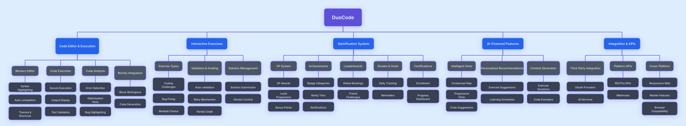
  <figcaption>Figure 4.2: Decomposition Diagram Part 2</figcaption>
</figure>

---

## <div class="chapter">Chapter 5: System Architecture</div>

### <div class="section">5.1 Actor-goal List</div>

| Actor | Goals |
|-------|-------|
| **Learner** | 1. Register, log in, and manage their own profiles.<br>2. Choose preferred programming languages and interface languages.<br>3. Follow structured learning paths and unlock lessons progressively.<br>4. Learn via text, videos, and interactive demos.<br>5. Practice coding using Monaco Editor with syntax highlighting, auto-completion, and real-time feedback.<br>6. Receive AI-powered hints, explanations, and recommendations.<br>7. Complete exercises, earn XP, badges, and certifications.<br>8. Track progress, mastery, and performance analytics.<br>9. Participate in leaderboards, streaks, and challenges. |
| **Content Creator / Instructor** | 1. Create and manage courses, lessons, and coding exercises.<br>2. Categorize exercises by difficulty and validate before publishing.<br>3. Add multimedia (videos, images) and localized content.<br>4. Review and update educational materials.<br>5. Generate content in different formats (text, code, interactive demos). |
| **Administrator** | 1. Manage user accounts and assign roles/permissions.<br>2. Monitor platform analytics and logs.<br>3. Moderate content and enforce warnings or removals.<br>4. Oversee data security, backups, and system performance. **"*-*"**<br>5. Configure integrations and APIs for external services. **"*-*"** |
| **AI System<br>(Gemini / OpenRouter)** | 1. Provide contextual hints and adaptive learning recommendations.<br>2. Analyze learner code to detect errors and suggest improvements.<br>3. Generate additional exercises and code examples. **"*-*"**<br>4. Adjust hint complexity based on user skill level. **"*-*"** |
| **System<br>(Platform / App)** | 1. Securely store and manage user data.<br>2. Execute and validate user code safely.<br>3. Deliver responsive and cross-platform experiences.<br>4. Integrate with external authentication and AI APIs.<br>5. Enforce data protection, input validation, and DDoS prevention. |

### <div class="section">5.2 Use Cases Diagram</div>

<figure>
  
  <figcaption>Figure 5.1: Use Cases Diagram</figcaption>
</figure>

---

### <div class="section">5.3 Use Cases Format</div>

**Learner Use Cases**

---

**Brief Format Use Cases**

**1. View Profile**
The learner views their profile information including avatar, bio, learning goals, and XP progress.

**2. Change Theme**
The learner switches between dark and light mode in the editor settings.

**3. View Badges**
The learner views their earned badges and achievements in their profile gallery.

**4. Check Streak**
The learner checks their current daily learning streak and streak milestones.

**5. View Leaderboard**
The learner views global, weekly, or friend-based leaderboards showing XP rankings.

**6. Update Avatar**
The learner uploads or changes their profile picture.

---

**Casual Format Use Cases**

**7. Register Account**

**Actor:** Learner

**Main Success Scenario:**
1. The learner navigates to the "Sign Up" page of the platform.
2. The learner selects the "Learner" role from account type options.
3. The learner provides required details:
   - Full name
   - Email address
   - Password (with confirmation)
   - Username
4. The learner agrees to Terms and Conditions and submits the form.
5. The system validates input (email format, password strength, username uniqueness).
6. The system sends a verification email to the provided address.
7. The learner clicks the verification link in the email.
8. The system activates the account and redirects to the login page.
9. The learner logs in successfully and sees a welcome message.

**Alternative Scenarios:**

**A1. Email Already Exists**
- At Step 5, if the email is already registered, the system displays:
  *"An account with this email already exists. Please log in or use a different email."*

**A2. Weak Password**
- At Step 5, if the password doesn't meet security criteria (minimum 8 characters with uppercase, lowercase, numbers, special characters), the system displays:
  *"Your password must be at least 8 characters long and include uppercase, lowercase, numbers, and symbols."*

**A3. Username Taken**
- At Step 5, if the username is already in use, the system displays:
  *"This username is already taken. Please choose a different one."*

---

**8. Login to System**

**Actor:** Learner

**Main Success Scenario:**
1. The learner navigates to the login page.
2. The learner enters their email/username and password.
3. The learner clicks "Login."
4. The system validates credentials.
5. The system authenticates the learner and redirects to the dashboard.
6. The learner sees their personalized dashboard with progress and recommendations.

**Alternative Scenarios:**

**A1. Incorrect Credentials**
- At Step 4, if credentials are invalid, the system displays:
  *"Incorrect email/username or password. Please try again."*

**A2. Account Not Verified**
- At Step 4, if the email is not verified, the system displays:
  *"Please verify your email address before logging in. Check your inbox for the verification link."*

**A3. Account Suspended**
- At Step 4, if the account is suspended, the system displays:
  *"Your account has been suspended. Please contact support for assistance."*

---

**9. Choose Learning Path**

**Actor:** Learner

**Main Success Scenario:**
1. The learner logs into the platform.
2. The learner navigates to the "Learning Paths" section.
3. The system displays available tracks (Python, JavaScript, Full-Stack Development, Algorithms).
4. The learner selects their preferred learning path.
5. The system shows a detailed overview including modules, estimated time, and prerequisites.
6. The learner confirms their selection by clicking "Start Path."
7. The system updates the learner's dashboard with the selected path.
8. The learner receives a confirmation message:
   *"You've successfully enrolled in the [Path Name] learning path! Let's start coding."*

**Alternative Scenarios:**

**A1. Prerequisite Not Met**
- At Step 6, if the learner lacks prerequisite skills, the system displays:
  *"This path requires basic programming knowledge. We recommend starting with [Beginner Path]."*
- The system offers to take a diagnostic quiz to determine the appropriate starting point.

**A2. Already Enrolled in Path**
- At Step 6, if the learner is already enrolled, the system displays:
  *"You're already enrolled in this path. Continue learning from your dashboard."*

---

**10. View Lesson Content**

**Actor:** Learner

**Main Success Scenario:**
1. The learner navigates to their enrolled course from the dashboard.
2. The learner selects a module and clicks on a specific lesson.
3. The system displays the lesson content including:
   - Text explanation
   - Video tutorial
   - Interactive code demonstrations
4. The learner reads/watches the content at their own pace.
5. The learner can pause, rewind, or fast-forward video content.
6. The system tracks time spent on the lesson.
7. The learner clicks "Mark as Complete" when finished.
8. The system updates progress and unlocks the next lesson.

**Alternative Scenarios:**

**A1. Lesson Locked**
- At Step 2, if prerequisites aren't completed, the system displays:
  *"Complete the previous lessons to unlock this content."*

**A2. Content Loading Error**
- At Step 3, if content fails to load, the system displays:
  *"We're having trouble loading this lesson. Please refresh or try again later."*

---

**11. Complete Exercise**

**Actor:** Learner

**Main Success Scenario:**
1. The learner navigates to the exercises section of a lesson.
2. The learner selects an available coding challenge.
3. The system displays the problem statement, input/output examples, and starter code.
4. The learner writes code in the Monaco Editor.
5. The learner clicks "Run Tests" to validate their solution.
6. The system executes the code against test cases.
7. The system displays results showing passed/failed test cases.
8. If all tests pass, the learner clicks "Submit Solution."
9. The system awards XP and updates skill mastery.
10. The learner receives a success message with earned points.

**Alternative Scenarios:**

**A1. Tests Failed**
- At Step 7, if some tests fail, the system displays:
  *"Some test cases failed. Review the expected vs. actual output and try again."*
- The learner can request hints or revise their code.

**A2. Syntax Error**
- At Step 6, if the code has syntax errors, the system displays:
  *"Syntax Error: [Error Description]. Check line [X]."*

**A3. Runtime Error**
- At Step 6, if the code causes a runtime error, the system displays:
  *"Runtime Error: [Error Description]. Your code crashed during execution."*

---

**12. Track Progress**

**Actor:** Learner

**Main Success Scenario:**
1. The learner navigates to the "Progress" section from the dashboard.
2. The system displays comprehensive progress metrics:
   - Completed modules and lessons
   - Current XP and level
   - Skill mastery percentages
   - Time spent learning
   - Streak information
3. The learner views a visual roadmap showing their journey.
4. The learner can filter progress by course, skill, or time period.
5. The system highlights weak areas and recommends improvement exercises.

**Alternative Scenarios:**

**A1. No Progress Data**
- At Step 2, if the learner hasn't completed any content, the system displays:
  *"Start your learning journey! Complete lessons to see your progress here."*

---

**13. Earn XP and Level Up**

**Actor:** Learner

**Main Success Scenario:**
1. The learner completes a lesson, exercise, or challenge.
2. The system calculates earned XP based on:
   - Task difficulty
   - Completion time
   - Accuracy
   - Streak bonuses
3. The system adds XP to the learner's total.
4. If the learner reaches a level threshold, the system triggers level-up animation.
5. The learner sees a congratulatory message with new level badge.
6. The system unlocks new content or features appropriate to the new level.

**Alternative Scenarios:**

**A1. Bonus XP Earned**
- At Step 2, if the learner completes on the first attempt or maintains a streak, the system displays:
  *"Bonus XP! You earned +[X] extra points for [reason]."*

---

**14. Participate in Challenge**

**Actor:** Learner

**Main Success Scenario:**
1. The learner navigates to the "Challenges" section.
2. The system displays available challenges (speed, efficiency, weekly contests).
3. The learner selects a challenge and clicks "Join."
4. The system displays challenge rules, deadline, and prize information.
5. The learner confirms participation.
6. The learner completes the challenge within the time limit.
7. The system evaluates the submission and ranks the learner.
8. The learner receives results and rankings on the leaderboard.

**Alternative Scenarios:**

**A1. Challenge Expired**
- At Step 3, if the deadline has passed, the system displays:
  *"This challenge has ended. Check upcoming challenges for new opportunities."*

**A2. Insufficient Skill Level**
- At Step 5, if the challenge requires higher skills, the system displays:
  *"This challenge is recommended for Level [X] learners. Continue learning to unlock it."*

---

**15. View Learning Analytics**

**Actor:** Learner

**Main Success Scenario:**
1. The learner navigates to the "Analytics" dashboard.
2. The system displays detailed performance metrics:
   - Accuracy rates per skill
   - Time-to-completion trends
   - Strength/weakness heatmap
   - Learning velocity
3. The learner views charts and graphs visualizing their data.
4. The system provides recommendations based on analytics.
5. The learner can export reports for personal records.

**Alternative Scenarios:**

**A1. Insufficient Data**
- At Step 2, if there's not enough activity, the system displays:
  *"Complete more lessons to see detailed analytics."*

---

**16. Set Language Preferences**

**Actor:** Learner

**Main Success Scenario:**
1. The learner navigates to Settings.
2. The learner selects "Language Preferences."
3. The system displays options for:
   - Interface language (Arabic/English)
   - Primary programming language (Python/JavaScript)
4. The learner makes selections and clicks "Save."
5. The system updates preferences and refreshes the interface.
6. The learner sees confirmation: *"Preferences updated successfully."*

**Alternative Scenarios:**

**A1. Save Error**
- At Step 5, if saving fails, the system displays:
  *"Unable to save preferences. Please try again."*

---

**17. Bookmark Lesson**

**Actor:** Learner

**Main Success Scenario:**
1. The learner is viewing a lesson.
2. The learner clicks the "Bookmark" icon.
3. The system adds the lesson to the learner's bookmarks.
4. The learner sees confirmation: *"Lesson bookmarked!"*
5. The learner can access bookmarks from their profile.

**Alternative Scenarios:**

**A1. Already Bookmarked**
- At Step 3, if the lesson is already bookmarked, the system removes it and displays:
  *"Bookmark removed."*

---

**18. Share Solution**

**Actor:** Learner

**Main Success Scenario:**
1. The learner completes an exercise successfully.
2. The learner navigates to the "Solution Gallery" section.
3. The learner clicks "Share My Solution."
4. The learner adds optional comments or explanations.
5. The learner submits the solution for community viewing.
6. The system publishes the solution with the learner's profile.
7. Other learners can view, upvote, and comment.

**Alternative Scenarios:**

**A1. Solution Not Approved**
- At Step 6, if the solution violates guidelines, moderators reject it with feedback.

---

**19. Join Discussion Forum**

**Actor:** Learner

**Main Success Scenario:**
1. The learner navigates to the "Community" section.
2. The learner browses discussion topics or searches for specific questions.
3. The learner selects a thread to read.
4. The learner posts a comment or question.
5. The system publishes the comment.
6. Other users and mentors can respond.
7. The learner receives notifications for replies.

**Alternative Scenarios:**

**A1. Inappropriate Content**
- At Step 5, if the post contains flagged content, the system displays:
  *"Your post was flagged. Please review community guidelines."*

---

**20. Recover Password**

**Actor:** Learner

**Main Success Scenario:**
1. The learner clicks "Forgot Password" on the login page.
2. The learner enters their registered email address.
3. The system validates the email.
4. The system sends a password reset link to the email.
5. The learner clicks the link and is directed to reset page.
6. The learner enters and confirms a new password.
7. The system updates the password.
8. The learner sees confirmation: *"Password reset successfully. You can now log in."*

**Alternative Scenarios:**

**A1. Email Not Found**
- At Step 3, if the email isn't registered, the system displays:
  *"No account found with this email address."*

**A2. Link Expired**
- At Step 5, if the reset link expired, the system displays:
  *"This link has expired. Please request a new password reset."*

---

**Fully Dressed Format Use Cases**

**21. Practice Coding with Monaco Editor**

**Primary Actor:** Learner

**Stakeholders and Interests:**
- **Learner:** Wants to write, execute, and debug code efficiently in an intuitive environment.
- **Platform:** Needs to provide secure, real-time code execution with helpful feedback.

**Preconditions:**
- Learner must be logged in.
- Learner must have access to a lesson or exercise with a coding component.
- Monaco Editor and execution APIs must be operational.

**Postconditions:**
- Code is written, executed, and results are displayed.
- Progress is tracked and saved.
- Learner receives feedback on their solution.

**Main Success Scenario:**
1. The learner navigates to a coding exercise or lesson.
2. The system loads the Monaco Editor with syntax highlighting for the selected language (Python/JavaScript).
3. The system displays the problem statement, starter code (if any), and expected output.
4. The learner writes their code in the editor.
5. The editor provides real-time features:
   - Auto-completion
   - Syntax highlighting
   - Error underlining
   - Code folding
6. The learner clicks "Run Code" to test their solution.
7. The system sends the code to the secure execution API.
8. The execution API runs the code in an isolated sandbox environment.
9. The system returns:
   - Console output
   - Execution time
   - Memory usage
   - Error messages (if any)
10. The results are displayed in the output panel below the editor.
11. If successful, the learner clicks "Submit Solution."
12. The system validates the solution against all test cases.
13. The system awards XP, updates mastery metrics, and saves the code.
14. The learner sees a success message with earned rewards.

**Alternative Scenarios:**

**A1. Syntax Error Detected**
- At Step 6, if the learner's code contains syntax errors:
  - The editor underlines the error in red.
  - A tooltip displays: *"Syntax Error: [Description]"*
  - The learner corrects the error and continues.

**A2. Runtime Error During Execution**
- At Step 9, if the code crashes during execution:
  - The system displays: *"Runtime Error: [Error Type]. Your code encountered an issue at line [X]."*
  - The learner can view the stack trace and debug.

**A3. Timeout Error**
- At Step 9, if code execution exceeds the time limit:
  - The system displays: *"Execution Timeout: Your code took too long to run. Consider optimizing your solution."*
  - The learner can revise their approach.

**A4. Test Cases Failed**
- At Step 12, if some test cases fail:
  - The system displays which tests passed/failed with input/output comparisons.
  - The learner can revise and resubmit.

**A5. Code Execution Service Unavailable**
- At Step 7, if the execution API is down:
  - The system displays: *"The code execution service is temporarily unavailable. Please try again shortly."*
  - The learner's code is saved as a draft.

**A6. Invalid Programming Language**
- At Step 2, if the selected language isn't supported:
  - The system displays: *"This language is not currently supported. Please select Python or JavaScript."*

**Extensions:**

**E1. Using Code Snapshotting**
- The learner can save multiple versions of their solution.
- At any point, the learner clicks "Save Snapshot."
- The system stores the current code version with a timestamp.
- The learner can compare or restore previous versions.

**E2. Accessing Model Solutions**
- After successful submission, the learner clicks "View Solutions."
- The system displays model solutions with complexity analysis.
- The learner can compare their approach with optimal solutions.

**Special Requirements:**
- Monaco Editor must support Python and JavaScript with full IntelliSense.
- Code execution must complete within 5 seconds for standard exercises.
- The sandbox environment must prevent malicious code execution.
- All code submissions must be encrypted during transmission.
- The editor must be accessible via keyboard shortcuts.
- Dark and light themes must be supported.

**Frequency of Use:**
- This is one of the most frequently used features, occurring multiple times per session for active learners.

**Open Issues:**
- Should we support additional languages (Java, C++) in future releases?
- How do we handle collaborative coding exercises?

---

**22. Receive AI-Powered Hints**

**Primary Actor:** Learner

**Stakeholders and Interests:**
- **Learner:** Wants contextual, progressive hints that guide without giving away the complete solution.
- **Platform:** Needs to provide intelligent assistance that enhances learning without creating dependency.
- **AI System (Gemini/OpenRouter):** Provides adaptive hints based on code analysis.

**Preconditions:**
- Learner must be working on an exercise.
- Learner must be logged in.
- AI API services (OpenRouter/Gemini) must be operational.
- Learner must have made at least one attempt at the exercise.

**Postconditions:**
- Appropriate hint is provided based on learner's current code and skill level.
- Hint usage is tracked for analytics.
- Learner can progress with better understanding.

**Main Success Scenario:**
1. The learner is working on a coding exercise and encounters difficulty.
2. The learner clicks the "Get Hint" button.
3. The system analyzes the learner's current code and attempt history.
4. The system determines the learner's skill level and hint count for this exercise.
5. The system sends a request to the AI API with:
   - Problem statement
   - Learner's current code
   - Skill level
   - Previous hint history
   - Requested hint level
6. The AI API processes the request and generates an appropriate hint.
7. The AI returns a hint that:
   - Doesn't reveal the complete solution
   - Addresses the learner's specific issue
   - Matches the learner's comprehension level
8. The system displays the hint in a panel below the editor.
9. The hint includes:
   - Conceptual guidance
   - Suggested approach
   - Relevant examples (if needed)
10. The learner reads the hint and applies the guidance.
11. The system tracks the hint usage and adjusts XP rewards accordingly.
12. If the learner needs additional help, they can request more specific hints (progressive levels).

**Alternative Scenarios:**

**A1. No Attempt Made Yet**
- At Step 2, if the learner hasn't written any code:
  - The system displays: *"Try writing some code first! Hints are most helpful after you've made an attempt."*
  - The "Get Hint" button remains disabled until code is written.

**A2. Maximum Hints Reached**
- At Step 4, if the learner has used all available hints for this exercise:
  - The system displays: *"You've used all available hints. Try applying what you've learned or view the model solution."*
  - The learner is offered the option to view the complete solution (with reduced XP reward).

**A3. AI Service Unavailable**
- At Step 6, if the AI API is down or unresponsive:
  - The system displays: *"AI hints are temporarily unavailable. Here's a pre-generated hint for this problem."*
  - The system provides a fallback hint from the database.

**A4. Request Timeout**
- At Step 6, if the AI API doesn't respond within 10 seconds:
  - The system displays: *"The hint service is taking longer than usual. Please try again."*
  - The request is logged for admin review.

**A5. Inappropriate Code Detected**
- At Step 5, if the learner's code contains inappropriate content:
  - The system doesn't send to AI and displays: *"Please ensure your code is appropriate before requesting hints."*

**A6. Hint Too Advanced**
- At Step 7, if the AI generates a hint beyond the learner's level:
  - The system uses natural language processing to simplify the hint.
  - If simplification fails, a pre-generated hint is used instead.

**Extensions:**

**E1. Progressive Hint Levels**
- First hint: Conceptual guidance only
- Second hint: Specific approach suggestion
- Third hint: Pseudocode or example structure
- Fourth hint: Partial code implementation
- Fifth hint: Complete solution with explanation

**E2. Code Analysis Insights**
- The AI identifies specific issues in the learner's code:
  - Logic errors
  - Incorrect algorithm choice
  - Edge case handling
- The hint addresses these specific issues.

**E3. Hint History**
- The learner can view all previously received hints.
- The learner clicks "Previous Hints" to review earlier guidance.
- This helps reinforce learning without requesting duplicate hints.

**E4. Contextual Examples**
- If the hint references a concept, the system includes a link to relevant lesson content.
- The learner can click to review the concept before continuing.

**Special Requirements:**
- AI hints must not reveal complete solutions directly.
- Hint generation must complete within 10 seconds.
- The system must track hint usage for XP calculation (fewer hints = more XP).
- Hints must be appropriate for the learner's skill level.
- The AI API must be rate-limited to prevent abuse.
- All API communications must be encrypted.
- Fallback hints must be available for all exercises.

**Frequency of Use:**
- Moderate to high frequency, especially among beginner learners.
- Expected usage: 30-40% of learners per exercise.

**Open Issues:**
- Should we implement a "hint cost" using virtual currency?
- How do we balance hint availability with learning independence?
- Should hints be personalized based on learning style preferences?

---

**23. Complete Certification Track**

**Primary Actor:** Learner

**Stakeholders and Interests:**
- **Learner:** Wants to earn a credential that validates their programming skills.
- **Platform:** Needs to ensure certification standards are maintained and verifiable.
- **Potential Employers/Institutions:** Want assurance that certifications represent genuine competency.

**Preconditions:**
- Learner must be logged in.
- Learner must meet prerequisite requirements for the certification track.
- Certification must be available and active.
- Learner must have completed required foundational courses.

**Postconditions:**
- All certification requirements are completed.
- Learner receives a digital certificate.
- Certificate is added to learner's profile and can be shared.
- Certification data is recorded in the system.

**Main Success Scenario:**
1. The learner navigates to the "Certifications" section.
2. The system displays available certification tracks with details:
   - Required skills
   - Time commitment
   - Prerequisites
   - Benefits
3. The learner selects a certification track (e.g., "Python Programming Fundamentals").
4. The system verifies the learner meets prerequisites.
5. The learner clicks "Enroll in Certification."
6. The system creates a certification dashboard showing:
   - Required courses (5-10 courses)
   - Required projects (2-3 portfolio projects)
   - Final assessment
   - Completion deadline (if applicable)
   - Progress tracker
7. The learner works through required courses and completes lessons/exercises.
8. The system tracks completion of each requirement.
9. The learner completes required portfolio projects:
   - Builds functional applications
   - Submits projects for review
   - Receives feedback and approval
10. After completing all courses and projects, the learner becomes eligible for the final assessment.
11. The learner starts the final certification exam:
    - Timed coding challenges (90-120 minutes)
    - Multiple difficulty levels
    - Real-world problem scenarios
12. The learner completes the exam within the time limit.
13. The system auto-grades objective questions and submits code for evaluation.
14. If code evaluation requires human review, the system assigns a mentor reviewer.
15. The reviewer evaluates code quality, efficiency, and correctness.
16. If the learner achieves the passing score (e.g., 70% or higher):
    - The system generates a digital certificate with unique ID.
    - Certificate includes: learner name, certification title, completion date, certificate ID, platform signature.
17. The system adds the certificate to the learner's profile.
18. The learner receives an email with certificate PDF and verification link.
19. The learner can share the certificate on LinkedIn, resume, or portfolio.
20. The certificate is permanently recorded on blockchain for verification (optional feature).

**Alternative Scenarios:**

**A1. Prerequisites Not Met**
- At Step 4, if prerequisites aren't completed:
  - The system displays: *"You need to complete [Course Names] before enrolling in this certification."*
  - The system shows a clear path to complete prerequisites.
  - The learner is offered to start the prerequisite courses.

**A2. Enrollment Limit Reached**
- At Step 5, if certification enrollment is at capacity:
  - The system displays: *"This certification track is currently full. Join the waitlist to be notified when spots open."*
  - The learner can join the waitlist.

**A3. Project Submission Rejected**
- At Step 9, if a project doesn't meet requirements:
  - The reviewer provides specific feedback on issues.
  - The system displays: *"Your project needs revision. See reviewer comments for details."*
  - The learner revises and resubmits (up to 2 additional attempts).
  - If third attempt fails, the learner must retake prerequisite materials.

**A4. Failed Final Assessment**
- At Step 16, if the score is below passing threshold:
  - The system displays: *"You scored [X]%, but need 70% to pass. Review the areas where you struggled and try again."*
  - The system identifies weak skills and recommends review materials.
  - The learner must wait 7 days before retaking.
  - The learner gets up to 3 attempts total.

**A5. Time Limit Exceeded on Exam**
- At Step 12, if the learner doesn't complete within time:
  - The system auto-submits completed portions.
  - Incomplete sections receive no credit.
  - The attempt counts toward the maximum allowed.

**A6. Technical Issues During Exam**
- At Step 11-12, if system issues occur:
  - The system saves all work automatically every 30 seconds.
  - If disconnected, the learner can resume with remaining time.
  - If issue is system-wide, the exam is rescheduled without penalty.

**A7. Deadline Missed**
- If certification has a deadline (e.g., 6 months):
  - 2 weeks before deadline: System sends reminder email.
  - 1 week before: System sends urgent notification.
  - If missed: *"The deadline for this certification has passed. You can re-enroll for the next cohort."*

**A8. Plagiarism Detected**
- At Step 9 or 13, if code plagiarism is detected:
  - The system flags the submission for admin review.
  - Admin investigates and may disqualify the learner.
  - Serious violations result in temporary suspension.

**Extensions:**

**E1. Early Completion Bonus**
- If the learner completes ahead of schedule:
  - The system awards a "Fast Learner" badge.
  - The certificate includes an "Accelerated Track" distinction.

**E2. Certificate Verification**
- Anyone can verify certificate authenticity:
  - Enter certificate ID on platform verification page.
  - System displays certificate details and learner name.
  - Blockchain verification ensures tampering prevention.

**E3. Certificate Levels**
- Certifications come in tiers:
  - Bronze: Basic proficiency (70-79%)
  - Silver: Solid competence (80-89%)
  - Gold: Excellence (90-100%)
- Certificate design reflects achievement level.

**E4. Portfolio Showcase**
- Completed certification projects are featured in learner's public portfolio.
- Projects can be viewed by recruiters or other learners.
- Code quality and creativity are highlighted.

**E5. Certification Expiry and Renewal**
- Some certifications require renewal every 2 years.
- System notifies learner 3 months before expiry.
- Renewal involves completing updated modules and a shorter assessment.

**Special Requirements:**
- Final assessments must be proctored using AI monitoring (webcam + screen recording) to prevent cheating.
- Certificates must include unique verification IDs.
- Certificate PDFs must be downloadable and professionally formatted.
- The system must track all certification attempts and scores.
- Mentor reviewers must complete evaluations within 5 business days.
- Certificates must comply with digital credential standards.
- All exam content must be kept confidential and rotated regularly.

**Frequency of Use:**
- Lower frequency compared to regular learning activities.
- Estimated 20-30% of active learners pursue certifications.
- Peak enrollment periods: End of quarter/year.

**Open Issues:**
- Should certifications have an expiration date?
- How do we price premium certifications vs. free learning?
- Should we partner with universities for credit recognition?
- What level of anti-cheating measures is appropriate?

---

**24. Enable Two-Factor Authentication** (continued)

**Alternative Scenarios:** (continued)

**A2. Backup Codes Not Saved**
- At Step 16, if the learner tries to continue without confirming:
  - The system displays: *"Please confirm you've saved your backup codes. You won't be able to view them again."*
  - The "Continue" button remains disabled until confirmed.

**A3. Learner Chooses SMS Method**
- At Step 5, if the learner selects SMS:
  - The system prompts for phone number.
  - The system sends a test verification code via SMS.
  - The learner enters the code to verify the phone number.
  - Setup proceeds with SMS as the 2FA method.
  - Note: The system warns that SMS is less secure than authenticator apps.

**A4. Learner Chooses Email Method**
- At Step 5, if the learner selects email verification:
  - The system uses the registered email address.
  - The system sends a test verification code via email.
  - The learner enters the code to confirm.
  - Setup completes with email as the 2FA method.

**A5. QR Code Won't Scan**
- At Step 8, if the learner can't scan the QR code:
  - The learner clicks "Can't scan? Enter code manually."
  - The system displays the secret key as text.
  - The learner manually enters the key into their authenticator app.
  - Setup continues from Step 10.

**A6. Lost Authenticator Device**
- After 2FA is enabled, if the learner loses access:
  - During login, the learner clicks "Use backup code instead."
  - The learner enters one of their saved recovery codes.
  - The system validates the code and grants access.
  - The system prompts the learner to reconfigure 2FA.
  - The used recovery code is marked as consumed.

**A7. All Backup Codes Used**
- If all 10 backup codes are exhausted:
  - The learner must contact support with identity verification.
  - Support verifies identity through:
    - Email verification
    - Security questions
    - Recent activity verification
  - Support can temporarily disable 2FA or reset it.

**A8. Technical Error During Setup**
- At any step, if a system error occurs:
  - The system displays: *"We encountered an error during 2FA setup. Please try again or contact support."*
  - The setup is rolled back; 2FA is not enabled.
  - The learner can retry after a few minutes.

**Extensions:**

**E1. Disable 2FA**
- The learner navigates to Security settings.
- The learner clicks "Disable Two-Factor Authentication."
- The system requires current password + 2FA code for confirmation.
- The system warns about reduced security.
- If confirmed, 2FA is disabled and all backup codes are invalidated.

**E2. Regenerate Backup Codes**
- If the learner loses their backup codes:
  - The learner navigates to Security settings.
  - The learner authenticates with password + 2FA code.
  - The learner clicks "Generate New Backup Codes."
  - The system creates 10 new codes and invalidates old ones.
  - The learner saves the new codes securely.

**E3. Change 2FA Method**
- The learner can switch from SMS to authenticator app (or vice versa):
  - The learner navigates to Security settings.
  - The learner selects "Change 2FA Method."
  - The system requires current 2FA verification.
  - Setup for new method proceeds as in main scenario.

**E4. Trusted Devices**
- After successful 2FA login:
  - The system offers: *"Trust this device for 30 days?"*
  - If accepted, 2FA is not required on this device for 30 days.
  - Trusted devices can be managed in Security settings.

**Special Requirements:**
- 2FA codes must expire after 30 seconds (standard TOTP protocol).
- Backup codes must be cryptographically secure random strings.
- The system must support time-based one-time passwords (TOTP) standard.
- SMS delivery must occur within 60 seconds.
- Recovery codes must be hashed in the database, not stored in plain text.
- The system must rate-limit 2FA verification attempts (max 5 per 15 minutes).
- All 2FA setup and verification events must be logged for security auditing.

**Frequency of Use:**
- One-time setup for security-conscious learners.
- Estimated adoption rate: 25-40% of active users.
- Daily use during login for enrolled users.

**Open Issues:**
- Should 2FA be mandatory for learners with certification credentials?
- Should we support hardware security keys (FIDO2/U2F)?
- How do we handle learners in regions with poor SMS delivery?

---

**Content Creator Use Cases**

---

**Brief Format Use Cases**

**1. View Created Content**
The content creator views a list of all courses, lessons, and exercises they have authored.

**2. Preview Lesson**
The content creator previews how learners will see and interact with a lesson before publishing.

**3. Duplicate Exercise**
The content creator clones an existing exercise as a template for creating similar challenges.

**4. Delete Draft**
The content creator removes unpublished course materials or exercises from their drafts.

---

**Casual Format Use Cases**

**5. Create Course**

**Actor:** Content Creator

**Main Success Scenario:**
1. The content creator logs into the platform.
2. The content creator navigates to "Content Management" section.
3. The content creator clicks "Create New Course."
4. The system displays a course creation form with fields:
   - Course title
   - Course description
   - Programming language (Python/JavaScript/Multi-language)
   - Difficulty level (Beginner/Intermediate/Advanced)
   - Estimated duration
   - Prerequisites
   - Course thumbnail image
5. The content creator fills in all required information.
6. The content creator organizes the course into modules:
   - Adds module titles
   - Orders modules sequentially
   - Assigns estimated time per module
7. The content creator clicks "Create Course."
8. The system validates all inputs and generates a unique course ID.
9. The system creates the course structure and saves it as a draft.
10. The system displays: *"Course created successfully! Now you can add lessons and exercises."*
11. The content creator is redirected to the course dashboard to begin adding content.

**Alternative Scenarios:**

**A1. Missing Required Fields**
- At Step 7, if required fields are empty:
  - The system displays: *"Please complete all required fields: [Field Names]."*
  - Incomplete fields are highlighted in red.

**A2. Duplicate Course Title**
- At Step 8, if a course with the same title exists:
  - The system displays: *"A course with this title already exists. Please choose a different title or modify the existing course."*

**A3. Invalid Image Format**
- At Step 5, if the thumbnail isn't in an accepted format:
  - The system displays: *"Please upload an image in JPG, PNG, or WebP format."*

**A4. Course Creation Limit Reached**
- At Step 3, if the creator has reached their course limit:
  - The system displays: *"You've reached the maximum number of draft courses (5). Please publish or delete existing drafts."*

---

**6. Create Lesson**

**Actor:** Content Creator

**Main Success Scenario:**
1. The content creator selects an existing course from their dashboard.
2. The content creator selects a module within the course.
3. The content creator clicks "Add New Lesson."
4. The system displays the lesson creation interface with sections:
   - Lesson title
   - Lesson objectives
   - Content type selection (Text/Video/Interactive Demo)
   - Estimated completion time
5. The content creator enters the lesson title and objectives.
6. The content creator creates multi-format content:
   - Writes explanatory text with rich formatting
   - Uploads or embeds video tutorial
   - Creates interactive code demonstrations
7. The content creator adds code snippets with syntax highlighting.
8. The content creator sets lesson order within the module.
9. The content creator can mark the lesson as:
   - Draft (not visible to learners)
   - Published (immediately available)
   - Scheduled (available on specific date)
10. The content creator clicks "Save Lesson."
11. The system validates content and saves the lesson.
12. The system displays: *"Lesson saved successfully!"*

**Alternative Scenarios:**

**A1. Video Upload Fails**
- At Step 6, if video upload encounters an error:
  - The system displays: *"Video upload failed. Please ensure the file is under 500MB and in MP4 format."*
  - Text content is saved as draft automatically.

**A2. Content Too Short**
- At Step 11, if the lesson content is minimal:
  - The system warns: *"This lesson appears brief. Consider adding more detail to help learners understand the concept."*
  - The creator can proceed or add more content.

**A3. Missing Prerequisites**
- At Step 10, if complex concepts lack foundation:
  - The system suggests: *"This lesson covers advanced topics. Consider linking prerequisite lessons."*

---

**7. Add Multimedia Content**

**Actor:** Content Creator

**Main Success Scenario:**
1. The content creator is editing a lesson.
2. The content creator clicks "Add Media" in the content editor.
3. The system displays media upload options:
   - Upload video file
   - Embed YouTube/Vimeo link
   - Upload images/diagrams
   - Add audio explanations
4. The content creator selects "Upload Video."
5. The content creator selects a video file from their device.
6. The system validates file size (max 500MB) and format (MP4, WebM).
7. The system displays upload progress bar.
8. The video uploads successfully to cloud storage.
9. The system generates a video player preview.
10. The content creator positions the video within the lesson content.
11. The content creator adds captions or transcripts (optional).
12. The content creator saves the lesson with embedded media.
13. The system confirms: *"Media added successfully!"*

**Alternative Scenarios:**

**A1. File Size Exceeds Limit**
- At Step 6, if the video is larger than 500MB:
  - The system displays: *"Video file is too large. Please compress to under 500MB or use an external hosting link."*

**A2. Unsupported Format**
- At Step 6, if the file format isn't supported:
  - The system displays: *"This format is not supported. Please upload MP4 or WebM files."*

**A3. Upload Interrupted**
- At Step 7, if internet connection drops:
  - The system attempts to resume upload.
  - If unsuccessful after 3 attempts: *"Upload interrupted. Please try again."*

**A4. Embed Link Invalid**
- At Step 4, if an external video link doesn't work:
  - The system displays: *"Unable to embed this link. Please verify the URL and privacy settings."*

---

**8. Localize Content**

**Actor:** Content Creator

**Main Success Scenario:**
1. The content creator selects a published course or lesson.
2. The content creator clicks "Add Translation."
3. The system displays available languages (Arabic, English).
4. The content creator selects the target language (e.g., Arabic).
5. The system creates a duplicate content template with original text.
6. The content creator translates:
   - Lesson titles and descriptions
   - Content paragraphs
   - Code comments
   - Exercise instructions
7. The content creator adjusts formatting for RTL (right-to-left) if translating to Arabic.
8. The content creator can use AI-assisted translation for initial draft.
9. The content creator reviews and refines the AI-generated translation.
10. The content creator saves the localized version.
11. The system marks the content as available in multiple languages.
12. Learners can now switch between languages when viewing the content.

**Alternative Scenarios:**

**A1. AI Translation Unavailable**
- At Step 8, if AI service is down:
  - The system displays: *"AI translation is temporarily unavailable. Please translate manually."*

**A2. Incomplete Translation**
- At Step 10, if some sections remain untranslated:
  - The system warns: *"Some content is still in [Original Language]. Do you want to save anyway?"*
  - The creator can save as draft or complete translation.

---

**9. Categorize Exercise Difficulty**

**Actor:** Content Creator

**Main Success Scenario:**
1. The content creator is creating or editing an exercise.
2. The system displays difficulty level options:
   - Beginner (Basic syntax and concepts)
   - Intermediate (Multiple concepts, logic building)
   - Advanced (Complex algorithms, optimization)
   - Expert (Real-world problems, system design)
3. The content creator selects the appropriate difficulty.
4. The system displays difficulty criteria to guide selection.
5. The content creator assigns skill tags (e.g., "loops", "arrays", "recursion").
6. The system estimates average completion time based on difficulty.
7. The content creator can test the exercise themselves to verify difficulty.
8. The content creator saves the categorization.
9. The system uses this information for:
   - Adaptive learning path recommendations
   - Filtering in course catalog
   - XP reward calculation

**Alternative Scenarios:**

**A1. Difficulty Mismatch Detected**
- At Step 8, if the system's AI analysis suggests different difficulty:
  - The system displays: *"Our analysis suggests this exercise may be [Suggested Level]. Would you like to review?"*
  - The creator can keep their choice or adjust.

---

**10. Update Course Materials**

**Actor:** Content Creator

**Main Success Scenario:**
1. The content creator navigates to "My Courses."
2. The content creator selects a published course.
3. The content creator identifies content to update (lesson, exercise, video).
4. The content creator clicks "Edit."
5. The system loads the content in edit mode.
6. The content creator makes changes:
   - Updates outdated information
   - Fixes errors or typos
   - Improves explanations
   - Adds new examples
7. The content creator saves changes.
8. The system creates a new version and maintains version history.
9. If the course has active learners, the system displays: *"[X] students are enrolled. Notify them of updates?"*
10. The content creator chooses to send update notification.
11. Enrolled learners receive: *"[Course Name] has been updated with new content!"*
12. The system logs all changes for audit trail.

**Alternative Scenarios:**

**A1. Breaking Changes**
- At Step 6, if changes affect exercise solutions or grading:
  - The system warns: *"This change may affect existing student submissions. Consider creating a new exercise instead."*

**A2. Multiple Editors Conflict**
- At Step 5, if another creator is editing simultaneously:
  - The system displays: *"[Creator Name] is currently editing this content. Changes may conflict."*
  - The system locks editing or enables collaborative editing mode.

---

**11. Review Student Submissions**

**Actor:** Content Creator

**Main Success Scenario:**
1. The content creator navigates to "Student Activity" dashboard.
2. The system displays recent submissions for the creator's courses.
3. The content creator filters by:
   - Specific course or exercise
   - Submission date
   - Grading status (graded/ungraded)
4. The content creator selects a student submission to review.
5. The system displays:
   - Student information (anonymous option available)
   - Problem statement
   - Student's code solution
   - Test case results
   - Execution metrics
6. The content creator reviews the code for:
   - Correctness
   - Code quality and style
   - Efficiency
   - Best practices
7. The content creator provides written feedback.
8. The content creator can award partial credit if applicable.
9. The content creator assigns a final grade.
10. The content creator clicks "Submit Review."
11. The system saves the review and updates the student's grade.
12. The student receives notification with feedback.

**Alternative Scenarios:**

**A1. Auto-Graded Exercise**
- At Step 4, if the exercise is automatically graded:
  - The system displays: *"This exercise was automatically graded. Manual review is optional."*
  - The creator can still provide additional feedback.

**A2. Plagiarism Suspected**
- At Step 6, if the system detects potential plagiarism:
  - The system flags the submission with similarity score.
  - The creator investigates and can report if confirmed.

---

**12. Manage Course Structure**

**Actor:** Content Creator

**Main Success Scenario:**
1. The content creator selects a course from their dashboard.
2. The content creator clicks "Edit Course Structure."
3. The system displays the course outline with all modules and lessons.
4. The content creator can:
   - Drag and drop to reorder modules
   - Drag and drop to reorder lessons within modules
   - Add new modules
   - Rename modules
   - Delete modules (with confirmation)
5. The content creator sets prerequisites:
   - Marks lessons that must be completed before others unlock
   - Creates skill dependencies
6. The content creator saves the new structure.
7. The system validates that prerequisites don't create circular dependencies.
8. The system updates the course structure.
9. If students are enrolled, the system adjusts their progress tracking.
10. The system displays: *"Course structure updated successfully!"*

**Alternative Scenarios:**

**A1. Circular Dependency Detected**
- At Step 7, if prerequisites create a loop:
  - The system displays: *"Error: This creates a circular dependency. Lesson A cannot require Lesson B if Lesson B requires Lesson A."*
  - Changes are not saved until resolved.

**A2. Active Students Affected**
- At Step 6, if reordering affects students mid-course:
  - The system warns: *"[X] students are currently progressing through this course. Major restructuring may confuse them."*
  - The creator can proceed with caution or schedule changes.

---

**Fully Dressed Format Use Cases**

**13. Create Coding Exercise**

**Primary Actor:** Content Creator

**Stakeholders and Interests:**
- **Content Creator:** Wants to design effective, fair exercises that test specific skills.
- **Learners:** Need clear instructions, fair test cases, and appropriate difficulty.
- **Platform:** Needs quality-controlled exercises that can be auto-graded reliably.

**Preconditions:**
- Content creator must be logged in and authorized.
- Content creator must have at least one course created.
- Content creator must have completed platform training on exercise creation.

**Postconditions:**
- Exercise is created with complete problem statement, test cases, and model solution.
- Exercise is validated and ready for publishing or remains in draft.
- Exercise can be discovered by learners in appropriate course sections.

**Main Success Scenario:**
1. The content creator navigates to a course lesson.
2. The content creator clicks "Add Exercise."
3. The system displays the exercise creation wizard with tabs:
   - Problem Details
   - Test Cases
   - Model Solution
   - Hints
   - Metadata
4. **Problem Details Tab:** The content creator enters:
   - Exercise title (clear, concise)
   - Problem statement with context
   - Input format explanation
   - Output format explanation
   - Example inputs and outputs (2-3 examples)
   - Constraints (time limits, input ranges)
5. The content creator writes starter code template (optional).
6. **Test Cases Tab:** The content creator creates test cases:
   - At least 5 test cases (minimum requirement)
   - Mix of edge cases, typical cases, and boundary cases
   - For each test case: input data, expected output, visibility (public/hidden)
   - Test case descriptions explaining what is being tested
7. The content creator marks 2-3 test cases as public (visible to learners).
8. The content creator marks remaining cases as hidden (for final validation).
9. **Model Solution Tab:** The content creator writes a reference solution:
   - Correct, efficient code in the target language
   - Well-commented for educational value
   - Multiple approaches (optimal, brute-force, alternative methods)
10. The content creator runs the model solution against all test cases.
11. The system validates that the model solution passes all test cases.
12. **Hints Tab:** The content creator creates progressive hints:
    - Level 1: Conceptual hint (approach suggestion)
    - Level 2: Algorithmic hint (specific strategy)
    - Level 3: Implementation hint (code structure)
13. **Metadata Tab:** The content creator sets:
    - Difficulty level (Beginner/Intermediate/Advanced)
    - Estimated time to complete
    - Skill tags (e.g., "arrays", "sorting", "dynamic-programming")
    - XP reward value
14. The content creator clicks "Validate Exercise."
15. The system runs comprehensive validation:
    - Checks all test cases execute successfully
    - Verifies model solution passes
    - Tests for infinite loops or timeout issues
    - Checks for ambiguous problem statements
    - Validates that hidden test cases aren't trivially guessable
16. If validation passes, the system displays: *"Exercise validated successfully!"*
17. The content creator can:
    - Save as draft
    - Submit for peer review
    - Publish immediately (if authorized)
18. The content creator selects "Submit for Peer Review."
19. The system assigns the exercise to 2-3 other content creators for review.
20. Reviewers test the exercise and provide feedback within 3-5 days.
21. The content creator receives feedback and makes revisions if needed.
22. After approval, the exercise is published and becomes available to learners.

**Alternative Scenarios:**

**A1. Insufficient Test Cases**
- At Step 15, if fewer than 5 test cases exist:
  - The system displays: *"Add at least 5 test cases to ensure thorough testing."*
  - Validation fails; exercise cannot be published.

**A2. Model Solution Fails Test Cases**
- At Step 11, if the model solution doesn't pass all tests:
  - The system displays: *"Your model solution failed test case [X]. Expected: [Y], Got: [Z]."*
  - The creator must fix either the solution or the test case.

**A3. Ambiguous Problem Statement**
- At Step 15, if AI analysis detects unclear instructions:
  - The system suggests: *"The problem statement may be unclear. Consider adding examples or clarifying [specific area]."*
  - Creator can revise or proceed with warning.

**A4. Test Case Timeout**
- At Step 15, if test execution exceeds time limits:
  - The system displays: *"Test case [X] exceeds the 5-second limit. Consider optimizing or adjusting constraints."*

**A5. Duplicate Exercise Detected**
- At Step 15, if a similar exercise exists:
  - The system displays: *"A similar exercise was found: [Exercise Name]. This may be redundant."*
  - Creator can proceed or modify to differentiate.

**A6. Peer Review Rejection**
- At Step 21, if reviewers identify serious flaws:
  - The system compiles reviewer feedback.
  - The creator must address concerns before resubmission.
  - Creator can discuss with reviewers or appeal to admin.

**A7. Hidden Test Cases Too Predictable**
- At Step 15, if hidden cases are similar to public ones:
  - The system warns: *"Hidden test cases should cover scenarios not demonstrated in public tests."*
  - Creator should add more diverse edge cases.

**A8. Multiple Programming Languages**
- At Step 9, if the exercise supports multiple languages:
  - Creator must provide model solutions in each language.
  - Each solution is validated independently.
  - Language-specific hints may be needed.

**Extensions:**

**E1. Complexity Analysis Addition**
- Creator adds Big O notation explanations:
  - Time complexity of optimal solution
  - Space complexity analysis
  - Comparison with alternative approaches
- This enhances educational value.

**E2. Interactive Test Case Builder**
- System provides GUI to build test cases:
  - Generate random inputs within constraints
  - Automatically compute expected outputs using model solution
  - Visualize test coverage

**E3. Exercise Difficulty Calibration**
- After 50+ student attempts:
  - System analyzes completion rates and average time
  - If actual difficulty differs from assigned level, system suggests recalibration
  - Creator can adjust difficulty rating based on real data

**E4. Community Test Cases**
- Advanced learners can suggest additional test cases
- Creator reviews and can incorporate into the exercise
- Contributors receive recognition credits

**E5. Exercise Versioning**
- Creator can update exercises without disrupting active students
- System maintains versions:
  - V1 for students who started before update
  - V2 for new enrollments
- Both versions tracked separately

**Special Requirements:**
- Exercise validation must complete within 30 seconds.
- Test cases must be stored securely; hidden cases not accessible to learners.
- Model solutions must be encrypted in database.
- System must support Python, JavaScript, and eventually Java/C++.
- Code execution sandbox must prevent malicious code.
- All exercises must have at least one working solution verified.
- Problem statements must be grammar-checked (AI-assisted).
- Exercise creation interface must be accessible via keyboard navigation.

**Frequency of Use:**
- High frequency during initial course development.
- Moderate ongoing use as creators add content.
- Estimated 10-20 exercises created per active content creator per month.

**Open Issues:**
- Should we allow community-contributed exercises with lighter review?
- How do we handle exercise updates for courses with active students?
- Should creators earn revenue share based on exercise popularity?
- What's the ideal ratio of public to hidden test cases?

---

14. Validate Exercise Before Publishing (continued)

Special Requirements: (continued)
- All validation checks must be logged for quality assurance auditing.
- Validation must detect common anti-patterns (hardcoded solutions, trivial test cases).
- System should cache validation results; re-validation only needed if exercise changes.
- Validation API must handle concurrent requests from multiple creators.
- Failed validations must provide actionable guidance, not just error messages.

Frequency of Use:
- Every exercise creation (100% of exercises must be validated).
- Re-validation after any exercise modification.
- Estimated 50-100 validations per active content creator over platform lifetime.

Open Issues:
- Should we implement tiered validation (basic, standard, rigorous) based on content type?
- How do we handle edge cases where automated validation gives false positives?
- Should validation be required before saving as draft, or only before publishing?
- Can we use machine learning to improve validation accuracy over time?

---

15. Design Learning Path

Primary Actor: Content Creator

Stakeholders and Interests:
- Content Creator: Wants to design a coherent, progressive curriculum that effectively builds skills.
- Learners: Need a clear, logical progression that builds on previous knowledge.
- Platform: Needs well-structured paths that improve learning outcomes and retention.

Preconditions:
- Content creator must be logged in with advanced privileges.
- Multiple courses and lessons must already exist in the system.
- Content creator must have curriculum design training or certification.

Postconditions:
- A complete learning path is created with prerequisite dependencies.
- Path is organized into skill tiers with clear progression.
- Path can be discovered and followed by learners.
- Path analytics tracking is enabled.

Main Success Scenario:
1. The content creator navigates to "Learning Paths" management section.
2. The content creator clicks "Create New Learning Path."
3. The system displays the path creation wizard with fields:
   - Path name (e.g., "Python Full-Stack Developer")
   - Path description and objectives
   - Target audience (beginners, intermediate, advanced)
   - Estimated total duration
   - Career outcomes or certifications earned
4. The content creator enters the basic path information.
5. Step 1: Define Skill Tiers
   - The system displays a visual canvas for organizing content
   - The content creator creates skill tiers (levels):
     - Tier 1: Foundation (variables, data types, basic syntax)
     - Tier 2: Core Concepts (loops, functions, data structures)
     - Tier 3: Intermediate (OOP, file handling, APIs)
     - Tier 4: Advanced (frameworks, databases, deployment)
     - Tier 5: Mastery (architecture, optimization, real projects)
6. The content creator assigns courses and lessons to each tier.
7. Step 2: Set Prerequisites
   - For each course/lesson, the creator defines:
     - Required prior courses (hard prerequisites)
     - Recommended prior knowledge (soft prerequisites)
     - Minimum skill mastery percentages needed
8. The system visualizes dependencies as a flowchart.
9. Step 3: Create Checkpoints
   - The content creator adds assessment checkpoints:
     - End-of-tier quizzes
     - Portfolio projects
     - Skill validation exercises
10. The content creator defines checkpoint passing criteria (e.g., 70% score, project approval).
11. Step 4: Configure Adaptive Elements
    - The creator sets rules for adaptive progression:
      - If learner struggles with topic X, recommend supplementary exercises
      - If learner excels, offer accelerated track options
      - If learner abandons for 7+ days, send encouragement notification
12. Step 5: Add Milestones and Rewards
    - The creator defines milestones (25%, 50%, 75%, 100% completion)
    - Each milestone awards:
      - Badges (e.g., "Python Fundamentals Master")
      - XP bonuses
      - Unlocked content or features
13. Step 6: Create Path Roadmap Visualization
    - The system generates an interactive visual roadmap
    - Shows learner's current position, completed modules, upcoming content
    - Highlights optional branches and specializations
14. The content creator reviews the complete path structure.
15. The content creator clicks "Validate Learning Path."
16. System Validation Process:
    - Checks for circular dependencies (A requires B, B requires A)
    - Verifies all content exists and is published
    - Ensures no orphaned content (unreachable modules)
    - Validates prerequisite logic
    - Estimates total time commitment is reasonable
17. The system reports: *"✓ Learning path structure validated successfully."*
18. Step 7: Set Enrollment Options
    - The creator configures:
      - Free or paid enrollment
      - Entry requirements (diagnostic quiz, prior experience)
      - Maximum concurrent enrollments
      - Certification options upon completion
19. The content creator writes a compelling path overview for learners:
    - What you'll learn
    - Career opportunities
    - Sample projects you'll build
    - Success stories from graduates
20. The content creator adds preview content (free introductory lessons).
21. The content creator sets the path status:
    - Draft (visible only to creator)
    - Beta (open to limited testers)
    - Published (publicly available)
22. The content creator selects "Publish."
23. The system publishes the learning path and makes it discoverable.
24. The system displays: *"Learning path '[Path Name]' published successfully! [X] learners can now discover it."*
25. The path appears in the catalog with enrollment call-to-action.

Alternative Scenarios:

A1. Circular Dependency Detected
- At Step 16, if prerequisites create a loop:
  - System displays: *"✗ Circular dependency detected: Course A → Course B → Course C → Course A"*
  - Shows visual diagram of the problematic chain
  - Validation fails; creator must restructure
  - Suggests which prerequisite to remove to break cycle

A2. Orphaned Content
- At Step 16, if some content is unreachable:
  - System warns: *"⚠ The following modules have no path to reach them: [List]"*
  - Creator can connect them or mark as optional side content

A3. Unrealistic Time Commitment
- At Step 16, if total estimated time is excessive:
  - System warns: *"⚠ This path requires ~500 hours. Consider breaking into multiple paths or reducing content."*
  - Shows average learner completion rates for paths of similar length
  - Creator can proceed or revise

A4. Missing Prerequisites
- At Step 8, if advanced content lacks foundation:
  - System suggests: *"Course [X] covers advanced topics but lacks prerequisites. Add foundational courses or adjust tier placement."*
  - Creator receives recommendations for appropriate prerequisites

A5. Content Not Published
- At Step 16, if referenced content is still in draft:
  - System displays: *"✗ Cannot publish path. The following content is unpublished: [List]"*
  - Creator must publish content or remove from path
  - Path can be saved as draft

A6. Insufficient Checkpoints
- At Step 9-10, if few or no checkpoints exist:
  - System warns: *"⚠ This path lacks assessment checkpoints. Learners may progress without adequate skill validation."*
  - Recommends adding checkpoints every 20-30 hours of content

A7. Duplicate Path
- At Step 23, if a very similar path exists:
  - System displays: *"A similar learning path exists: '[Path Name]'. This may confuse learners. Consider differentiating or merging."*
  - Shows comparison of content overlap
  - Creator can proceed or revise
A8. Beta Testing Feedback
- At Step 21, if creator chooses "Beta":
  - System limits enrollment to 50-100 testers
  - Collects detailed feedback on path clarity and difficulty
  - After 30 days or 25+ completions, creator reviews feedback
  - Creator adjusts path before full publication

A9. Enrollment Requirements Too Restrictive
- At Step 18, if entry requirements are very high:
  - System warns: *"⚠ Entry requirements may limit enrollment. Estimated eligible learners: [X]"*
  - Creator can adjust or proceed with niche audience

A10. Missing Career Outcomes
- At Step 19, if career information is vague:
  - System prompts: *"Learners want to know career outcomes. Add job roles, salary ranges, or skills validated."*
  - Provides templates and industry data

Extensions:

E1. Path Branching
- Creator can design choice points in the path:
  - After Core Python, learner chooses:
    - Branch A: Data Science specialization
    - Branch B: Web Development specialization
    - Branch C: Automation/DevOps specialization
  - Each branch has unique content and outcomes

E2. Collaborative Path Design
- Multiple creators can co-author a learning path:
  - Each contributes courses in their expertise area
  - System tracks contributions and splits analytics
  - Coordinators approve structural changes

E3. Path Cloning and Customization
- Creator can clone an existing successful path:
  - Modify for different audience (teens vs. adults)
  - Translate to different language
  - Add organization-specific content
  - Original creator receives attribution

E4. Dynamic Path Updates
- Path can be updated without disrupting active learners:
  - New content added at end or as optional modules
  - Deprecated content marked but remains accessible
  - Learners notified of updates with opt-in to new version

E5. Path Analytics Dashboard
- After publication, creator accesses analytics:
  - Enrollment trends over time
  - Completion rates per tier
  - Common drop-off points
  - Average time per module
  - Learner satisfaction ratings
  - Employment outcomes (if tracked)
- Data informs path improvements

E6. Certification Integration
- Path can include official certification:
  - Final comprehensive exam
  - Portfolio review by mentors
  - Interview simulation
  - Digital credential issued upon completion
  - Verified on blockchain for authenticity

E7. Corporate/Academic Partnerships
- Paths designed for institutions:
  - Aligns with specific curriculum standards
  - Includes institutional branding
  - Provides instructor dashboard for monitoring groups
  - Exports transcripts and grades

Special Requirements:
- The visual path designer must support drag-and-drop for organizing content.
- The system must prevent circular dependencies through real-time validation.
- Path roadmaps must be responsive and accessible on mobile devices.
- All prerequisite logic must be clearly documented and testable.
- System must handle paths with 50+ courses without performance degradation.
- Path analytics must aggregate data without exposing individual learner privacy.
- Paths must support localization for international audiences.
- The system must cache complex prerequisite graphs for performance.

Frequency of Use:
- Lower frequency; typically 5-10 comprehensive paths per creator over time.
- High usage during initial platform launch and major curriculum updates.
- Moderate ongoing maintenance for path updates.

Open Issues:
- Should learning paths have expiration dates or version numbers?
- How do we handle learners who start a path that's later significantly updated?
- Should there be limits on path length or complexity?
- Can AI assist in recommending optimal path structures based on learning science?
- How do we measure and optimize for path completion rates?

---

16. Create Interactive Walkthrough

Primary Actor: Content Creator
Stakeholders and Interests:
- Content Creator: Wants to create engaging, step-by-step coding demonstrations that enhance understanding.
- Learners: Need guided, interactive experiences that build confidence before independent practice.
- Platform: Needs high-quality interactive content that differentiates from static tutorials.

Preconditions:
- Content creator must be logged in.
- A lesson must exist within a course to host the walkthrough.
- Interactive walkthrough builder tool must be operational.
- Content creator should have completed training on effective walkthrough design.

Postconditions:
- An interactive walkthrough is created with segmented code steps.
- Each step includes explanations, highlights, and interactive elements.
- Walkthrough is integrated into the lesson and accessible to learners.
- Learner interactions are tracked for analytics.

Main Success Scenario:
1. The content creator is editing a lesson.
2. The content creator clicks "Add Interactive Walkthrough."
3. The system displays the walkthrough builder interface with two panels:
   - Left panel: Code editor
   - Right panel: Step-by-step annotations
4. Step 1: Define the Coding Problem
   - The creator writes the complete working code example
   - Code could demonstrate:
     - A specific algorithm (e.g., binary search)
     - A programming concept (e.g., list comprehension)
     - A real-world application (e.g., API request handling)
5. The creator runs the code to verify it works correctly.
6. Step 2: Segment the Code
   - The creator divides the code into logical steps (typically 5-12 steps)
   - Example for bubble sort algorithm:
     - Step 1: Initialize array
     - Step 2: Outer loop setup
     - Step 3: Inner loop comparison
     - Step 4: Swap elements
     - Step 5: Continue iterations
     - Step 6: Return sorted array
7. For each step, the creator:
   - Highlights relevant lines of code
   - Writes explanation text (2-4 sentences)
   - Adds visual annotations (arrows, boxes, emphasis)
8. Step 3: Add Interactive Elements
   - For each step, the creator can add:
     - Variable state visualization: Show variable values at this point
     - Memory diagrams: Visualize data structure state
     - Input/output examples: Show what happens with specific inputs
     - "Try it yourself" prompts: Learner modifies code and sees results
     - Comprehension checks: Quick questions before proceeding
9. The creator configures step navigation:
   - Auto-advance (after X seconds)
   - Manual advance (learner clicks "Next")
   - Completion requirement (answer question correctly to proceed)
10. Step 4: Add Code Evolution
    - The creator can show code transformation:
      - Start with pseudocode
      - Gradually convert to actual syntax
      - Show refactoring improvements
      - Demonstrate optimization steps
11. Step 5: Configure Interactivity Level
    - Read-only mode: Learner just watches and reads
    - Follow-along mode: Learner types code as instructor guides
    - Guided practice: Learner completes partially written code
    - Challenge mode: Learner implements concept independently after walkthrough
12. The creator adds code execution at key steps:
    - Click "Run at this step" shows output
    - Learner sees program state after each step
    - Console output displayed alongside code
13. Step 6: Add Supplementary Resources
    - The creator links related content:
      - Prerequisite concepts
      - Documentation references
      - Extended reading
      - Related exercises
14. The creator adds narration (optional):
    - Text-to-speech: System generates voice narration
    - Video overlay: Creator records explanation video
    - Audio commentary: Creator uploads audio track
15. The creator previews the complete walkthrough as a learner would experience it.
16. The creator tests all interactive elements:
    - Clicks through each step
    - Verifies code highlighting
    - Tests comprehension questions
    - Ensures visualizations render correctly
17. The system validates:
    - All code executes successfully at each step
    - Explanations are clear and concise (AI readability check)
    - Navigation flows logically
    - No broken links or missing resources
18. The creator sets accessibility options:
    - Keyboard navigation support
    - Screen reader compatibility
    - Adjustable text size and contrast
    - Caption/transcript availability
19. The creator saves the walkthrough.
20. The system integrates the walkthrough into the lesson.
21. The walkthrough appears in the lesson with a prominent "Start Interactive Walkthrough" button.
22. Learners can now access and interact with the walkthrough.
23. The system tracks walkthrough analytics:
    - Completion rate per step
    - Time spent per step
    - Common drop-off points
    - Comprehension check performance

Alternative Scenarios:

A1. Code Execution Fails
- At Step 5 or 17, if code doesn't execute properly:
  - System displays: *"Code execution error at Step [X]: [Error message]"*
  - Creator must debug and fix the code
  - Cannot proceed until all steps execute successfully

A2. Too Many Steps
- At Step 6, if creator defines 20+ steps:
  - System warns: *"⚠ This walkthrough has many steps. Consider breaking into multiple walkthroughs for better engagement."*
  - Research shows optimal range is 5-12 steps
  - Creator can proceed or split content

A3. Missing Explanations
- At Step 17, if some steps lack explanations:
  - System alerts: *"Steps [X, Y, Z] are missing explanations. Add context to help learners understand."*
  - Creator must add explanations or mark steps as self-explanatory

A4. Visualization Rendering Error
- At Step 16, if data structure visualizations fail:
  - System displays: *"Unable to render visualization for Step [X]. Choose alternative visualization or simplify data."*
  - Provides troubleshooting suggestions

A5. Comprehension Check Too Difficult
- After publication, if analytics show high failure rates:
  - System notifies creator: *"80% of learners fail the check at Step [X]. Consider simplifying or adding hints."*
  - Creator can adjust difficulty or reword questions

A6. Walkthrough Too Long
- At Step 17, if estimated completion time exceeds 20 minutes:
  - System warns: *"⚠ This walkthrough may take 25+ minutes. Long walkthroughs have lower completion rates."*
  - Suggests breaking into multiple shorter walkthroughs

A7. Accessibility Issues Detected
- At Step 18, if accessibility checks fail:
  - System reports: *"Code highlights may not be visible to colorblind users. Add pattern fills or labels."*
  - *"Audio narration lacks captions. Add text transcript."*
  - Creator must address issues for inclusivity

A8. Duplicate Walkthrough
- At Step 19, if similar walkthrough exists:
  - System displays: *"A walkthrough on [similar topic] already exists. Consider differentiating or linking as alternatives."*

A9. Narration Sync Issues
- At Step 14, if audio/video doesn't sync with steps:
  - System provides timeline editor to align narration with code steps
  - Creator adjusts timing for each segment

A10. Learner Feedback Negative
- After publication, if ratings are low:
  - Creator reviews learner comments
  - Common issues: "Too fast," "Unclear explanations," "Missing examples"
  - Creator revises and republishes improved version

Extensions:

E1. Branching Walkthroughs
- Creator can design choice points:
  - "Choose approach: Iterative or Recursive"
  - Learner selects and sees different implementation
  - Both paths teach same concept with different techniques
E2. Live Code Editing
- Learner can modify code during walkthrough:
  - Change variable values
  - Adjust loop conditions
  - See immediate impact on execution
  - System provides feedback on modifications

E3. Collaborative Walkthroughs
- Multiple creators can contribute to complex walkthroughs:
  - One handles frontend code, another backend
  - Each annotates their expertise area
  - Coordinated multi-file demonstrations

E4. Version Comparison
- Show before/after code versions side-by-side:
  - Initial naive implementation
  - Optimized version
  - Highlight differences
  - Explain improvements

E5. Gamification Integration
- Walkthrough completion earns XP and badges
- Hidden achievement for completing without hints
- Speed bonus for efficient progression
- Mastery badge for answering all checks correctly

E6. Community Remixes
- Advanced learners can create variations:
  - Same algorithm in different language
  - Alternative approach to same problem
  - Enhanced version with additional features
  - Creator reviews and can feature remixes

E7. Export and Sharing
- Walkthrough can be exported as:
  - Standalone HTML page
  - Embeddable widget for external sites
  - PDF with code snapshots
  - Video rendering of the full walkthrough

Special Requirements:
- Walkthrough builder must auto-save progress every 30 seconds to prevent data loss.
- Code highlighting must support all platform languages (Python, JavaScript, etc.).
- Visualizations must render consistently across browsers and devices.
- Interactive elements must work on touch devices (tablets, phones).
- System must handle complex visualizations (trees, graphs, recursion stacks) efficiently.
- Walkthroughs must load quickly; large assets should be lazy-loaded.
- Analytics must track granular engagement (time per step, skipped steps, repeated steps).
- Accessibility features must meet WCAG 2.1 AA standards.

Frequency of Use:
- Moderate frequency; creators typically develop 5-10 walkthroughs per comprehensive course.
- High usage during course creation phases.
- Periodic updates as programming best practices evolve.

Open Issues:
- Should we support real-time collaborative walkthrough creation between multiple creators?
- How do we balance interactivity with completion rates (too much interaction may frustrate)?
- Should walkthroughs be version-controlled like exercises?
- Can AI generate draft walkthroughs from working code to accelerate creation?
- Should we integrate with external visualization tools (Pythontutor.com, etc.)?

---

**Administrator Use Cases**

---

**Brief Format Use Cases**

**1. View System Logs**
The administrator views system activity logs, error reports, and security events to monitor platform health.

**2. Check Platform Statistics**
The administrator views key metrics including total users, active learners, course enrollments, and system performance indicators.

**3. View User List**
The administrator displays a searchable list of all registered users with basic information and account status.

---

**Casual Format Use Cases**

**4. Manage User Accounts**

**Actor:** Administrator

**Main Success Scenario:**
1. The administrator logs into the admin dashboard.
2. The administrator navigates to the "User Management" section.
3. The system displays a searchable, filterable user list with columns:
   - Username
   - Email
   - Role (Learner/Content Creator/Admin)
   - Account status (Active/Suspended/Deactivated)
   - Registration date
   - Last login
   - Total XP/Activity level
4. The administrator can search by username, email, or user ID.
5. The administrator can filter by:
   - Role type
   - Account status
   - Registration date range
   - Activity level (active/inactive)
6. The administrator selects a specific user to view details.
7. The system displays comprehensive user profile:
   - Personal information
   - Enrolled courses
   - Progress statistics
   - Activity history
   - Violation reports (if any)
8. The administrator can perform actions:
   - Edit user information
   - Reset password
   - Change account status
   - Adjust user role
   - View security logs
9. The administrator makes necessary changes and clicks "Save."
10. The system updates user information and logs the administrative action.
11. The affected user receives notification of account changes (if applicable).

**Alternative Scenarios:**

**A1. User Not Found**
- At Step 4, if search returns no results:
  - The system displays: *"No users found matching '[search term]'. Try different keywords or check spelling."*

**A2. Concurrent Admin Actions**
- At Step 9, if another admin is editing the same user:
  - The system displays: *"Administrator [Name] is currently editing this account. Changes may conflict."*
  - System prevents conflicting simultaneous edits.

**A3. Cannot Modify Super Admin**
- At Step 8, if attempting to change super admin permissions:
  - The system displays: *"Super Administrator accounts cannot be modified. Contact platform owner for changes."*

**A4. Bulk Action Requested**
- At Step 8, if admin selects multiple users:
  - The system offers bulk actions: suspend, send message, export data
  - Admin confirms bulk action
  - System processes with progress indicator

---

**5. Assign User Roles**

**Actor:** Administrator

**Main Success Scenario:**
1. The administrator navigates to "Role Management" in the admin panel.
2. The system displays available roles:
   - Learner (default)
   - Content Creator
   - Mentor/Reviewer
   - Administrator
   - Super Administrator
3. The administrator searches for a specific user.
4. The administrator selects the user and clicks "Change Role."
5. The system displays current role and available role options.
6. The administrator selects the new role from the dropdown.
7. If promoting to Content Creator or higher, the system prompts:
   - *"This role grants elevated permissions. Confirm you want to proceed?"*
8. The administrator confirms the role change.
9. The system updates the user's role and permissions.
10. The system sends notification to the user:
    - *"Your account role has been updated to [New Role]. You now have access to [features]."*
11. The system logs the role change with timestamp and admin identifier.
12. The user's interface updates to reflect new capabilities on next login.

**Alternative Scenarios:**

**A1. Insufficient Permissions**
- At Step 6, if the admin lacks authority to assign certain roles:
  - The system displays: *"You cannot assign [Role Name]. Only Super Administrators can grant this role."*

**A2. User Already Has Role**
- At Step 6, if attempting to assign current role:
  - The system displays: *"This user already has the [Role Name] role."*

**A3. Content Creator Requirements Not Met**
- At Step 8, if promoting to Content Creator but user hasn't met criteria:
  - The system warns: *"This user hasn't completed Content Creator training. Assign role anyway?"*
  - Admin can proceed with override or require training first.

**A4. Demoting Active Content Creator**
- At Step 8, if demoting a creator with published content:
  - The system warns: *"This user has [X] published courses. Demoting will affect content management. Reassign content?"*
  - Admin must decide how to handle existing content.

---

**6. Monitor Platform Analytics**

**Actor:** Administrator

**Main Success Scenario:**
1. The administrator logs into the admin dashboard.
2. The administrator navigates to "Platform Analytics."
3. The system displays a comprehensive analytics dashboard with widgets:
   - **User Metrics**: Total users, new registrations, active users (daily/weekly/monthly)
   - **Engagement Metrics**: Average session duration, lessons completed, exercises submitted
   - **Content Metrics**: Total courses, lessons, exercises; most popular content
   - **Performance Metrics**: System uptime, response times, error rates
   - **Revenue Metrics**: Enrollments, certification purchases, subscription status
   - **Geographic Distribution**: User locations, regional activity
4. The administrator can customize the date range (last 7 days, 30 days, 90 days, custom).
5. The administrator can filter by:
   - User segment (learners, content creators)
   - Course categories
   - Learning paths
   - Device types (desktop, mobile)
6. The administrator views detailed charts and graphs:
   - User growth trends (line graph)
   - Enrollment distribution (pie chart)
   - Peak usage times (heatmap)
   - Course completion rates (bar chart)
7. The administrator can drill down into specific metrics:
   - Clicks on "Course Completion Rate"
   - System shows breakdown by course, difficulty level, and time period
8. The administrator identifies trends:
   - Notice a drop in engagement on weekends
   - See spike in mobile usage
   - Identify popular learning paths
9. The administrator can export reports in multiple formats:
   - PDF (executive summary)
   - Excel (detailed data)
   - CSV (raw data)
10. The administrator schedules automated reports:
    - Weekly summary email
    - Monthly executive dashboard
    - Quarterly performance review
11. The system saves admin's preferred dashboard configuration.

**Alternative Scenarios:**

**A1. Insufficient Data**
- At Step 3, if platform is newly launched with minimal data:
  - The system displays: *"Limited data available. Analytics become more meaningful after 30+ days of activity."*

**A2. Data Loading Delays**
- At Step 3, if analytics take time to compile:
  - The system displays progress indicator: *"Loading analytics... This may take a minute for large datasets."*

**A3. Export Limit Exceeded**
- At Step 9, if requesting very large data export:
  - The system warns: *"This export contains 100,000+ records. It will be processed in the background and emailed when ready."*

**A4. Real-Time Data Unavailable**
- At Step 3, if requesting real-time metrics during system maintenance:
  - The system displays: *"Real-time data temporarily unavailable. Showing last cached data from [timestamp]."*

---

**7. View System Logs**

**Actor:** Administrator

**Main Success Scenario:**
1. The administrator navigates to "System Logs" in the admin panel.
2. The system displays log categories:
   - Security logs (authentication, failed logins, permission changes)
   - Error logs (application errors, API failures)
   - User activity logs (major actions, submissions)
   - Content logs (course creation, updates, deletions)
   - System performance logs (response times, resource usage)
3. The administrator selects "Security Logs."
4. The system displays recent security events with details:
   - Timestamp
   - Event type
   - User involved
   - IP address
   - Action taken
   - Outcome (success/failure)
5. The administrator can filter logs by:
   - Date/time range
   - Event severity (info, warning, error, critical)
   - User or IP address
   - Event type
6. The administrator searches for specific events (e.g., "failed login attempts from IP X").
7. The system highlights matching log entries.
8. The administrator can expand log entries for detailed information:
   - Full error stack trace
   - Request parameters
   - System state at time of event
9. The administrator can export filtered logs for analysis.
10. The system allows the administrator to flag logs for follow-up investigation.
11. The administrator can set up alerts for specific log patterns:
    - Multiple failed logins from same IP → possible attack
    - Spike in errors → system issue requiring attention

**Alternative Scenarios:**

**A1. Excessive Log Volume**
- At Step 4, if millions of log entries exist:
  - The system displays: *"Showing most recent 10,000 entries. Narrow your search or time range for specific logs."*

**A2. Sensitive Information in Logs**
- At Step 8, if logs contain sensitive data:
  - The system masks passwords, tokens, personal data
  - Only super admins can view unmasked logs with additional authentication

**A3. Log Storage Full**
- At Step 2, if log storage approaching limit:
  - The system alerts: *"Warning: Log storage at 85% capacity. Archive or delete old logs to prevent data loss."*

---

**8. Remove Inappropriate Content**

**Actor:** Administrator

**Main Success Scenario:**
1. The administrator receives a content flagging notification or browses flagged content.
2. The administrator navigates to "Content Moderation" section.
3. The system displays pending moderation queue:
   - Flagged courses
   - Flagged exercises
   - Flagged forum posts
   - Flagged solutions
   - Reported user profiles
4. Each item shows:
   - Content preview
   - Reporter information
   - Reason for flag
   - Timestamp
   - Content creator
5. The administrator selects a flagged item to review.
6. The system displays the full content with context.
7. The administrator evaluates against platform guidelines:
   - Offensive language
   - Plagiarized content
   - Inappropriate images
   - Misleading information
   - Spam or advertising
   - Copyright violations
8. If content violates guidelines, the administrator chooses action:
   - Remove content immediately
   - Require revision by creator
   - Issue warning to creator
   - Suspend creator account
9. The administrator selects "Remove Content."
10. The system prompts for removal reason (required for transparency).
11. The administrator enters: *"Contains plagiarized code from [source]. Violates copyright policy."*
12. The system removes the content from public view.
13. The system notifies the content creator:
    - *"Your content '[Title]' has been removed for: [Reason]. You may appeal this decision or create compliant content."*
14. If repeat violation, the system automatically escalates to account suspension.
15. The system logs all moderation actions for audit trail.
16. The reporter receives notification that their flag was reviewed and action taken.

**Alternative Scenarios:**

**A1. Content Doesn't Violate Guidelines**
- At Step 8, if content is acceptable:
  - Administrator selects "Dismiss Flag"
  - Enters reason: *"Content reviewed - no violation found. Appropriate educational material."*
  - Reporter notified that content was reviewed but approved
  - Flag dismissed from queue

**A2. Borderline Content**
- At Step 8, if content is questionable but not clearly violating:
  - Administrator selects "Request Revision"
  - Specifies improvements needed
  - Creator has 7 days to revise
  - If not revised, content is removed

**A3. False/Malicious Reporting**
- At Step 7, if multiple flags from same user are consistently dismissed:
  - System alerts: *"User [X] has filed 5+ false reports. Possible abuse of flagging system."*
  - Administrator can warn or restrict user's flagging ability

**A4. Emergency Content Removal**
- At Step 1, for severe violations (illegal content, safety concerns):
  - Administrator uses "Emergency Remove" option
  - Content immediately removed without notification delay
  - Account automatically suspended pending investigation
  - Legal team notified if necessary

---

**9. Issue User Warnings**

**Actor:** Administrator

**Main Success Scenario:**
1. The administrator identifies a policy violation (minor infraction).
2. The administrator navigates to the user's account.
3. The administrator clicks "Issue Warning."
4. The system displays warning form with fields:
   - Violation type (dropdown: spam, inappropriate language, plagiarism, etc.)
   - Severity (Minor, Moderate, Severe)
   - Description of violation
   - Evidence (attach screenshots, links)
   - Suggested corrective action
5. The administrator fills in the form:
   - Violation: "Inappropriate forum language"
   - Severity: Minor
   - Description: "Used profanity in discussion thread on [date]"
   - Action: "Please review community guidelines and maintain respectful communication"
6. The administrator selects "Send Warning."
7. The system records the warning on user's account.
8. The system sends notification to the user:
   - Email and in-platform notification
   - Clear explanation of violation
   - Link to relevant policy
   - Consequences of repeated violations
9. The warning appears on user's account record (visible to admins only).
10. The system tracks warning count:
    - 1st warning: Notice only
    - 2nd warning: 24-hour activity restriction
    - 3rd warning: 7-day suspension
    - 4th warning: Permanent ban
11. User can acknowledge warning or submit an appeal.
12. The system logs the warning issuance.

**Alternative Scenarios:**

**A1. User Appeals Warning**
- After Step 11, if user submits appeal:
  - Administrator reviews appeal and additional context
  - Can uphold, modify, or rescind warning
  - User notified of appeal decision with explanation
  - Decision is final unless escalated to senior admin

**A2. Warning Escalation Required**
- At Step 5, if violation is more serious than initially assessed:
  - Administrator changes severity to "Severe"
  - System suggests immediate suspension instead of warning
  - Administrator can proceed with suspension instead

**A3. Pattern of Violations**
- At Step 3, if user has prior warnings:
  - System displays: *"This user has [X] prior warnings. Escalated action may be warranted."*
  - Suggests automatic penalties based on policy

**A4. Warning Expiration**
- Warnings expire after 90 days of good behavior
- System automatically archives expired warnings
- User's slate cleaned if no violations in 90 days

---

**Fully Dressed Format Use Cases**

**10. Configure System Security Settings**

**Primary Actor:** Administrator (Super Admin level)

**Stakeholders and Interests:**
- **Administrator:** Wants to protect platform from security threats while maintaining usability.
- **Users (All):** Want their data protected and accounts secure.
- **Platform:** Needs robust security to prevent breaches, maintain trust, and comply with regulations.
- **Legal/Compliance:** Requires adherence to data protection laws (GDPR, COPPA, etc.).

**Preconditions:**
- Administrator must be logged in with Super Admin privileges.
- Administrator must have completed security training.
- Security configuration interface must be operational.
- Changes must be logged for compliance auditing.

**Postconditions:**
- Security settings are updated across the platform.
- All users are subject to new security policies.
- Changes are logged and reversible.
- System security posture is enhanced.

**Main Success Scenario:**
1. The administrator logs into the admin panel with Super Admin credentials.
2. The administrator navigates to "Security Configuration."
3. The system displays current security settings organized by category:
   - **Authentication Settings**
   - **Password Policies**
   - **Session Management**
   - **API Security**
   - **Data Protection**
   - **Threat Prevention**
4. **Authentication Settings Configuration:**
   - The administrator reviews current settings:
     - Two-factor authentication: Optional
     - Social login providers: Google, GitHub
     - Account lockout threshold: 5 failed attempts
     - Lockout duration: 30 minutes
   - The administrator changes 2FA setting:
     - From: Optional
     - To: Mandatory for Content Creators and Admins
   - Sets grace period: 30 days for existing users to enable 2FA
5. **Password Policy Configuration:**
   - The administrator sets password requirements:
     - Minimum length: 12 characters (increased from 8)
     - Required character types: uppercase, lowercase, numbers, special characters
     - Password expiration: 90 days (for admin accounts only)
     - Password history: Cannot reuse last 5 passwords
     - Common password blocking: Enabled
   - System validates settings and warns:
     - *"Increasing password requirements will require all users to update passwords on next login. This may cause support volume increase. Proceed?"*
   - Administrator confirms understanding
6. **Session Management Configuration:**
   - The administrator configures session policies:
     - Session timeout (inactive): 30 minutes
     - Absolute session timeout: 12 hours
     - Concurrent session limit: 3 devices maximum
     - Force logout on password change: Enabled
     - Remember me duration: 30 days
7. **API Security Configuration:**
   - The administrator sets API security rules:
     - Rate limiting: 100 requests per minute per user
     - Burst limit: 150 requests per minute
     - API key rotation: Required every 90 days
     - IP whitelist for admin API: Enabled
     - CORS policy: Restrict to approved domains
8. **Data Protection Configuration:**
   - The administrator configures data protection:
     - Encryption at rest: Enabled (AES-256)
     - Encryption in transit: TLS 1.3 only
     - Personal data retention: 2 years after last activity
     - Automatic data deletion: Enabled for inactive accounts (3+ years)
     - Data backup frequency: Daily full, hourly incremental
     - Backup retention: 30 days
9. **Threat Prevention Configuration:**
   - The administrator enables security features:
     - DDoS protection: Enabled
     - SQL injection prevention: Enabled
     - XSS filtering: Enabled
     - CSRF protection: Enabled
     - Suspicious activity monitoring: Enabled
     - Auto-ban threshold: 10 failed login attempts from same IP in 1 hour
     - Geo-blocking: Enable for high-risk countries (optional)
10. The administrator reviews all proposed changes in a summary view.
11. The system performs impact analysis:
    - *"Changes will affect [X] users who must update passwords."*
    - *"[Y] Content Creators must enable 2FA within 30 days."*
    - *"API clients may need rate limit adjustments."*
12. The administrator clicks "Apply Changes."
13. The system prompts for confirmation with password re-entry.
14. The administrator re-enters password and confirms.
15. The system applies changes in staged rollout:
    - Phase 1: Admin accounts (immediate)
    - Phase 2: Content Creators (24 hours)
    - Phase 3: All users (7 days)
16. The system sends notifications to affected users:
    - Email explaining upcoming security changes
    - In-platform banners with action items
    - FAQ links for common questions
17. The system logs all configuration changes with:
    - Timestamp
    - Administrator who made changes
    - Before/after values
    - Rollout phase completion status
18. The administrator monitors rollout progress dashboard:
    - Compliance rates
    - Support ticket volume
    - User feedback
    - Security incident reduction
19. After successful rollout, the system generates security compliance report.
20. The administrator reviews and archives the report for auditing.

**Alternative Scenarios:**

**A1. Configuration Conflict Detected**
- At Step 10, if settings conflict (e.g., session timeout shorter than required task completion time):
  - System warns: *"Session timeout of 15 minutes may disconnect users during code exercises. Recommend minimum 30 minutes."*
  - Administrator adjusts or overrides with documented reason

**A2. Overly Restrictive Settings**
- At Step 11, if impact analysis shows high user disruption:
  - System displays: *"Warning: 85% of users will need to take immediate action. Consider gradual rollout or less restrictive settings."*
  - Administrator can adjust settings or proceed with comprehensive user communication plan

**A3. Regulatory Compliance Violation**
- At Step 8, if data retention exceeds legal limits for certain regions:
  - System alerts: *"Data retention of 2 years exceeds GDPR requirements for EU users. Adjust to 1 year for EU or create region-specific policies?"*
  - Administrator must resolve compliance issues before proceeding

**A4. API Client Breakage Risk**
- At Step 7, if rate limit changes will break existing integrations:
  - System identifies affected API clients
  - Administrator must notify API users in advance
  - Provides grace period for adjustments

**A5. Rollout Failure**
- At Step 15, if technical issues occur during rollout:
  - System automatically pauses rollout
  - Alerts administrator: *"Rollout paused due to error: [details]"*
  - Administrator can rollback, fix issue, or proceed manually

**A6. User Resistance/Support Overload**
- At Step 18, if support tickets spike significantly:
  - System alerts: *"Support ticket volume increased 300%. Common issue: [problem]"*
  - Administrator can pause rollout, extend grace period, or deploy additional help resources

**A7. Emergency Security Threat**
- If urgent security vulnerability discovered:
  - Administrator can use "Emergency Security Update" option
  - Bypasses staged rollout
  - Applies critical fixes immediately across all users
  - Post-incident communication sent to users

**A8. Rollback Required**
- At Step 18, if changes cause major issues:
  - Administrator clicks "Rollback Security Changes"
  - System reverts to previous configuration
  - All users notified of temporary rollback
  - Issues investigated before re-attempting

**Extensions:**

**E1. Custom Security Profiles**
- Administrator can create role-specific security profiles:
  - Admins: Strictest settings (mandatory 2FA, password rotation, IP restrictions)
  - Content Creators: Moderate settings (optional 2FA, standard passwords)
  - Learners: Basic settings (flexible authentication)
- Applies appropriate profile to each user type

**E2. Geo-Specific Security Rules**
- Configure different security settings by region:
  - EU users: GDPR-compliant data handling
  - US users: COPPA compliance for minors
  - High-risk regions: Additional authentication requirements
- System automatically applies based on user location

**E3. Scheduled Security Reviews**
- System automatically prompts quarterly security reviews:
  - Analyzes recent security incidents
  - Recommends policy updates
  - Shows industry best practice comparisons
- Administrator reviews and updates policies

**E4. Security Audit Trail**
- Complete change history available:
  - Who made what changes when
  - Justification for changes
  - Impact of changes
- Exportable for compliance audits

**E5. Automated Threat Response**
- System can automatically respond to threats:
  - Brute force attack detected → Auto-ban IP
  - SQL injection attempt → Block request, alert admin
  - Unusual API usage → Rate limit, require re-authentication
- Administrator reviews automated actions and can adjust thresholds

**E6. Security Testing Integration**
- Before applying changes, run automated security tests:
  - Penetration testing simulation
  - Vulnerability scanning
  - Compliance validation
- Identifies issues before production deployment

**Special Requirements:**
- All security configuration changes must be logged in tamper-proof audit log.
- Password policies must comply with NIST 800-63B guidelines.
- Data encryption must use industry-standard algorithms (AES-256, RSA-2048+).
- Session management must prevent fixation, hijacking, and replay attacks.
- API security must include OAuth 2.0 support and JWT token validation.
- System must support PCI DSS compliance if handling payment data.
- Security settings must be exportable for compliance reporting.
- Changes must be reversible with full rollback capability.
- Critical security changes require dual administrator approval (separation of duties).

**Frequency of Use:**
- Initial configuration during platform setup.
- Quarterly reviews and updates recommended.
- Emergency updates as security threats emerge.
- Adjustments based on compliance requirements or audit findings.

**Open Issues:**
- Should security settings be customizable per organization for enterprise clients?
- How do we balance security with user experience for younger learners?
- Should we implement risk-based authentication (stricter security for suspicious activity)?
- What's the optimal rate limiting strategy to prevent abuse without impacting legitimate users?
- Should we require security training completion before granting elevated privileges?

---

l---

**11. Perform Data Backup and Recovery** (continued)

**Alternative Scenarios:** (continued)

**A7. Large-Scale Disaster Recovery** (continued)
- For complete platform failure requiring full restoration:
  - Administrator initiates "Disaster Recovery Mode"
  - System guides through complete platform rebuild:
    1. Provision new infrastructure
    2. Restore databases from most recent backup
    3. Restore file systems
    4. Restore application configurations
    5. Verify all services operational
    6. Restore user sessions and state
  - Estimated RTO: 4 hours for full platform recovery
  - Status page updates users during recovery process

**A8. Backup Encryption Key Lost**
- If encryption keys are unavailable:
  - System cannot decrypt backup data
  - Administrator must retrieve keys from secure key management system
  - If keys permanently lost, backup is unrecoverable
  - Emphasizes importance of secure key backup procedures

**A9. Selective User Data Recovery**
- At Step 23, if restoring specific user's deleted account:
  - System locates user data across all backup points
  - Shows: *"User [username] data found in backups: [dates]"*
  - Administrator selects specific backup point
  - Only that user's data is restored
  - User notified: *"Your account has been restored from [date]"*

**A10. Compliance-Required Backup Retention**
- When attempting to delete old backups:
  - System checks retention policies
  - If backup within retention period (e.g., 2 years for GDPR):
    - System prevents deletion: *"Cannot delete. Required for compliance until [date]."*
  - Administrator can override with documented justification

**A11. Concurrent Backup and Restore**
- At Step 6 or 22, if attempting operations simultaneously:
  - System warns: *"A backup is currently in progress. Wait for completion or schedule restore for later?"*
  - Prevents data inconsistency from simultaneous operations

**A12. Restore Test Failed**
- At Step 32, if post-restore validation detects issues:
  - System alerts: *"Restore validation failed. Database relationships inconsistent."*
  - Options:
    - Rollback restore (revert to pre-restore state)
    - Attempt repair
    - Restore from different backup point
  - Administrator investigates root cause

**Extensions:**

**E1. Automated Backup Monitoring**
- System continuously monitors backup health:
  - Checks backup completion status
  - Verifies backup integrity automatically
  - Monitors storage capacity trends
  - Alerts if backup failures detected
  - Sends weekly backup health report to administrators

**E2. Point-in-Time Recovery (PITR)**
- For databases with transaction logs:
  - Administrator can restore to any specific timestamp
  - Not just backup snapshot times
  - Example: *"Restore database to 2025-11-19 14:37:22"*
  - Useful for recovering from specific incidents (e.g., accidental mass deletion at 14:35)

**E3. Backup Retention Policies**
- Automated backup lifecycle management:
  - Daily backups retained for 30 days
  - Weekly backups retained for 3 months
  - Monthly backups retained for 1 year
  - Yearly backups retained for 7 years (compliance)
  - System automatically archives and deletes per policy
  - Exceptions for legally required retention

**E4. Cross-Region Backup Replication**
- Backups automatically replicated to multiple geographic regions:
  - Primary: US East
  - Secondary: EU West
  - Tertiary: Asia Pacific
  - Protects against regional disasters
  - Administrator can trigger recovery from any region

**E5. Backup Performance Optimization**
- System intelligently optimizes backup operations:
  - Schedules during low-usage periods
  - Uses compression to reduce storage (up to 60% reduction)
  - Implements deduplication for redundant data
  - Prioritizes critical data for faster backup completion
  - Throttles backup I/O to prevent production impact

**E6. Backup Testing Schedule**
- Quarterly disaster recovery drills:
  - System automatically initiates test restore to staging environment
  - Validates entire recovery process works
  - Measures actual RTO (recovery time objective)
  - Identifies issues before real disaster
  - Generates test report for compliance

**E7. User-Initiated Data Export**
- Learners and content creators can request personal data exports:
  - Not full backup, but their data only
  - Complies with GDPR "right to data portability"
  - System generates ZIP file with user's:
    - Profile information
    - Course progress
    - Submitted code
    - Created content
  - Available for download for 7 days

**E8. Incremental Forever Backup Strategy**
- After initial full backup, only incremental backups needed:
  - Saves storage space and time
  - System maintains chain: Full → Inc1 → Inc2 → Inc3...
  - Can restore to any point by combining full + incrementals
  - Periodic synthetic full backups created from chain

**E9. Backup Validation Reporting**
- Detailed validation reports generated:
  - Checksum verification results
  - Data integrity checks
  - Restore test outcomes
  - Storage health status
  - Compliance adherence
  - Exportable for audits

**E10. Emergency Backup Triggers**
- System automatically creates backups before:
  - Major system upgrades
  - Database schema changes
  - Security patches
  - Configuration changes
  - Mass data operations
- Labeled "Pre-[Operation] Safety Backup"

**Special Requirements:**
- Backup encryption must use AES-256 or stronger algorithms.
- Backup storage must be geographically redundant (3+ locations).
- Recovery Point Objective (RPO) must not exceed 1 hour of data loss.
- Recovery Time Objective (RTO) must not exceed 4 hours for full platform.
- All backups must be tested quarterly through actual restore procedures.
- Backup and restore operations must be logged in immutable audit trail.
- System must support granular restoration (database, file, or record level).
- Backup infrastructure must handle platform growth without performance degradation.
- Compliance with GDPR, HIPAA (if applicable), SOC 2, and other regulations.
- Backup access must require multi-factor authentication.
- Backup retention must align with legal and business requirements.

**Frequency of Use:**
- **Automated backups**: Daily full, hourly incremental (24/7 automated).
- **Manual backups**: As needed before major changes (weekly to monthly).
- **Restore operations**: Rare but critical (monthly for testing, as-needed for recovery).
- **Backup monitoring**: Continuous automated monitoring with weekly admin review.

**Open Issues:**
- Should we implement blockchain-based backup verification for immutability?
- What's the optimal balance between backup frequency and storage costs?
- Should individual users have access to restore their own deleted content?
- How do we handle backup of AI-generated content and model weights?
- Should we offer premium "instant recovery" SLA for enterprise clients?

---

**12. Integrate External API Services**

**Primary Actor:** Administrator (Super Admin or Integration Specialist)

**Stakeholders and Interests:**
- **Administrator:** Wants seamless integration of third-party services to enhance platform capabilities.
- **Platform:** Needs reliable, secure connections to external services (AI APIs, payment processors, analytics tools).
- **Users:** Benefit from enhanced features without knowing technical integration details.
- **External Service Providers:** Want their APIs used correctly according to their specifications.

**Preconditions:**
- Administrator must have integration privileges.
- External API credentials and documentation must be available.
- Platform must have network connectivity to external services.
- Integration testing environment must be available.

**Postconditions:**
- External API is successfully integrated and operational.
- Configuration is documented and monitored.
- Fallback mechanisms are in place for service disruptions.
- Usage metrics and costs are tracked.

**Main Success Scenario:**

1. The administrator logs into the admin panel with appropriate credentials.
2. The administrator navigates to "Integrations" → "API Management."
3. The system displays currently integrated services:
   - **OpenRouter** (AI hints): Status: Active, Uptime: 99.7%, Requests today: 1,247
   - **Gemini API** (Code analysis): Status: Active, Uptime: 99.9%, Requests today: 892
   - **Payment Gateway** (Stripe): Status: Active, Transactions today: 34
   - **Monaco Editor CDN**: Status: Active, Load time: 1.2s avg
   - **Cloudflare** (CDN/Security): Status: Active
4. The administrator clicks "Add New Integration."
5. The system displays available integration templates:
   - AI/ML Services (OpenAI, Anthropic, Google AI)
   - Authentication Providers (OAuth, SAML, LDAP)
   - Payment Processors (Stripe, PayPal, Square)
   - Analytics Tools (Google Analytics, Mixpanel)
   - Communication Services (SendGrid, Twilio)
   - Storage Services (AWS S3, Azure Blob, Google Cloud Storage)
   - Learning Management Systems (Canvas, Moodle)
   - Custom API (manual configuration)
6. **Example: Integrating New AI Service (Anthropic Claude API)**
7. The administrator selects "AI/ML Services" → "Anthropic Claude."
8. The system displays integration wizard with steps:
   - **Step 1: API Credentials**
   - **Step 2: Configuration**
   - **Step 3: Testing**
   - **Step 4: Deployment**
9. **Step 1: API Credentials**
   - System prompts for:
     - API Key (encrypted input field)
     - API Secret (if required)
     - Organization ID (optional)
     - Environment (Production/Sandbox)
   - Administrator enters credentials from Anthropic dashboard
   - System validates credential format
10. **Step 2: Configuration**
    - Administrator configures integration settings:
      - **Service Name**: "Claude Code Review Assistant"
      - **Purpose**: "Advanced code analysis and feedback"
      - **Model**: "claude-sonnet-4-20250514"
      - **Rate Limits**: 100 requests/minute
      - **Timeout**: 30 seconds
      - **Retry Policy**: 3 attempts with exponential backoff
      - **Fallback Behavior**: Use cached responses or alternative service
      - **Cost Tracking**: Enable billing alerts at $500/month
11. Administrator sets usage rules:
    - **Who can use**: Content creators for exercise validation, learners for advanced hints (premium feature)
    - **Daily limits**: 10 requests per free user, unlimited for premium
    - **Allowed operations**: Code review, hint generation, explanation generation
    - **Blocked operations**: Content generation, user impersonation
12. Administrator configures security settings:
    - **Data handling**: Do not send personally identifiable information
    - **Request logging**: Log prompts and responses (anonymized)
    - **Encryption**: TLS 1.3 for all communications
    - **IP restrictions**: Allow only from platform servers
13. **Step 3: Testing**
    - System provides test interface
    - Administrator clicks "Test Connection"
    - System sends test request to Claude API:
      ```
      Prompt: "Explain what this Python code does: print('Hello, World!')"
      Expected: Natural language explanation
      ```
14. Claude API responds successfully within 2 seconds.
15. System displays test results:
    - *"✓ Connection successful"*
    - *"✓ API credentials valid"*
    - *"✓ Response received and parsed correctly"*
    - *"✓ Latency: 1.8s (within acceptable range)"*
16. Administrator runs additional test cases:
    - Edge case: Empty input → API handles gracefully
    - Error case: Invalid code → API provides helpful error message
    - Load test: 10 concurrent requests → All successful
17. All tests pass successfully.
18. **Step 4: Deployment**
    - System prompts: *"Deploy integration to:"*
      - ☑ Production
      - ☑ Staging (for final verification)
    - Administrator selects both
19. Administrator sets deployment schedule:
    - Staging: Immediate
    - Production: After 24-hour staging validation
20. Administrator clicks "Deploy Integration."
21. System deploys to staging environment first:
    - Updates configuration
    - Activates API endpoints
    - Enables monitoring
22. System notifies: *"Integration deployed to staging. Test thoroughly before production deployment."*
23. Administrator conducts staging validation:
    - Creates test exercise with code review feature
    - Submits intentionally flawed code
    - Verifies Claude API provides appropriate feedback
    - Checks response formatting and UI integration
24. After 24 hours of successful staging operation:
    - No errors reported
    - Response times acceptable
    - User feedback positive
25. System automatically deploys to production per schedule.
26. System sends notification: *"Claude Code Review Assistant is now live in production!"*
27. Administrator configures monitoring and alerts:
    - Alert if response time > 10 seconds
    - Alert if error rate > 5%
    - Alert if daily cost exceeds $50
    - Weekly usage summary report
28. Integration is now fully operational and monitored.
29. Administrator documents integration in platform knowledge base:
    - Purpose and capabilities
    - Usage guidelines
    - Troubleshooting procedures
    - Cost considerations

**Alternative Scenarios:**

**A1. Invalid API Credentials**
- At Step 9-13, if credentials are incorrect:
  - System displays: *"✗ Authentication failed. Please verify your API key."*
  - Error details: "401 Unauthorized - Invalid API key format"
  - Administrator must obtain correct credentials
  - Cannot proceed until valid credentials provided

**A2. API Service Unavailable**
- At Step 13, if external service is down:
  - System displays: *"✗ Connection failed. Service may be temporarily unavailable."*
  - System retries 3 times with delays
  - If still failing: *"Unable to reach service. Try again later or contact support."*
  - Administrator can save configuration and test later

**A3. Rate Limit Exceeded During Testing**
- At Step 16, if hitting API rate limits:
  - System warns: *"Rate limit reached (100/100 requests). Wait 60 seconds or reduce test volume."*
  - Pauses testing automatically
  - Resumes after rate limit window resets

**A4. Cost Threshold Exceeded**
- During operation, if monthly cost exceeds threshold ($500):
  - System automatically throttles usage
  - Sends alert: *"Claude API costs reached $500 limit. Integration paused."*
  - Administrator can:
    - Increase budget limit
    - Review usage patterns
    - Optimize request volume
  - Critical operations can override throttling

**A5. API Version Deprecated**
- If external service announces API version deprecation:
  - System displays banner: *"Anthropic API v1 will be deprecated on 2026-01-31. Upgrade required."*
  - Provides migration guide
  - Administrator must update integration before deadline
  - System tests backward compatibility

**A6. Integration Conflict**
- At Step 10, if new integration conflicts with existing service:
  - System warns: *"Claude API overlaps with existing OpenRouter integration. Both provide AI hints."*
  - Suggests: *"Consider configuring primary/fallback relationship or specializing each service."*
  - Administrator resolves conflict before proceeding

**A7. Security Vulnerability Detected**
- During operation, if security scan detects issue:
  - System alerts: *"Security vulnerability in [Service] API detected. CVE-2025-XXXX."*
  - Automatically disables integration
  - Administrator must:
    - Review vulnerability details
    - Apply patches or workarounds
    - Re-test security
    - Re-enable integration

**A8. Staging Tests Fail**
- At Step 23, if staging validation reveals issues:
  - Example: Response formatting breaks UI
  - Administrator cancels production deployment
  - Works with development team to fix integration
  - Retests in staging
  - Only deploys to production after successful validation

**A9. Unexpected API Behavior Change**
- If external service changes behavior without notice:
  - System detects anomaly: response format different than expected
  - Logs error: *"Unexpected API response structure from Claude"*
  - Automatically switches to fallback service
  - Alerts administrator to investigate
  - Administrator contacts external service provider

**A10. Geographic Restrictions**
- At Step 13, if API unavailable in certain regions:
  - System detects: *"Service unavailable in [region] due to geographic restrictions."*
  - Administrator configures region-specific routing:
    - EU users → EU-compliant service
    - Other regions → Standard service
  - Ensures compliance with data residency laws

**Extensions:**

**E1. Multi-Provider Failover**
- Configure multiple providers for same function:
  - Primary: Claude API
  - Secondary: GPT-4 API
  - Tertiary: Cached/pre-generated responses
- If primary fails, automatically switches to secondary
- Seamless failover without user impact

**E2. A/B Testing Integration**
- Test new API against current implementation:
  - Route 10% of requests to new Claude API
  - Route 90% to existing OpenRouter
  - Compare: response quality, speed, cost
  - Gradually shift traffic based on performance
  - Full migration when new API proves superior

**E3. Cost Optimization Analytics**
- Track detailed usage and costs:
  - Cost per request type
  - Most expensive users/features
  - Peak usage times
  - Identify optimization opportunities
- Recommendations: *"Caching hint responses could save $150/month"*

**E4. Custom Integration Development**
- For services without templates:
  - Administrator selects "Custom API"
  - Configures manually:
    - Endpoint URLs
    - Authentication method (API key, OAuth, JWT)
    - Request/response formats
    - Headers and parameters
  - Writes request/response transformation logic
  - Creates comprehensive test suite

**E5. Webhook Configuration**
- For event-driven integrations:
  - Configure webhook endpoints
  - Set up event triggers (user registration, course completion, payment success)
  - Define payload format
  - Implement security (HMAC signatures)
  - Test webhook delivery and retries

**E6. Integration Health Dashboard**
- Real-time monitoring view:
  - Service status (up/down/degraded)
  - Response time trends
  - Error rate graphs
  - Request volume by hour/day
  - Cost tracking
  - SLA compliance metrics
- Alerts displayed prominently for issues

**E7. Bulk Integration Updates**
- Update multiple integrations simultaneously:
  - Example: Update all AI services to use new authentication method
  - Administrator selects affected integrations
  - Applies configuration changes in bulk
  - Tests each integration
  - Rolls out incrementally

**E8. Integration Marketplace**
- Pre-built integrations from community:
  - Browse available connectors
  - Read reviews and ratings
  - One-click install
  - Automatic configuration
  - Community support

**E9. API Usage Analytics**
- Detailed insights into API consumption:
  - Which features use which APIs
  - User segments generating most API calls
  - Time-of-day patterns
  - Seasonal trends
  - Cost attribution by feature
- Helps optimize integration strategy

**E10. Compliance and Data Governance**
- Track data flow through integrations:
  - What data is sent to external services
  - How long data is retained
  - Where data is processed geographically
  - GDPR/CCPA compliance status
  - Data processing agreements (DPAs) tracking

**Special Requirements:**
- All API credentials must be encrypted at rest using AES-256.
- API keys must never be logged or displayed in plain text.
- Integration must support circuit breaker pattern to prevent cascade failures.
- All external API communications must use TLS 1.3 or higher.
- System must implement rate limiting to prevent cost overruns.
- Failed requests must be logged for troubleshooting without exposing sensitive data.
- Integration configuration must be version-controlled and auditable.
- System must support zero-downtime integration updates.
- Comprehensive error handling for all potential API failures.
- Integration testing must occur in isolated staging environment.

**Frequency of Use:**
- **New integrations**: Monthly to quarterly as platform expands.
- **Integration updates**: As needed when external services change (monthly to yearly).
- **Monitoring**: Continuous automated monitoring with daily admin review.
- **Testing**: Weekly health checks, monthly comprehensive testing.

**Open Issues:**
- Should we implement automatic API selection based on cost/performance/availability?
- How do we handle integrations with inconsistent uptime (< 95%)?
- Should we build abstraction layer to make switching providers easier?
- What's the optimal balance between feature richness and integration complexity?
- Should we offer white-label integrations for enterprise clients?

---

### <div class="section">Sequence Diagram</div>

<figure>
    
    <figcaption>Figure 5.2: Register Account Sequence Diagram</figcaption>
</figure>
<figure>
    
    <figcaption>Figure 5.3: Login Sequence Diagram</figcaption>
</figure>
<figure>
    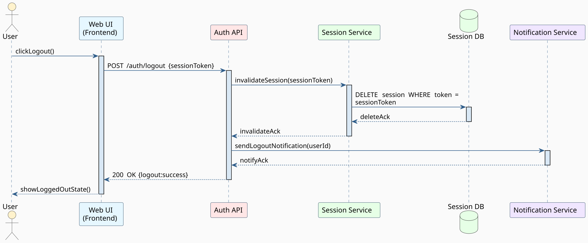
    <figcaption>Figure 5.4: Logout Sequence Diagram</figcaption>
</figure>
<figure>
    
    <figcaption>Figure 5.5: Reset Password Sequence Diagram</figcaption>
</figure>
<figure>
    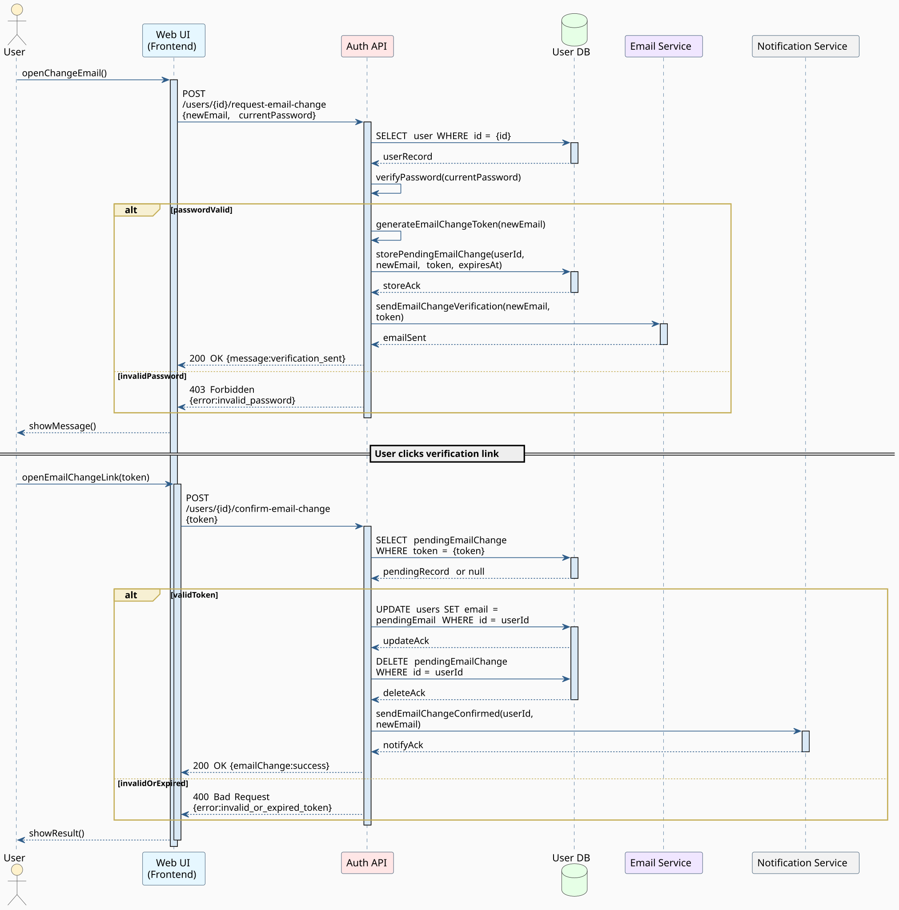
    <figcaption>Figure 5.6: Change Email Sequence Diagram</figcaption>
</figure>
<figure>
    
    <figcaption>Figure 5.7: Enable 2FA Sequence Diagram</figcaption>
</figure>
<figure>
    
    <figcaption>Figure 5.8: Edit Profile Sequence Diagram</figcaption>
</figure>
<figure>
    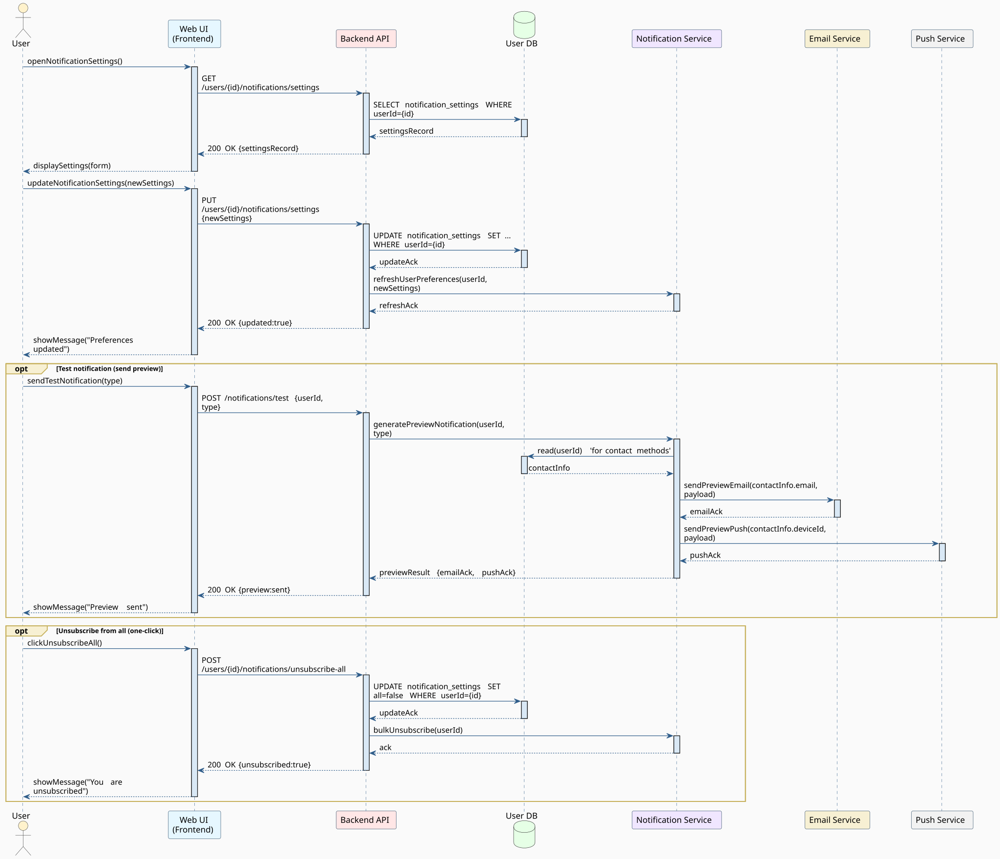
    <figcaption>Figure 5.9: Notifications Sequence Diagram</figcaption>
</figure>
<figure>
    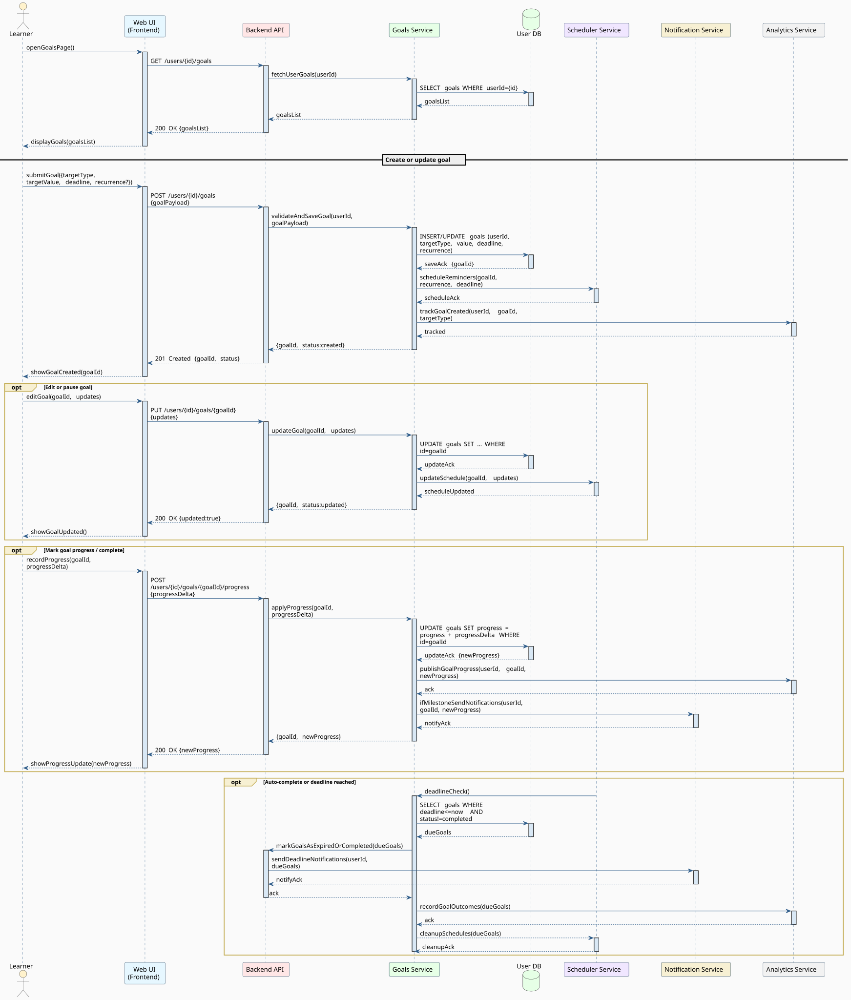
    <figcaption>Figure 5.10: Set Learning Goals Sequence Diagram</figcaption>
</figure>
<figure>
    
    <figcaption>Figure 5.11: View Lesson Content Sequence Diagram</figcaption>
</figure>
<figure>
    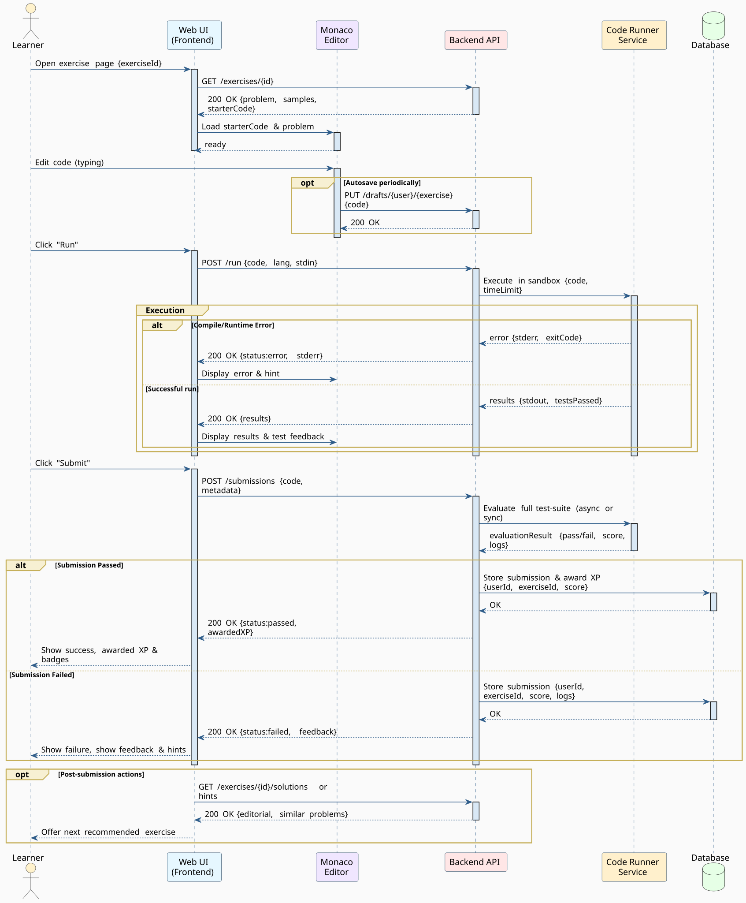
    <figcaption>Figure 5.12: Complete Exercise Sequence Diagram</figcaption>
</figure>
<figure>
    
    <figcaption>Figure 5.13: Review Exercise Sequence Diagram</figcaption>
</figure>
<figure>
    
    <figcaption>Figure 5.14: Practice Code Sequence Diagram</figcaption>
</figure>
<figure>
    
    <figcaption>Figure 5.15: Receive Hints Sequence Diagram</figcaption>
</figure>
<figure>
    
    <figcaption>Figure 5.16: Create Coding Exercise Sequence Diagram</figcaption>
</figure>
<figure>
    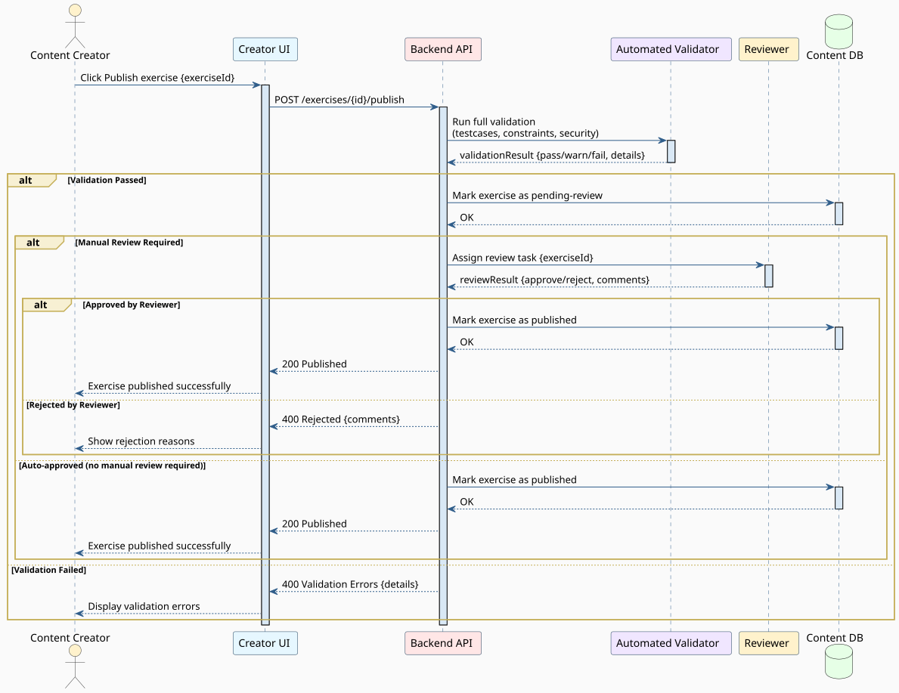
    <figcaption>Figure 5.17: Validate Exercise Sequence Diagram</figcaption>
</figure>
<figure>
    
    <figcaption>Figure 5.18: Design Learning Path Sequence Diagram</figcaption>
</figure>
<figure>
    
    <figcaption>Figure 5.19: Create Interactive Walkthrough Sequence Diagram</figcaption>
</figure>
<figure>
    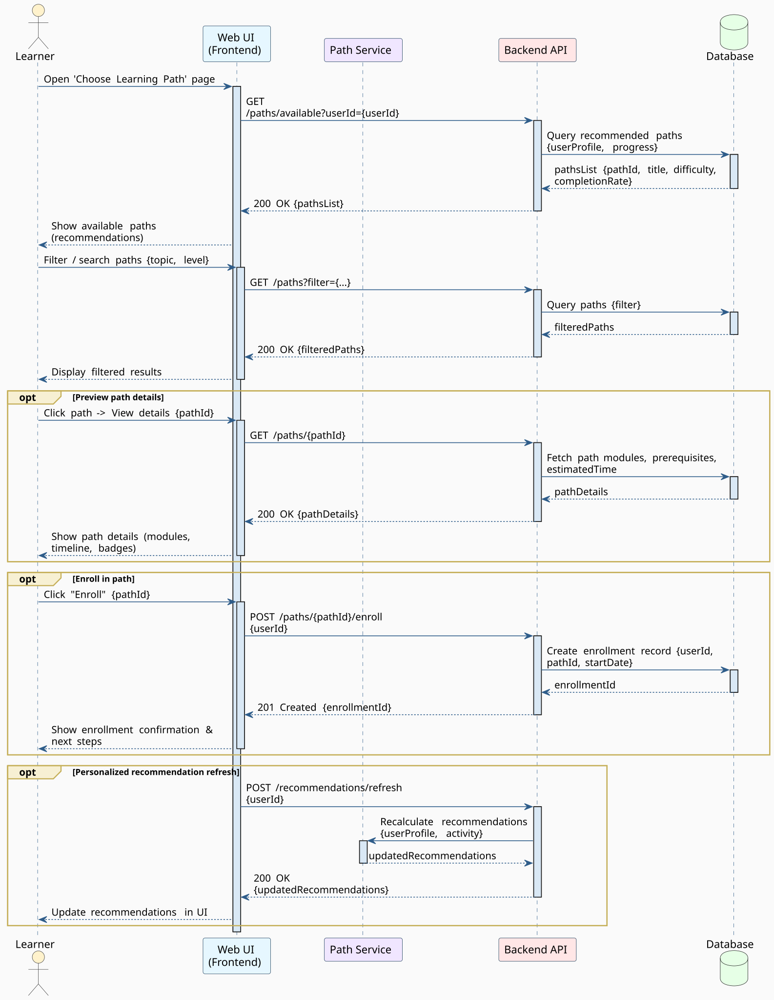
    <figcaption>Figure 5.20: Choose Learing Path Sequence Diagram</figcaption>
</figure>
<figure>
    
    <figcaption>Figure 5.21: Search Cources Sequence Diagram</figcaption>
</figure>
<figure>
    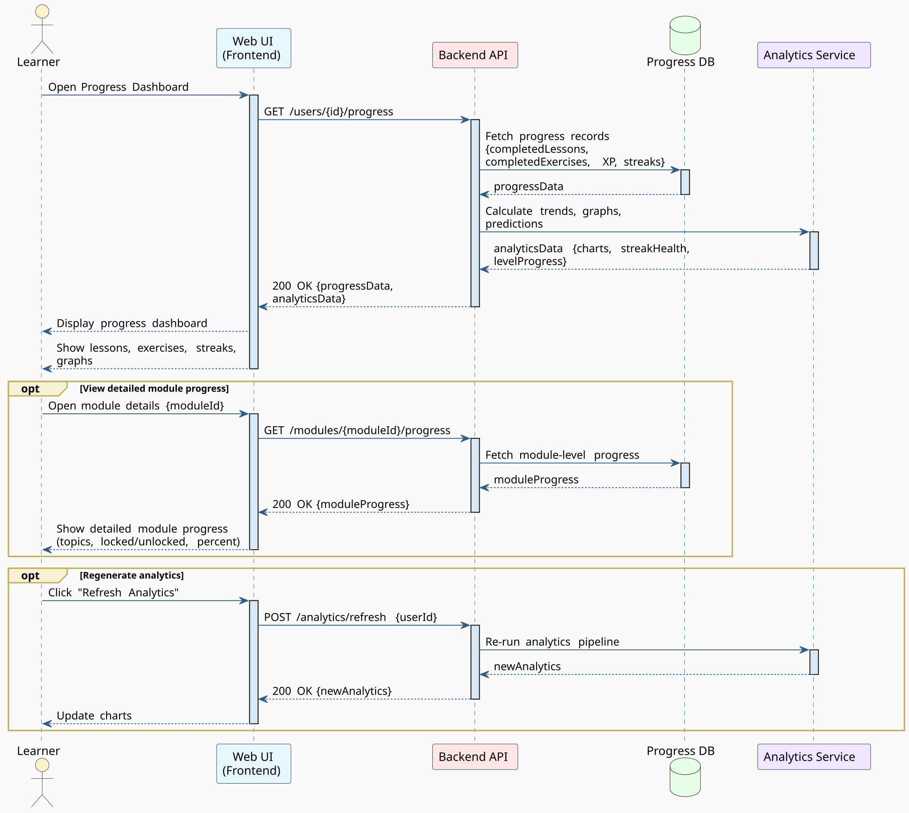
    <figcaption>Figure 5.22: Track Progress Sequence Diagram</figcaption>
</figure>
<figure>
    
    <figcaption>Figure 5.23: Earn XP Sequence Diagram</figcaption>
</figure>
<figure>
    
    <figcaption>Figure 5.24: Redeem Reward Sequence Diagram</figcaption>
</figure>
<figure>
    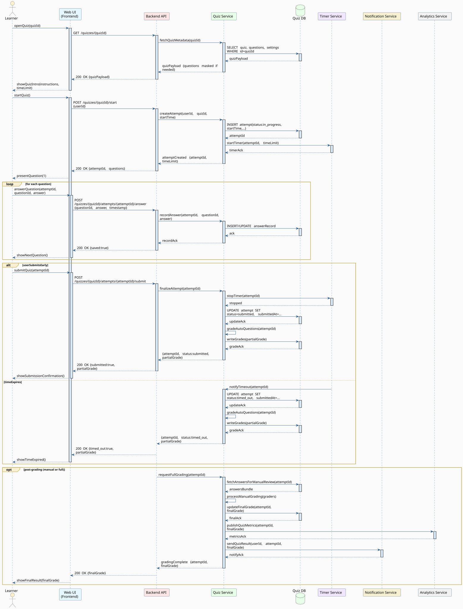
    <figcaption>Figure 5.25: Take Quiz Sequence Diagram</figcaption>
</figure>
<figure>
    
    <figcaption>Figure 5.26: View Quiz Results Sequence Diagram</figcaption>
</figure>
<figure>
    
    <figcaption>Figure 5.27: Complete Certification Track Sequence Diagram</figcaption>
</figure>
<figure>
    
    <figcaption>Figure 5.28: Join Course Sequence Diagram</figcaption>
</figure>
<figure>
    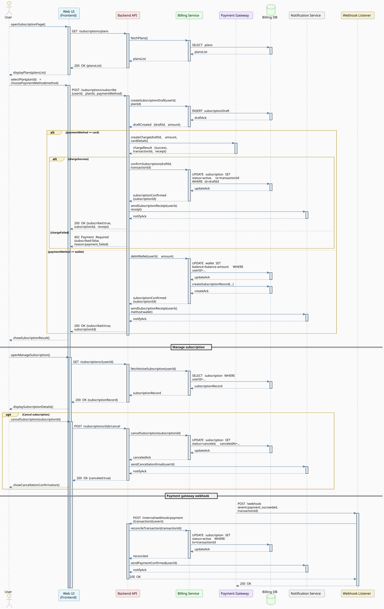
    <figcaption>Figure 5.29: Manage Payment Sequence Diagram</figcaption>
</figure>
<figure>
    
    <figcaption>Figure 5.30: View Certificate Sequence Diagram</figcaption>
</figure>
<figure>
    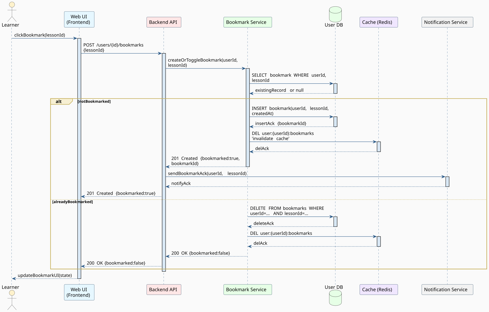
    <figcaption>Figure 5.31: Bookmark Sequence Diagram</figcaption>
</figure>
<figure>
    
    <figcaption>Figure 5.32: Download Resources Sequence Diagram</figcaption>
</figure>
<figure>
    
    <figcaption>Figure 5.33: View Leader Board Sequence Diagram</figcaption>
</figure>
<figure>
    
    <figcaption>Figure 5.34: Social Interaction Sequence Diagram</figcaption>
</figure>
<figure>
    
    <figcaption>Figure 5.35: Share Progress Sequence Diagram</figcaption>
</figure>
<figure>
    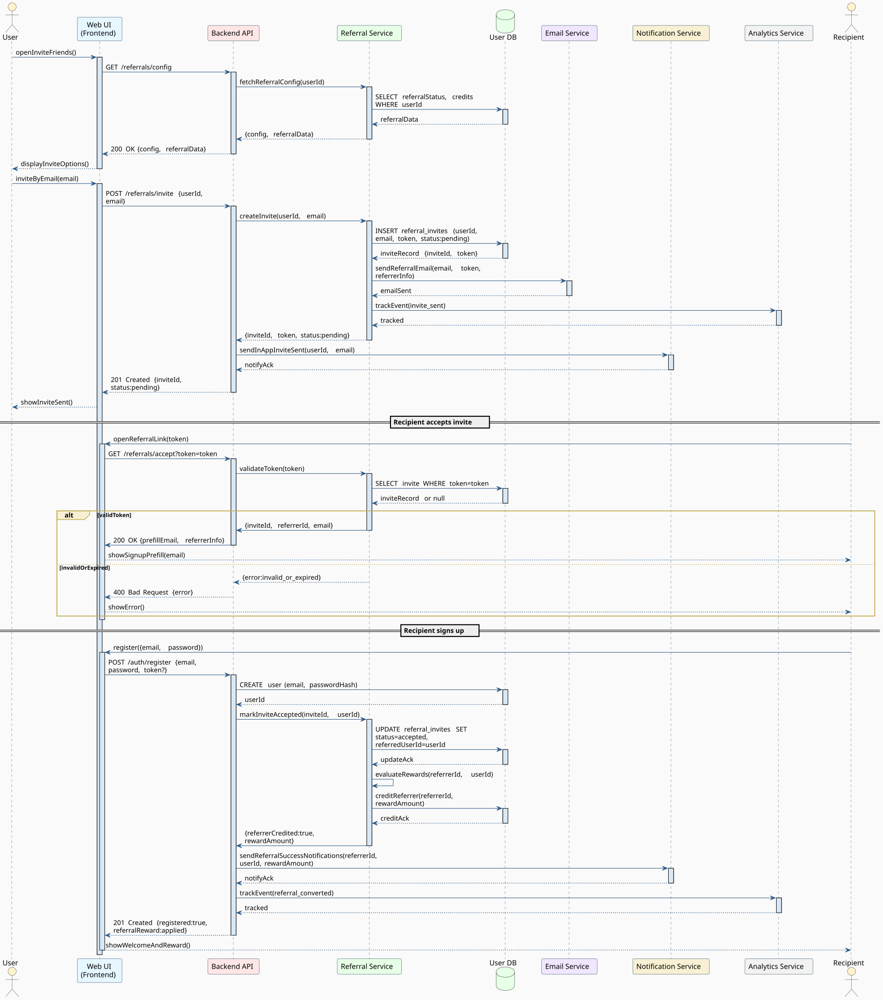
    <figcaption>Figure 5.36: Invite Friend Sequence Diagram</figcaption>
</figure>
<figure>
    
    <figcaption>Figure 5.37: Post Comment Sequence Diagram</figcaption>
</figure>
<figure>
    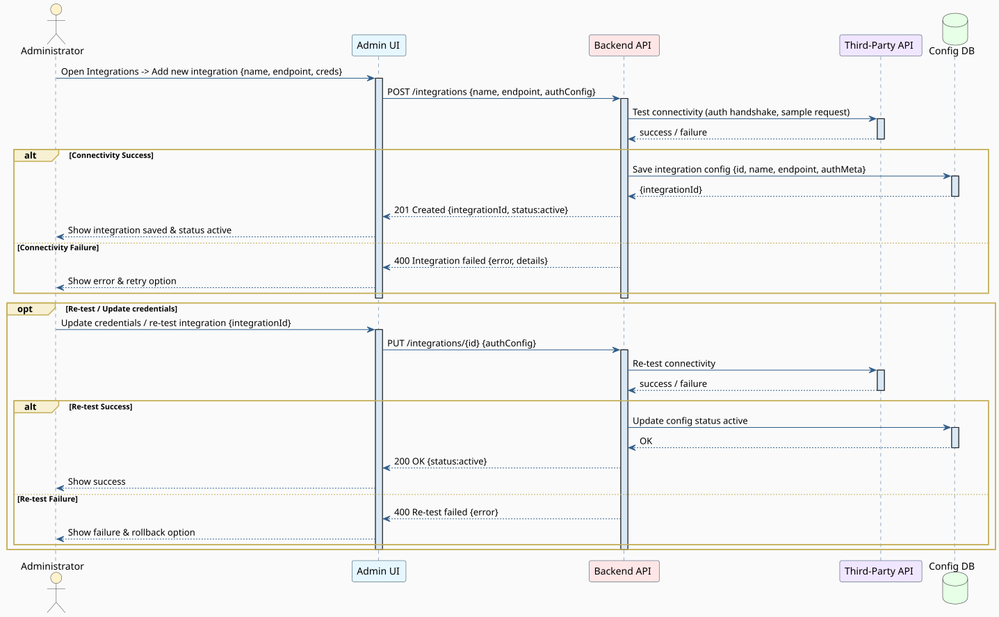
    <figcaption>Figure 5.38: Integrate External API Sequence Diagram</figcaption>
</figure>
<figure>
    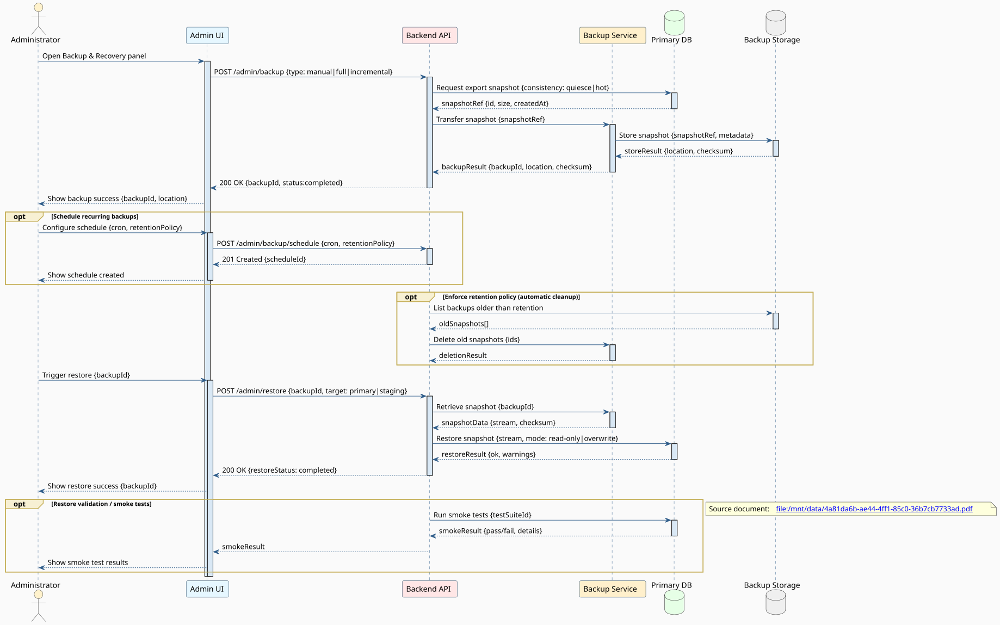
    <figcaption>Figure 5.39: Backup Sequence Diagram</figcaption>
</figure>
<figure>
    
    <figcaption>Figure 5.40: Report Error Sequence Diagram</figcaption>
</figure>

---

</div>