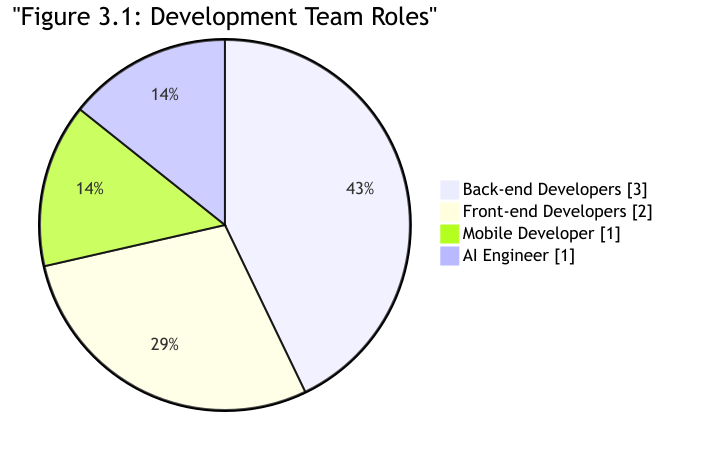
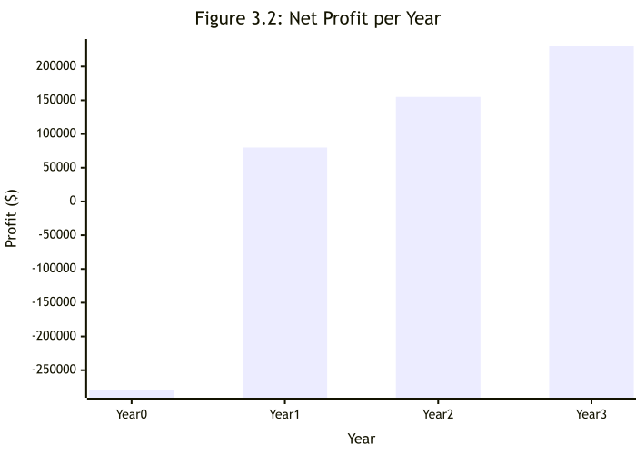
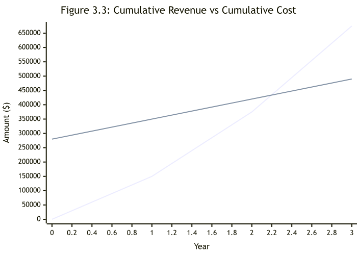

## Chapter 1: Project Overview
### Main Idea

We aim to create a Duolingo-inspired programming education platform that transforms how beginners learn to code by eliminating overwhelm through structured, gamified micro-lessons. Unlike fragmented resources, this platform provides a clear, progressive learning path—from core programming fundamentals to advanced topics like OOP, algorithms, and web development—all delivered via multi-format explanations (articles, videos, and guided walkthroughs).  

At its core, the platform seamlessly integrates:  
1. Interactive Practice & Feedback:  
   - An in-browser code editor (supporting Python and JavaScript) with real-time execution, syntax highlighting, and instant error diagnostics.  
   - Hands-on exercises featuring model solutions and optional complexity analysis to deepen understanding of code efficiency.  
2. Motivational Gamification:  
   - XP systems, unlockable levels, daily streaks, and skill badges to reward consistency.  
   - Global leaderboards and friendly competitions to fuel engagement.  
3. Personalized Progress Tracking:  
   - Visual roadmaps highlighting completed, active, and upcoming modules.  
   - Mastery dashboards quantifying skill growth and retention.  
4. Collaborative Community:  
   - Peer code reviews, solution sharing, and discussion forums for collective problem-solving.  
   - Optional challenges to apply skills in real-world scenarios.  

By combining structured curriculum, instant feedback, and social accountability, the platform turns programming education into an addictive, confidence-building journey—making learning feel like play while ensuring tangible skill development.

---

### Project Scope

### Extended Project Scope  

#### 1. Comprehensive Curriculum & Content  
   - Structured Learning Path:  
     - Tiered modules from absolute fundamentals (variables, loops) to advanced domains (OOP, algorithms, web frameworks, databases).  
     - Specialized tracks for Python, JavaScript, and full-stack development.  
   - Multi-Format Delivery:  
     - Concept primers: Short videos + annotated articles.  
     - Interactive walkthroughs: Step-by-step coding simulations.  
     - Real-world projects: Mini-applications (e.g., weather API integration, todo-list).  

#### 2. Intelligent Code Editor  
   - Multi-Language Support:  
     - Browser-based execution for Python, JavaScript, HTML/CSS, with plans for Java/C++.  
   - Enhanced Developer Experience:  
     - Real-time syntax + error highlighting, auto-completion, and debugging hints.  
     - Code snapshotting: Save/compare solution versions.  
   - Accessibility:  
     - Dark/light mode, keyboard shortcuts, screen-reader compatibility.  

#### 3. Dynamic Interactive Exercises  
   - Adaptive Challenges:  
     - Exercises auto-adjust difficulty based on user performance.  
     - "Fix-the-Bug" tasks: Debug pre-written flawed code.  
   - Deep-Dive Analysis:  
     - Runtime complexity breakdowns (Big O notation).  
     - Memory/performance metrics for optimization practice.  
   - Solution Libraries:  
     - Model answers + multiple approach comparisons (e.g., iterative vs. recursive).  

#### 4. Advanced Gamification System  
   - Engagement Mechanics:  
     - Daily streaks, skill-specific badges (e.g., "Algorithm Ace"), and XP bonuses for consistency.  
     - Unlockable content: Secret lessons or tools for high achievers.  
   - Competitive Elements:  
     - Global/weekly leaderboards (XP-based).  
     - Speed challenges and efficiency contests with peer rankings.  

#### 5. Personalized Progress Ecosystem  
   - Learning Analytics:  
     - Mastery dashboards showing skill proficiency (e.g., "Data Structures: 85%").  
     - Time-tracking: Session duration, concepts revisited.  
   - Roadmap Customization:  
     - Adaptive recommendations for weak areas.  
     - Bookmarkable "Playlists" for user-defined goals.  

#### 6. Collaborative Community Hub  
   - Knowledge Sharing:  
     - Solution galleries with upvoting/commenting.  
     - Peer review workflows (rubric-guided code critiques).  
   - Social Learning:  
     - Group challenges: Team-based projects (e.g., build a collaborative app).  
     - Q&A forums with mentor verification.  
     - Live events: Coding sprints or AMAs with experts.  

#### 7. Accessibility & Scalability  
   - Mobile-responsive design: Seamless tablet/phone access.  
   - Offline mode: Download lessons/exercises for practice without internet.  
   - API integration: Future compatibility with LMS/CMS platforms.  

---  

### Problem Statement

Learning programming remains a daunting barrier for beginners, exacerbated by *four core gaps* in existing solutions:  

1. Structural Deficiency:  
   - Resources are fragmented (video tutorials, disjointed exercises) with no coherent progression, leaving learners adrift.  
   - *Advanced topics* (OOP, algorithms) feel inaccessible without scaffolded skill-building.  

2. Practice-Explanation Misalignment:  
   - Passive video/article consumption fails to translate to coding competence.  
   - Feedback is delayed or absent, leading to reinforcement of errors and frustration.  

3. Motivation Erosion:  
   - Isolated learning lacks psychological hooks (rewards, social accountability) to sustain consistency.  
   - *80% of beginners quit within 3 months* due to diminishing confidence.  

4. Community & Real-World Gap:  
   - No safe space to share imperfect code, receive peer reviews, or collaborate.  
   - Exercises feel academic, detached from tangible projects or industry practices.  

---

### Solution Approach

To bridge these gaps, the platform leverages Duolingo’s engagement model fused with developer-centric depth:  

#### A. Structured Yet Adaptive Onboarding  
- Skill Tree Curriculum:  
  - *Tiered modules* map concepts from syntax basics → real-world stacks (e.g., Flask/React).  
  - Diagnostic quizzes auto-route learners to optimal starting points.  
- Bite-Sized, Multi-Modal Lessons:  
  - Concepts taught via <5-min videos, annotated snippets, and interactive sandboxes—all in one flow.  

#### B. Contextual Practice Engine  
- AI-Assisted Feedback:  
  - Real-time error explanations + debugging hints (e.g., “Your loop exits early: check conditionals!”).  
- Exercise Evolution:  
  - Adaptive difficulty: Problems scale complexity based on user mastery.  
  - Project Sprints: Build *portfolio-ready micro-apps* (e.g., API-driven weather dashboard).  

#### C. Gamification × Depth  
- Progressive Unlock System:  
  - Earn XP/badges for *accuracy*, *efficiency* (e.g., “O(1) Solver”), and *streaks*.  
  - Competitive Depth:  
    - Leaderboards rank speed (solved in 30s) vs. elegance (least code lines).  
- Complexity Playgrounds:  
  - Visualize Big O trade-offs via interactive graph comparisons (e.g., O(n²) vs. O(n log n)).  

#### D. Community-Powered Growth  
- Collaborative Accountability:  
  - Peer review pools: Anonymously critique solutions using *rubric-guided feedback*.  
  - Solution Showcases: Compare/upvote multiple approaches (e.g., “Recursive vs. Iterative”).  
- Mentor-Verified Support:  
  - Expert-vetted discussions in Q&A forums + live coding AMAs.  

#### E. Personalized Reinforcement  
- Predictive Roadmaps:  
  - Weakness-targeted challenges (e.g., “Struggling with callbacks? Try these 3 exercises!”).  
- Mastery Analytics:  
  - Heatmaps track concept retention + time-to-proficiency across skills.  

---  

### Project Objectives

#### 1. Deliver a Progressive, Mastery-Based Curriculum  
- Modular Skill Tiers: Implement 10+ competency levels (Novice → Architect) with checkpoint assessments for each tier.  
- Cross-Language Tracks: Offer specialized paths for Python (Data Science/Backend), JavaScript (Frontend/Full-Stack), and Algorithms.  
- Real-World Alignment: Integrate industry frameworks (e.g., React, Flask) and tools (Git, APIs) into advanced modules.  

#### 2. Build an Intelligent, Adaptive Practice Ecosystem  
- AI-Driven Exercise Engine:  
  - Generate personalized problem sets targeting weak areas (e.g., "80% accuracy on recursion? Try these 5 challenges!").  
  - Auto-graded projects with rubrics for code quality, efficiency, and creativity.  
- Multi-Layer Feedback:  
  - Provide instant syntax corrections, runtime error diagnostics, and performance benchmarks (CPU/memory usage).  

#### 3. Gamify Learning with Depth & Nuance  
- Tiered Reward System:  
  - Award skill-specific badges (e.g., "Memory Optimizer") + rarity tiers (Bronze → Platinum).  
  - "Double-or-Quit" streaks: Bonus XP for consecutive days, reset on skip.  
- Competitive Arenas:  
  - Host weekly efficiency leagues (lowest Big O wins) and speed sprints (fastest debugger).  

#### 4. Foster Collaborative Expertise  
- Structured Peer Review:  
  - Implement rubric-based code critiques (readability, efficiency, edge cases) with upvoted "Top Reviewer" rankings.  
- Mentor-Guided Growth:  
  - Verified experts host live "Code Clinics" for Q&A and architecture reviews.  
- Solution Explorer:  
  - Curate multiple approaches per problem (e.g., "3 Pythonic Solutions") with complexity comparisons.  

#### 5. Enable Hyper-Personalized Tracking  
- Predictive Analytics Dashboard:  
  - Visualize skill decay (e.g., "Arrays mastery ↓15% in 2 weeks") and recommend refreshers.  
  - Track efficiency gains (e.g., "Reduced solution time by 40% this month").  
- Custom Roadmapping:  
  - Let users build goal-oriented playlists ("Prep for FAANG Interviews" → auto-adds relevant exercises).  

#### 6. Ensure Accessibility & Scalability  
- Inclusive Design:  
  - Support screen readers, keyboard navigation, and color-blind modes.  
  - Offer text-to-speech explanations for complex concepts.  
- Infrastructure Goals:  
  - Offline-first capability: Download modules + editor for remote learning.  
  - API extensibility: Integrate with GitHub/LMS platforms for portfolio syncing.  

#### 7. Bridge Theory to Real-World Impact  
- Portfolio Projects:  
  - Guide users to build deployable micro-apps (e.g., REST API service, interactive dashboard).  
- Industry Challenges:  
  - Partner with tech firms for sponsored "real-world" tasks (e.g., "Optimize Shopify’s cart algorithm").  

#### 8. Drive Community-Led Innovation  
- User-Generated Content:  
  - Allow advanced learners to design peer-reviewed exercises (vetted by mentors).  
- Global Hackathons:  
  - Host quarterly themed competitions (e.g., "Sustainable Code Challenge") with expert judging.  

---

## Chapter 2: Project Background

### Project Background

**Figma** is a versatile, cloud‑based design platform widely used for crafting user interfaces, wireframes, and interactive prototypes. It enables designers and stakeholders to collaborate in real time, streamlining the design process from ideation to final output. Figma’s rich feature set — including vector editing, component‑based design, version history, and a robust plugin ecosystem — makes it central to modern UI/UX workflows. As a browser‑based tool, it removes installation barriers and ensures cross‑device accessibility.

For more detailed imformation. you can refer to ([Figma](https://www.figma.com/)).

**Nuxt.js** is a high-level framework built on Vue.js, optimized for developing server-rendered applications and static websites. It offers features like automatic routing, server-side rendering (SSR), static site generation, and a modular architecture. With built-in support for SEO, performance optimizations, and a rich community-driven ecosystem, Nuxt simplifies the development of scalable, high‑performance web apps.

For more detailed imformation. you can refer to ([Nuxt.js](https://nuxt.com/)).

**Node.js** is a high-performance JavaScript runtime built on Chrome’s V8 engine, enabling developers to run JavaScript on the server side. Renowned for its event-driven, non-blocking I/O model, it excels at building scalable network applications and APIs. Supported by npm’s extensive package ecosystem, Node.js facilitates rapid development of web servers and real-time services.

For more detailed imformation. you can refer to ([Node.js](https://nodejs.org/)).

**PostgreSQL** is a powerful, open-source relational database management system (RDBMS) known for its reliability, scalability, and advanced feature set. It supports SQL for relational queries and JSON for non-relational data, making it highly versatile for modern application development. PostgreSQL offers robust features such as ACID compliance, foreign keys, triggers, views, stored procedures, and full-text search. It also provides strong support for data integrity, concurrency, and extensibility, allowing developers to define custom data types, operators, and functions. Trusted by enterprises and developers worldwide, PostgreSQL is widely used for web applications, analytics, and large-scale data systems.

For more detailed imformation. you can refer to ([PostgreSQL](https://www.postgresql.org/)).

**OpenRouter** is an open‑source API platform that offers a unified interface to multiple large language models (LLMs). It enables developers to seamlessly integrate AI features—such as natural language processing, chat interfaces, and content generation—while managing authentication, fallback strategies, and cost efficiency. OpenRouter simplifies switching between or combining models from different providers.

For more detailed imformation. you can refer to ([OpenRouter](https://openrouter.ai/)).

**Gemini API** is a developer-friendly interface provided by Google to access the capabilities of its Gemini family of large language models (LLMs). It allows developers to integrate advanced AI features into their applications, including natural language understanding, code generation, content summarization, and multi-modal reasoning (text, image, and more). The Gemini API is accessible through Google AI Studio and is designed to support rapid prototyping and scalable deployment of generative AI solutions. With robust security, comprehensive documentation, and seamless integration with Google Cloud, the Gemini API enables powerful, flexible AI experiences across a wide range of use cases.

For more detailed imformation. you can refer to [Gemini API documentation](https://ai.google.dev/gemini-api/docs)

**Monaco Editor** is the highly customizable, in‑browser code editor that powers Visual Studio Code. It supports syntax highlighting, IntelliSense, code folding, and more. Lightweight yet powerful, Monaco is perfect for embedding code editing experiences within web applications such as educational platforms, developer tools, or live coding playgrounds.

For more detailed imformation. you can refer to ([Monaco Editor](https://microsoft.github.io/monaco-editor/)).

**Cloudflare** is a leading web performance and security platform that provides a wide range of services to protect and accelerate websites, APIs, and applications. It acts as a reverse proxy between users and web servers, offering features such as DDoS protection, content delivery network (CDN), SSL/TLS encryption, firewall rules, and performance optimization. By caching content at global edge locations and filtering malicious traffic, Cloudflare helps improve loading speeds, reduce server load, and enhance overall security. It also offers developer tools like Cloudflare Pages and Workers for deploying scalable, serverless applications.

For more detailed imformation. you can refer to: ([CloudFlare](https://www.cloudflare.com/)).

---

### Related Work

#### Elzero Web School

Description:  
Elzero Web School is an excellent free resource for Arabic-speaking beginners and intermediate learners who want to build strong web development skills through structured, practical learning.

Techniques Used:  
- External resources and useful tool recommendations included  
- A Q&A section to ask questions and receive community support  

Advantages:  
- Step-by-step structured study plans for better learning flow  
- Dedicated learning paths for Frontend, Backend, and Full Stack  

Disadvantages:  
- No built-in progress tracking to monitor course completion  
- Users cannot rate or review courses or lessons  

Reference: [https://elzero.org](https://elzero.org)

#### Codeforces

Description:  
A well-known platform that hosts regular contests like Div 1 and Div 2. It includes a robust rating system and editorial support to develop algorithmic thinking.

Techniques Used:  
- Mathematical algorithms  
- Rating system  
- Editorial learning  

Advantages:  
- Regular contests with large community participation  
- Detailed editorial explanations  
- Transparent and active rating system  

Disadvantages:  
- Interface can be intimidating for beginners  
- Problems often require deep mathematical insight  

Reference: [https://codeforces.com](https://codeforces.com)

#### CodeChef

Description:  
An Indian educational platform hosting contests like Long Challenge and Lunchtime, with a vast problem archive and community engagement.

Techniques Used:  
- Long format contests (Long Challenge)  
- Short contests (Lunchtime)  
- Tutorial-based learning  

Advantages:  
- Great for long-term learning with multiple contest formats  
- Offers tutorials and mentorship programs  

Disadvantages:  
- Sometimes suffers from server lags during contests  
- Problems can be less curated compared to Codeforces or LeetCode  

Reference: [https://www.codechef.com](https://www.codechef.com)

#### HackerRank

Description:  
Focuses on algorithms, SQL, and data structures with a live coding environment, widely used for tech interviews.

Techniques Used:  
- Structured learning paths  
- Auto-grading system  
- Skill-specific tracks (SQL, AI, etc.)  
- Live coding interface  

Advantages:  
- Beginner-friendly interface and structured learning paths  
- Great for practicing specific skills (e.g. SQL, AI)  
- Instant feedback and auto-grading  

Disadvantages:  
- Contest competitiveness is relatively low  
- Less challenging for advanced users  

Reference: [https://www.hackerrank.com](https://www.hackerrank.com)

#### LeetCode

Description:  
A premier platform for coding interview prep with 2,500+ problems and company-specific questions.

Techniques Used:  
- Interview prep questions  
- Company-tagged problems  
- Weekly contests  
- Solution discussions  

Advantages:  
- Focused on technical interview preparation  
- Community solutions and tutorials  
- Weekly contests to benchmark skills  

Disadvantages:  
- Some premium features are behind a paywall  
- Less emphasis on advanced algorithms  

Reference: [https://leetcode.com](https://leetcode.com)

#### TopCoder

Description:  
One of the oldest platforms, known for SRM (Single Round Matches) and Marathon Matches focusing on complex, long-term problems.

Techniques Used:  
- SRM (Single Round Match)  
- Marathon Match  
- High-difficulty algorithm challenges  
- Real-world modeling problems  

Advantages:  
- Highly competitive and professional-grade problems  
- Real-world challenges and big prizes  
- Community of expert coders  

Disadvantages:  
- Interface feels outdated  
- Steeper learning curve for newcomers  

Reference: [https://www.topcoder.com](https://www.topcoder.com)

#### AtCoder

Description:  
A Japanese platform offering well-structured contests (ABC, ARC, AGC) with a focus on clean problem statements and difficulty progression.

Techniques Used:  
- ABC, ARC, AGC contests  
- Clean and structured problems  
- Difficulty progression  
- On-time weekly contests  

Advantages:  
- High-quality problems and fair difficulty curve  
- Regular, punctual contests  
- Structured for serious learners  

Disadvantages:  
- Japanese-first interface; some translations may be rough  
- Smaller international community than others  

Reference: [https://atcoder.jp](https://atcoder.jp)

#### CodinGame

Description:  
Gamifies coding challenges with multiplayer and story-based games like Clash of Code and Code vs Zombies.

Techniques Used:  
- Game-based problem solving  
- Real-time multiplayer coding  
- Visual programming challenges  
- Language flexibility (25+)  

Advantages:  
- Fun and visual way to learn coding  
- Supports 25+ programming languages  
- Great for casual or team play  

Disadvantages:  
- Not focused on algorithm depth  
- Less suitable for serious competitive programming  

Reference: [https://www.codingame.com](https://www.codingame.com)

#### CodeCombat

Description:  
An RPG-style platform that teaches Python, JavaScript, and HTML through story-driven games and challenges.

Techniques Used:  
- RPG-style game interface  
- Code-to-play mechanics  
- Curriculum-based learning  
- Beginner visual feedback  

Advantages:  
- Ideal for children and beginners  
- Game-based engagement with rewards  
- Offers structured curriculum  

Disadvantages:  
- Too basic for experienced developers  
- Some content requires a subscription  

Reference: [https://codecombat.com](https://codecombat.com)

#### Codewars

Description:  
Uses "Kata" - short coding exercises - to improve coding progressively with ranking and community feedback.

Techniques Used:  
- Community challenge creation  
- Rank-based progression  
- Peer-reviewed solutions  

Advantages:  
- Unique ranking and progression system  
- Community-driven challenges and solutions  
- Good for practicing idiomatic code  

Disadvantages:  
- Lacks formal contest system  
- Quality of community challenges can vary  

Reference: [https://www.codewars.com](https://www.codewars.com)

#### CheckiO

Description:  
Offers gamified learning of Python and JavaScript through short, interactive problem-solving challenges.

Techniques Used:  
- Gamified challenges  
- Code review mechanism  
- Puzzle solving  
- Interactive feedback  

Advantages:  
- Fun and visual interface  
- Encourages reviewing others' code  
- Python-focused challenges are especially polished  

Disadvantages:  
- Less suitable for advanced algorithm training  
- Limited language support  

Reference: [https://checkio.org](https://checkio.org)

---

### Summary
In this chapter, the tools that will be used in implementation like (Node.js, Nuxt.js, Figma, Gemini API, OpenRouter, Monaco Editor, and CloudFlare). were described.
Then the related work was described, (Which is listed in the previous table), and the advantages, disadvantages, and benefits of each one, then compared with the project.

---

## Chapter 3: Requirement Analysis

### 3.1 Feasibility Study

#### 3.1.1 Technical Feasibility

- **Familiarity with Applications:** 
  - The target learners and educators in our region are already familiar with mobile educational apps and interactive tutorials (e.g. Duolingo, Code.org) in Arabic. Using a gamified, Arabic-language interface makes the platform intuitive; users require no extra training to log in, practice coding, or track progress.  
  - Core team members have experience building web/mobile learning tools, so we understand typical user workflows (account setup, interactive lessons, community forums).  
  - Because the UI and content are in Arabic, language barriers are eliminated, further smoothing the learning curve for beginners.

- **Familiarity with Technology:**  
  - Our team has strong expertise in the chosen tech stack: we have built Vue/Nuxt.js and Node.js applications before and are proficient with PostgreSQL databases. This means we can efficiently develop the front-end UI and the back-end server.  
  - We have experience with embedding real-time code editors (the platform will use Microsoft’s Monaco Editor, the same engine as VS Code) and handling Python and JavaScript code execution on the server.  
  - We are comfortable working with AI APIs; in past projects we have integrated services (e.g. OpenAI APIs) and we can similarly use OpenRouter to connect to the Gemini API for intelligent hints. Overall, **our familiarity is high** and we have confidence that we have the coding, design, and integration skills needed to implement all planned features.

- **Project Size:**  
  - The core team will include about 6 members (detailed below), which is appropriate for a mid-size project.  
  - The platform’s scope involves a moderate variety of features: a real-time code editor (supporting Python and JS), gamification mechanics (XP, badges, streaks, daily goals), AI-driven hints, and a community sharing module. This is a mid-level complexity for an experienced team.  
  - The development timeline is relatively tight: with a target launch by May 2026 (about 6 months from planning start), the schedule is ambitious. However, by assigning parallel sprints for front-end, back-end, and content creation, and by leveraging reusable components (Nuxt/Vue libraries, Monaco Editor, etc.), we believe the team can meet this deadline.

---

### 3.1.2 Organizational Feasibility

- **Champion:** The development team and supervisors provide time and effort for the system.

- **Project Sponsor:** Dr. Rehab Emad El-Dein

- **System Users:**  
  1. **Learners:** Arabic-speaking students and self-learners who use the platform to learn programming through structured courses, interactive exercises, and real-time code challenges. They earn XP, badges, and streaks as they progress.  
  2. **Mentors/Instructors:** More experienced developers or educators who contribute by answering questions, reviewing user code, curating content, and moderating the community. Mentors help ensure quality and provide additional support (similar to Duolingo “language mentors”).  
  3. **Administrators/Content Creators:** A small team of admins who upload new course material, monitor the system, and handle technical support.

- **Project Manager:** Dr. Rehab Emad El-Dein

- **Development Team Breakdown:** The team is organized into specialized roles with overlapping collaboration to ensure flexibility:  

  - **Back-end Developers (3):**  
    Build and maintain the server-side logic in Node.js, manage the PostgreSQL database, and implement APIs. One of the back-end developers will also take on **DevOps responsibilities**, handling cloud infrastructure, CI/CD pipelines, and security. Together, they will also implement real-time code execution and integration with AI APIs.  

  - **Front-end Developers (2):**  
    Develop the user interface using Nuxt.js, ensuring a responsive and intuitive design across desktop and mobile browsers. They will integrate the Monaco editor, implement gamification features (XP, badges, leaderboards), and collaborate closely with the mobile developer to keep design consistent.  

  - **Mobile Developer (1):**  
    Focuses on building and optimizing the mobile application version of the platform, ensuring a smooth experience on iOS and Android. Works with front-end and back-end teams for synchronization and performance.  

  - **AI Engineer (1):**  
    Specializes in integrating AI features, including intelligent hints and personalized feedback, through APIs like OpenRouter/Gemini. This role also explores adaptive learning models to tailor exercises to each learner’s progress.  

  - **Content & Instructional Design (shared responsibility):**  
    Instead of dedicated content creators, **all team members will collaborate** on producing and localizing course material in Arabic. This includes designing structured lessons, writing exercises, and embedding gamification mechanics. Team members’ technical expertise ensures content is accurate, while shared responsibility distributes workload evenly.  
    
---

### 3.1.3 Economic Feasibility

- **Tangible Benefits:**  
  - **Course Revenue:** With a pay-per-course model at an average price of $30 per course, enrolling 5,000 users in Year 1 (our target) would generate roughly $150,000 in Year-1 sales. As user growth continues, Year 2 and 3 revenues could be, for example, $225,000 and $300,000 (assuming 50% year-over-year user growth).  
  - **Additional Revenue Streams:** We can develop premium content or certification services in later years (e.g. advanced courses, official completion certificates) to create new revenue. Partnerships or bulk licenses with schools or companies could also add income.  
  - **Economies of Scale:** Because hosting and maintenance costs (see below) are largely fixed per year, each additional user above Year 1 yields mostly profit. For instance, once we cover the $20,000/year hosting expense and $50,000/year marketing, further enrollments significantly improve margins.

- **Intangible Benefits:**  
  - **Learner Engagement:** The gamified, Duolingo-style approach will keep students motivated. Studies show gamification (points, streaks, badges) significantly boosts user engagement and retention. By making coding fun and rewarding, we help learners persist.  
  - **Education Impact:** Providing coding education in Arabic removes language barriers and makes computer science more accessible. This can broaden participation in tech education and help develop local talent in programming.  
  - **Community Growth:** Building a collaborative platform fosters a peer-learning community. Learners and mentors share projects and tips, which enhances learning outcomes and provides social value.  
  - **Brand and Market Position:** Successfully launching this platform will position our team as innovators in Arabic EdTech. Positive reputation and user testimonials will attract future investments, partnerships, and possibly expansion into new topics or markets.

---

**Development and Operational Costs (Years 0–3):**

| Item                       | Year 0       | Year 1      | Year 2      | Year 3      | Total        |
| -------------------------- | ------------ | ----------- | ----------- | ----------- | ------------ |
| **Development (one-time)** | $280,000     | $0          | $0          | $0          | $280,000     |
| Dev team salaries          | $180,000     | –           | –           | –           | $180,000     |
| Content creation           | $100,000     | –           | –           | –           | $100,000     |
| **Hosting/AI/maint.**      | $0           | $20,000     | $20,000     | $20,000     | $60,000      |
| **Marketing**              | $0           | $50,000     | $50,000     | $50,000     | $150,000     |
| **Total Cost**             | **$280,000** | **$70,000** | **$70,000** | **$70,000** | **$490,000** |

**ROI and Cumulative Net:**

| Metric             | Year 0    | Year 1    | Year 2   | Year 3   | Total    |
| ------------------ | --------- | --------- | -------- | -------- | -------- |
| **Revenue**        | $0        | $150,000  | $225,000 | $300,000 | $675,000 |
| **Total Cost**     | $280,000  | $70,000   | $70,000  | $70,000  | $490,000 |
| **Net Profit**     | -$280,000 | $80,000   | $155,000 | $230,000 | $185,000 |
| **Cumulative Net** | -$280,000 | -$200,000 | -$45,000 | $185,000 | —        |

> **3-Year ROI:** $185,000 ÷ $490,000 ≈ **37.8%**

---

**Break-even Analysis** 

The **break-even point** occurs when cumulative revenue surpasses cumulative costs:  

- **Year 1:** Cumulative revenue = $150,000, cumulative cost = $350,000 → still negative (-$200,000).  
- **Year 2:** Cumulative revenue = $375,000, cumulative cost = $420,000 → still negative (-$45,000).  
- **Year 3:** Cumulative revenue = $675,000, cumulative cost = $490,000 → **positive cumulative net ($185,000)**.  

Therefore, the project is expected to **break even during Year 3**, after which all additional revenue contributes to profit.  

To illustrate:  

- **Break-even revenue threshold:** $490,000 (total 3-year cost).  
- Achieved at ~**16,333 paid enrollments** (490,000 ÷ $30).  
- Based on projected growth, this milestone will be reached in the **third year of operation**.  

---

### 3.2 Risk Management

This section identifies key risks for the coding education platform across technical, operational, and legal domains. Each risk is assessed with a likelihood (Low/Medium/High), impact (Low/Medium/High), and mitigation strategies. Where appropriate, a qualitative risk matrix is used to emphasize prioritization.  

#### 3.2.1 Technical Risks

| **Risk**                     | **Description**                                                                                                                                                     | **Likelihood** | **Impact** | **Mitigation**                                                                                                                                                                                         |
| ---------------------------- | ------------------------------------------------------------------------------------------------------------------------------------------------------------------- | -------------- | ---------- | ------------------------------------------------------------------------------------------------------------------------------------------------------------------------------------------------------ |
| **Scalability & Uptime**     | High traffic or data growth could overwhelm the platform. Without modular architecture and robust testing, performance bottlenecks and downtime can occur.          | High           | High       | Design a scalable, microservices-based architecture; use horizontal scaling (load balancing, CDN, caching); implement automated testing and monitoring to detect and prevent bottlenecks.              |
| **External API Integration** | Reliance on third-party APIs (e.g. Gemini, OpenRouter) can introduce outages or unpredictable behavior. Third-party services may have downtime or breaking changes. | Medium         | High       | Vet and monitor external APIs closely (uptime/SLA checks); implement timeouts and retries; use circuit breakers to protect against surges; prepare fallback or degraded modes if an API fails.         |
| **Real-time Code Execution** | Running user-submitted code in real time is error-prone. Sandbox failures, resource exhaustion, or vulnerabilities could crash the executor, harming reliability.   | Medium         | High       | Isolate execution in secure sandboxes or containers; enforce resource limits (memory/time); continuously test with diverse workloads; scale the execution engine separately; monitor and auto-recover. |

#### 3.2.2 Operational Risks

| Risk                                | Description                                                                                                                          | Likelihood | Impact | Mitigation                                                                                                                                                     |
| ----------------------------------- | ------------------------------------------------------------------------------------------------------------------------------------ | ---------- | ------ | -------------------------------------------------------------------------------------------------------------------------------------------------------------- |
| **Timeline Delays**                 | Requirement changes, scope creep, or underestimation can derail schedules. Over-optimistic estimates may lead to extended deadlines. | High       | High   | Use thorough upfront planning and clear requirements; apply realistic time estimates with contingency; use agile sprints for incremental delivery and reviews. |
| **Resource Constraints**            | Limited team size or skill shortages create bottlenecks.                                                                             | Medium     | High   | Cross-train staff and onboard talent early; use contingent resources; maintain a pipeline of developers; forecast and reallocate workloads proactively.        |
| **Content Development Bottlenecks** | Creating high-quality, engaging coding lessons and exercises is time-consuming, which can delay releases or reduce quality.          | Medium     | Medium | Develop content iteratively with SMEs; reuse or adapt existing materials; employ instructional designers; prioritize high-impact modules first.                |

#### 3.2.3 Legal & Compliance Risks

| Risk                            | Description                                                                                                                                        | Likelihood | Impact | Mitigation                                                                                                                                                          |
| ------------------------------- | -------------------------------------------------------------------------------------------------------------------------------------------------- | ---------- | ------ | ------------------------------------------------------------------------------------------------------------------------------------------------------------------- |
| **Data Privacy (Minors)**       | Collecting data on children raises strict legal requirements (e.g., COPPA, GDPR). Failure to comply can cause severe penalties.                    | Medium     | High   | Apply "privacy by design": minimize data collection, encrypt sensitive data, obtain parental consent, maintain clear privacy policies, and conduct regular audits.  |
| **Copyright & Licensing**       | Using third-party or community code/assets risks license infringement. Even one noncompliant license could result in legal or financial penalties. | Low        | Medium | Enforce strict review of all content/code; use license scanners; prefer permissive or original content; educate users on plagiarism; remediate infringing material. |
| **Terms-of-Service Violations** | Users may post disallowed content (hate speech, copyrighted code, malicious submissions) or cheat, violating the platform's ToS.                   | Medium     | Medium | Publish comprehensive ToS; implement moderation and reporting tools; enforce rules via filters and manual review; respond promptly and revise policies regularly.   |

---

### 3.3 Project plan

  **TO DO**

### 3.4 Gantt Chart

  **TO DO**
