- [Chapter 7: User Interface](#Chapter-7-User-Interface)
  * [7.1 Authentication Screens](#Authentication-Screens)
  * [7.2 Main Dashboard](#Main-Dashboard)
  * [7.3 Learning Features](#Learning-Features) 
  * [7.4 Progress Tracking & Analytics](#Progress-Tracking-Analytics)
  * [7.5 Communication & Settings](#Communication-Settings)
  * [7.6 Theme Options](#Theme-Options) 

- [Figure 7.1: Login Screen](#Figure71)
- [Figure 7.2: Registration Screen](#Figure72)
- [Figure 7.3: OTP Verification Screen](#Figure73)
- [Figure 7.4: Password Entry Screen](#Figure74)
- [Figure 7.5: New Password Creation Screen](#Figure75)
- [Figure 7.6: Main Dashboard](#Figure76)
- [Figure 7.7: Dashboard Details View](#Figure77)
- [Figure 7.8: Dashboard with Filtration Options](#Figure78)
- [Figure 7.9: Learning Path Interface](#Figure79)
- [Figure 7.10: Video Player Screen](#Figure710)
- [Figure 7.11: Multiple Choice Quiz](#Figure711)
- [Figure 7.12: Code Quiz Interface](#Figure712)
- [Figure 7.13: Quiz Completion Screen](#Figure713)
- [Figure 7.14: Progress & Analysis Dashboard](#Figure714)
- [Figure 7.15: Chat Interface](#Figure715)
- [Figure 7.16: User Profile Screen](#Figure716)
- [Figure 7.17: Interface with Collapsed Sidebar](#Figure717)
- [Figure 7.18: Dark Mode Interface](#Figure718)

## 
Chapter 7: User Interface

   
### 
7.1 Authentication Screens

<figure id="Figure71">
    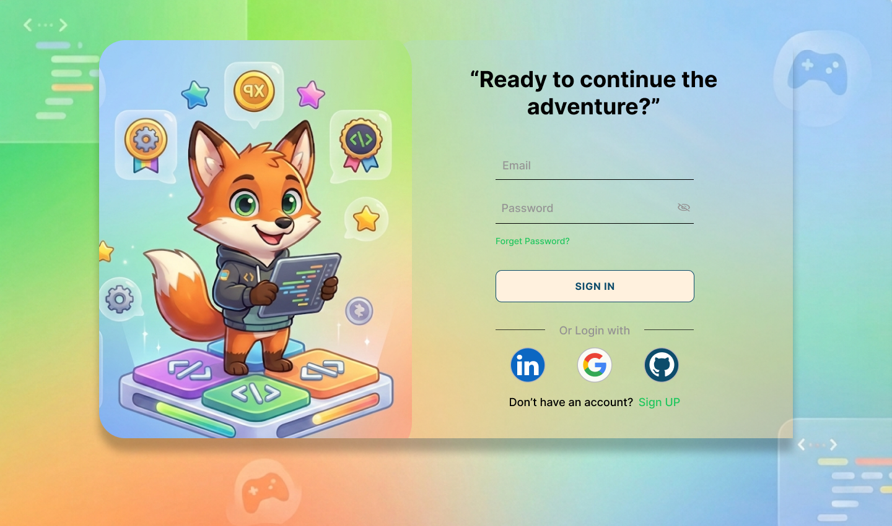
    <figcaption>Figure 7.1: Login Screen</figcaption>
</figure>

<figure id="Figure72">
    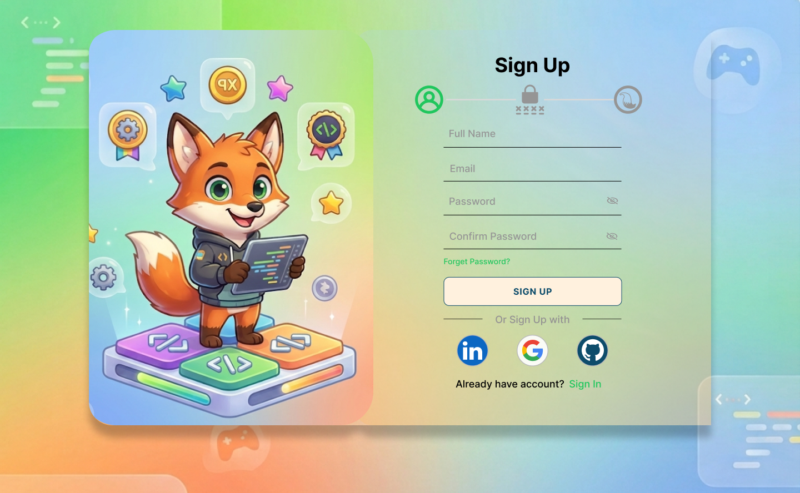
    <figcaption>Figure 7.2: Registration Screen</figcaption>
</figure>

<figure id="Figure73">
    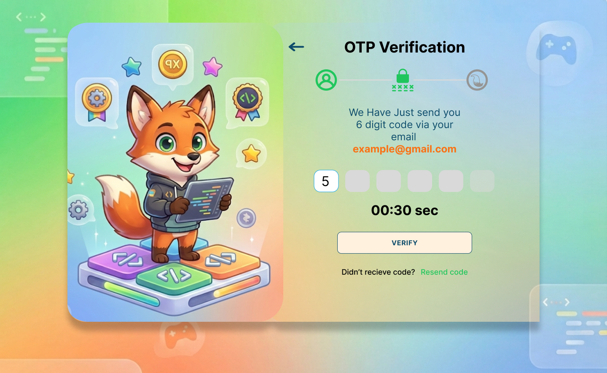
    <figcaption>Figure 7.3: OTP Verification Screen</figcaption>
</figure>

<figure id="Figure74">
    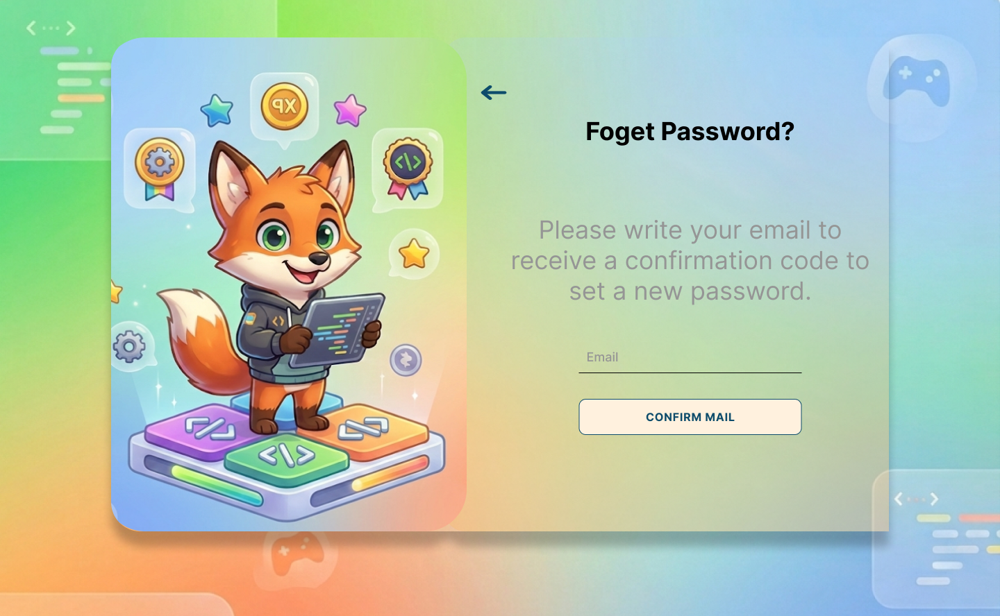
    <figcaption>Figure 7.4: Password Entry Screen</figcaption>
</figure>

<figure id="Figure75">
    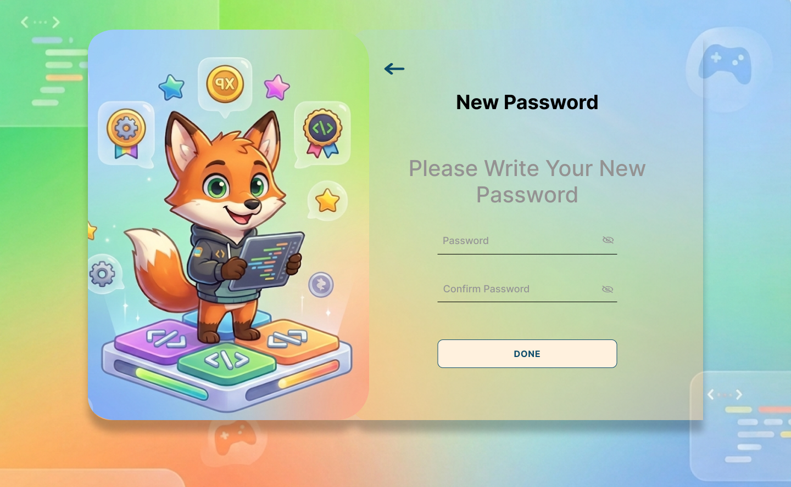
    <figcaption>Figure 7.5: New Password Creation Screen</figcaption>
</figure>

### 
7.2 Main Dashboard

<figure id="Figure76">
    
    <figcaption>Figure 7.6: Main Dashboard</figcaption>
</figure>
    
<figure id="Figure77">
    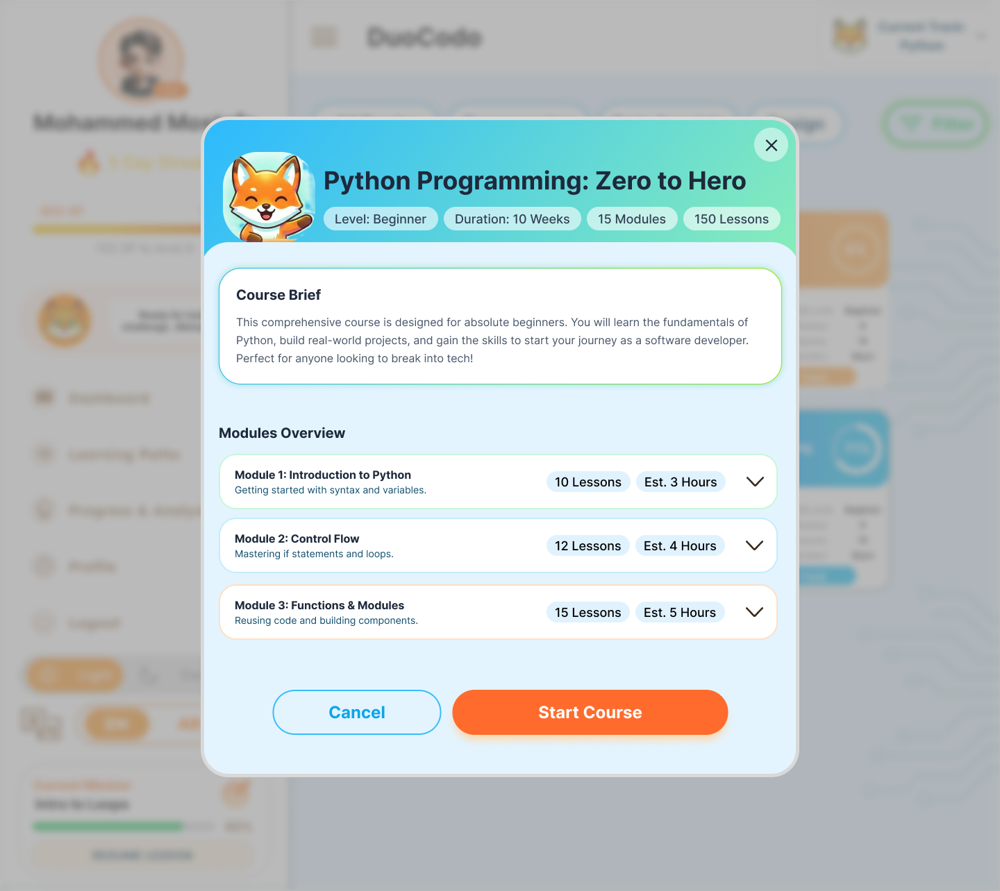
    <figcaption>Figure 7.7: Dashboard Details View</figcaption>
</figure>

<figure id="Figure78">
    
    <figcaption>Figure 7.8: Dashboard with Filtration Options</figcaption>
</figure>

7.3 Learning Features

<figure id="Figure79">
    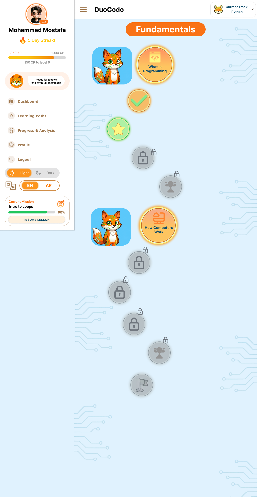
    <figcaption>Figure 7.9: Learning Path Interface</figcaption>
</figure>
    
<figure id="Figure710">
    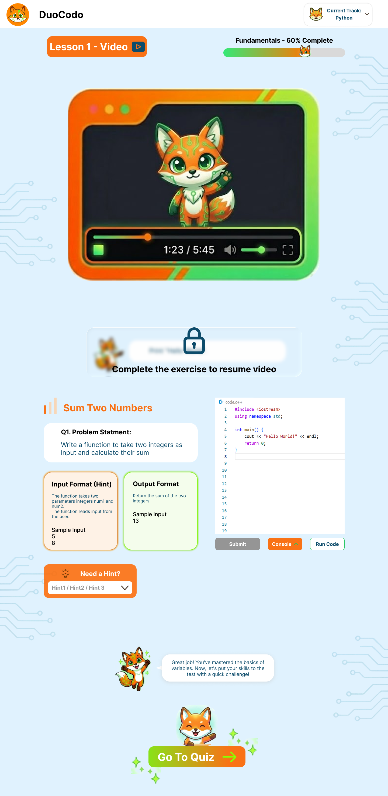
    <figcaption>Figure 7.10: Video Player Screen</figcaption>
</figure>
    
<figure id="Figure711">
    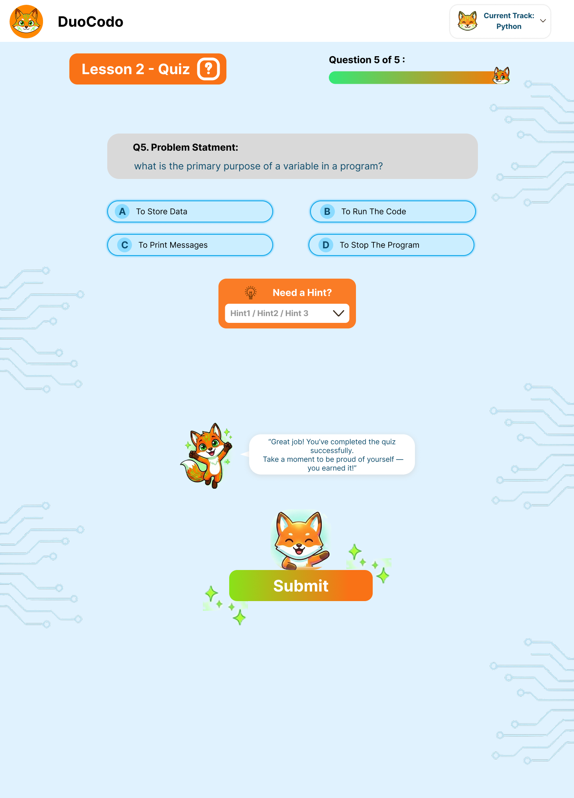
    <figcaption>Figure 7.11: Multiple Choice Quiz</figcaption>
</figure>
    
<figure id="Figure712">
    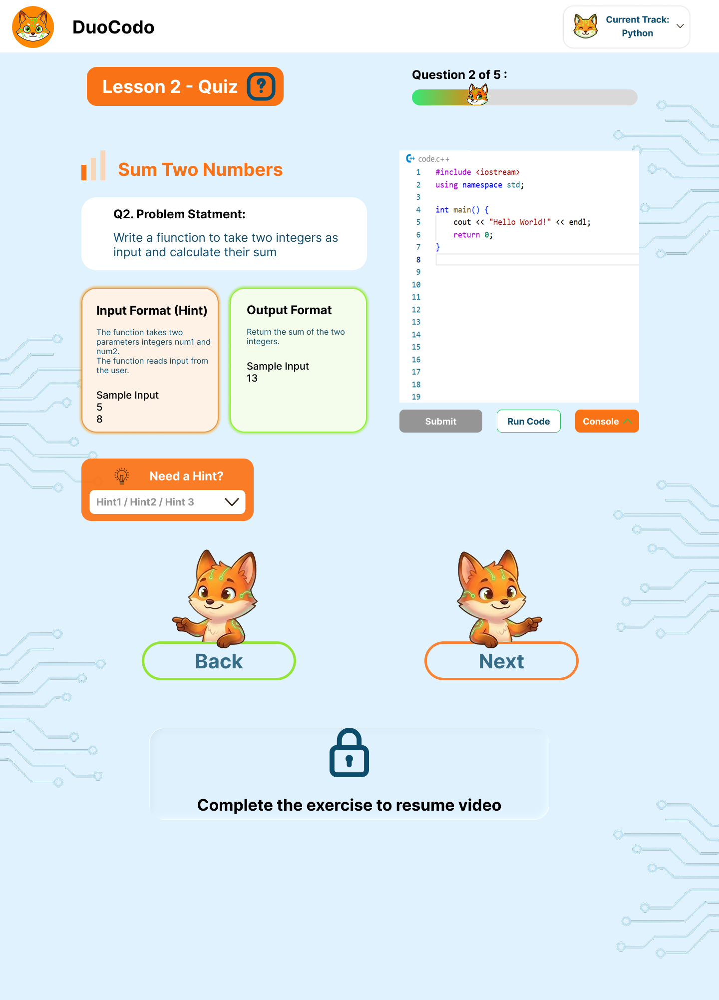
    <figcaption>Figure 7.12: Code Quiz Interface</figcaption>
</figure>
    
<figure id="Figure713">
    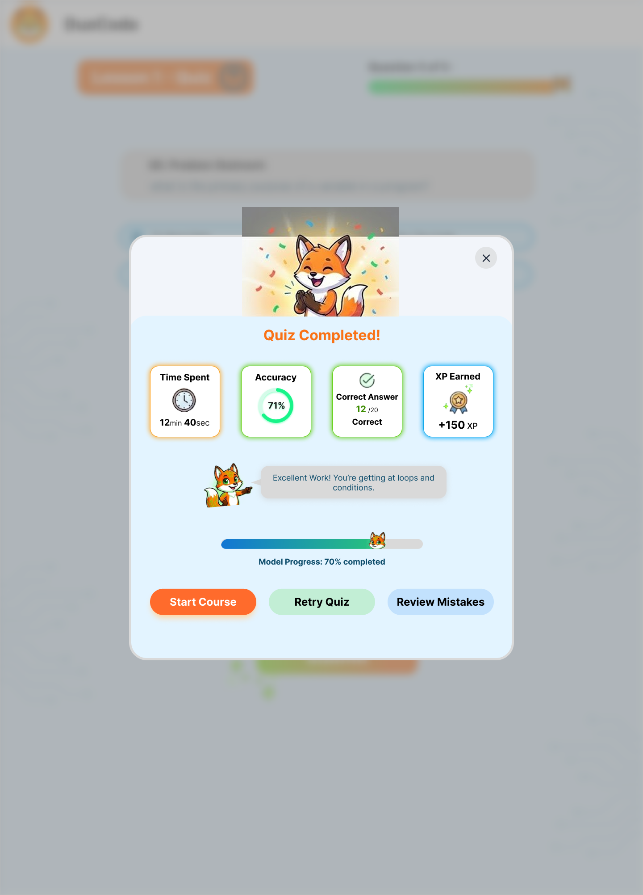
    <figcaption>Figure 7.13: Quiz Completion Screen</figcaption>
</figure>

7.4 Progress Tracking & Analytics

    <figure id="Figure714">
        
        <figcaption>Figure 7.14: Progress & Analysis Dashboard</figcaption>
    </figure>

7.5 Communication & Settings

<figure id="Figure715">
    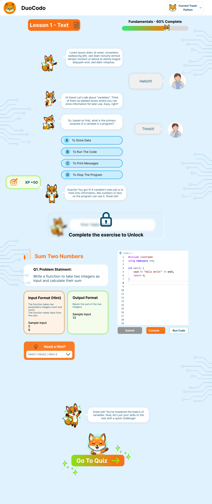
    <figcaption>Figure 7.15: Chat Interface</figcaption>
</figure>
    
<figure id="Figure716">
    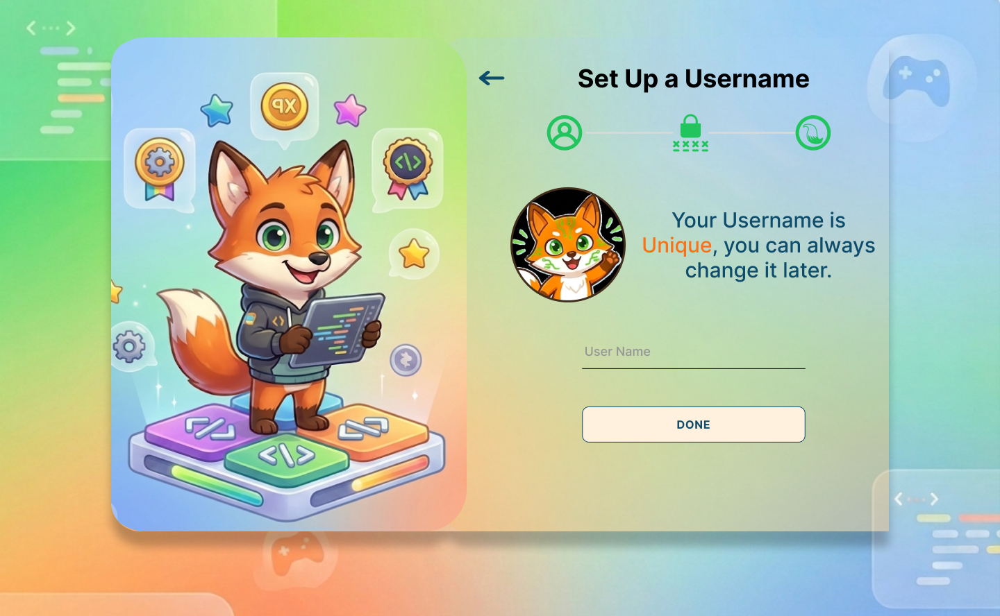
    <figcaption>Figure 7.16: User Profile Screen</figcaption>
</figure>

<figure id="Figure717">
    
    <figcaption>Figure 7.17: Interface with Collapsed Sidebar</figcaption>
</figure>

7.6 Theme Options

    <figure id="Figure718">
        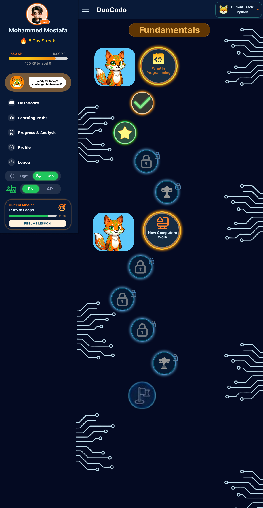
        <figcaption>Figure 7.18: Dark Mode Interface</figcaption>
    </figure>

